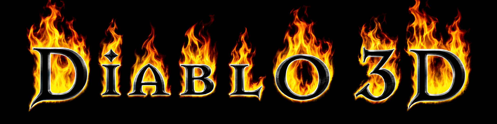

<p align="center"></p>

# Diablo 3D · D3D

A community prototype bringing Diablo 1's Tristram into a rotatable 3D view, built on [DevilutionX](https://github.com/diasurgical/devilutionX). Press **F4** to switch views in the same running game. Our next priority is reconstructing **whole objects** that match the original camera and remain coherent through 360°.

**[Official Discord](https://discord.gg/4YxQ7s69S)** · **[Contribute](docs/CONTRIBUTING.md)** · **[Roadmap](docs/ROADMAP.md)** · **[Build and play](docs/BUILDING-D3D.md)** · **[Estado em português](docs/TRISTRAM-STATUS.pt-BR.md)**

> This is modified DevilutionX software, distributed under its inherited **[Sustainable Use License](LICENSE.md)**. Source is public for collaboration; distribution must be free of charge and non-commercial. This is not an MIT/GPL release or an OSI-approved open-source license. Preserve upstream notices. Original Diablo game data is required and is not included.

## What works today

- F4 switches between the original rendering and the Tristram prototype without reloading the map.
- Orbit the camera through 360°, adjust pitch, zoom and framing.
- Buildings have reconstructed closed geometry; trees and rocks are grouped from their native pieces into volumes.
- Characters have depth. Warrior and cow reconstruction can use eight original views; unseen anatomy for single-view townspeople is inferred.
- Walking, collisions, inventory and NPC interaction use the existing game simulation.
- Windows build, headless scene diagnostics and native-view comparison tools are included as source.

This is an **offline, CPU-rendered prototype for Tristram**. Dungeon levels still use the original renderer. The reconstructed shapes and materials need substantial visual refinement, particularly unseen faces, characters and compound scenery. Meshy-generated candidates are experiments and are not integrated game models.

**Home currently returns to the original rendering backend.** Identical pixels at that pose verify the original-backend dispatch, not a perfect reconstruction. Forced-mesh comparisons still show differences. Contributors must compare the actual geometry with the native view and inspect rotated views before calling an asset faithful.

## Build and play

See [BUILDING-D3D.md](docs/BUILDING-D3D.md) for Windows compiler prerequisites and diagnostics. With Visual Studio 2022 or later, CMake and Ninja available:

```powershell
.\build.ps1
.\Iniciar-Tristram.ps1 -DataDirectory 'C:\path\to\your\Diablo'
```

Supply your own `DIABDAT.MPQ`, or separately obtain supported shareware data. The launcher reads your data directory and keeps this prototype's saves and settings in an ignored `perfil-tristram/` folder. Nothing needs to be installed over your original game.

| Control | Action |
| --- | --- |
| F4 | Switch original / 3D in Tristram |
| Middle mouse + drag | Orbit and adjust pitch |
| Mouse wheel | Zoom |
| Shift + middle mouse + drag | Move framing |
| Home | Restore the native pose and original backend |
| Click ground / NPC | Native movement / interaction |

The helper build defaults to **`NONET=ON`**. Voice, larger sessions and multiplayer compatibility have not been implemented or validated by this prototype.

## Help create complete 3D objects

We especially welcome contributors for houses, the cathedral exterior, trees, rocks, props, townspeople and characters. Match composition, scale, silhouette, doors, windows, ground contact and placement at the original camera angle. Then complete the unseen faces and review the entire object through 360°.

Start with the [3D asset issue form](https://github.com/douglasopan/diablo-3d/issues/new?template=3d_asset.yml), read the [contribution guide](docs/CONTRIBUTING.md), or coordinate in [Discord](https://discord.gg/4YxQ7s69S). Procedural geometry and asset-import contributions are welcome alongside independently created art with documented provenance.

Do not submit game archives, extracted game artwork, saved characters, private credentials or paid-service keys. Local tools can read a user's own archives; their generated extracts are not part of this repository.

## Next milestones

1. Refine complete Tristram objects and establish a reproducible import and visual-validation pipeline.
2. Add scene lighting and **real shadows cast by geometry**, with moving lights and actors. Painted ground shadows currently remain a compatibility approximation; dynamic shadows are planned work.
3. Generate coherent 3D dungeon geometry from the live procedural map and its existing seed, beginning with the Cathedral.
4. Restore and validate the existing four-player networking in a separate experiment, then investigate a shared town hub and larger sessions.
5. Evaluate optional proximity voice through Mumble, Discord Social SDK, TeamSpeak or a project-managed transport.

The [networking research](docs/NETWORKING-RESEARCH.md) explains the current limits and integration choices. Increasing a player constant alone will not produce a scalable server. These milestones are plans, not shipped capabilities.

## Project identity and upstream

Use the full [Diablo 3D banner](assets/branding/diablo3d-banner.png) for project pages and the square [D3D mark](assets/branding/d3d-avatar.png) for icons and project avatars. [Artwork provenance](assets/branding/README.md) records their origin. The optional menu-logo tool rebuilds its animation locally from the user's own game data; those generated game-art replacements are not distributed here.

This independent fan project is not affiliated with Blizzard Entertainment. Diablo and associated marks belong to their respective owners. Public source access does not grant rights to proprietary game assets.

The original engine [README](docs/UPSTREAM-README.md), [contribution instructions](docs/UPSTREAM-CONTRIBUTING.md), [license](LICENSE.md) and other upstream notices are preserved. The renderer prototype started from DevilutionX commit `dac104babfb6187415432f428ac2516747ffc154`.