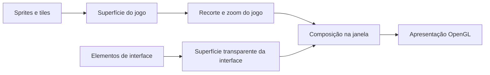

# Belzebub: análise do executável instalado

Análise de 7 de outubro de 2026, realizada a pedido do responsável pelo D3D. O objetivo é entender o comportamento gráfico do Belzebub por engenharia reversa e usar esse conhecimento para projetar melhorias no nosso código. A disponibilidade de um repositório do mod não é uma condição para este estudo.

## Material e método

Foi lido o `Belzebub.exe` da instalação fornecida, sem modificar ou executar o mod:

| Identificação | Valor |
|---|---|
| Formato | PE x86, 32 bits |
| Tamanho | 2.832.896 bytes |
| SHA-256 | `5a124484fbdf8c6bb45d0892a201e4794d10e13d28a2d2b4b917118c010bce27` |
| Base preferencial da imagem | `0x00400000` |

A inspeção combinou imports do PE, strings, referências cruzadas, desassemblagem x86 e leitura de argumentos e constantes nas rotinas gráficas. Foram usados pefile 2024.8.26 e Capstone 5.0.9, instalados somente no diretório local de diagnóstico. Os endereços abaixo são VAs estáticos nessa base; seu RVA é o VA menos `0x00400000`. Não são endereços garantidos para outra versão do mod ou para uma execução com relocação.

Os scripts, desassemblagens e arquivos originais ficam localmente em `diagnostics/belzebub-reverse-engineering`, fora da publicação. Este documento registra comportamento e evidência resumida. Não distribui o executável nem transforma a implementação do Belzebub em código do D3D.

## Comportamentos confirmados no binário

| Área | Evidência estática | Conclusão e limite |
|---|---|---|
| Janela/contexto | Chamadas a `SDL_CreateWindow` e `SDL_GL_CreateContext`, em `0x005a06c8` e `0x005a06f6`. A criação usa flags `0x2002`. | Há um contexto OpenGL real e solicitação de janela com suporte HiDPI. Essa solicitação não comprova a resolução física efetivamente obtida. |
| Texturas | Chamadas a `glTexImage2D`, inclusive `0x0040c6d3`, `0x0040f278` e `0x0040f33f`, com RGBA, bytes sem sinal e nível zero. | Os caminhos observados alocam texturas de cor na GPU. Isso não demonstra uma substituição dos sprites originais por versões com mais detalhe. |
| Filtragem | `glTexParameteri` em `0x0040c68d` e `0x0040c6a2` recebe `GL_LINEAR` para magnificação e minificação. | A criação observada configura interpolação linear. A avaliação visual final depende da escala e dos demais caminhos de composição. |
| Transparência | Ativação de `GL_BLEND` em `0x0040f0e3`; `glBlendFunc` em `0x0040f0f3` recebe `GL_SRC_ALPHA` e `GL_ONE_MINUS_SRC_ALPHA`. | A configuração observada usa a composição convencional por alfa. Não constitui um sistema de sombras geométricas ou iluminação 3D. |
| Cor de paleta | Rotinas anteriores a `glColor4ub`, em `0x0040900b` e `0x0040aac1`, leem um índice de byte e fazem uma consulta RGB com três bytes por entrada. | Há caminhos que convertem cores de paleta para desenho OpenGL. Não foi reconstruído todo o algoritmo de iluminação nem atribuída uma identidade a cada asset desses caminhos. |
| Brilho | Na rotina `0x0043e550`, um índice limitado é convertido em `0,75 + 0,5 × índice/(quantidade−1)` e passado a `SDL_SetWindowBrightness` em `0x0043e58e`. O valor é guardado quando a chamada retorna sucesso. | O controle usa o recurso de brilho/gamma do SDL nesse caminho. Sua disponibilidade e efeito dependem do sistema; não é evidência de uma correção de cor por shader. A origem e a quantidade das posições da interface precisam de validação adicional. |
| Apresentação | `SDL_GL_SwapWindow` em `0x005a0c4c`; viewport e `glOrtho` na configuração, incluindo `0x0040f0d1`. | O quadro final é apresentado pela janela OpenGL, com um caminho de composição 2D ortográfica. A análise não encontrou nesse caminho um mundo com geometria 3D. |
| Mundo/interface separados | Geração de dois framebuffers em `0x0040f148`, duas anexações de textura em `0x0040f29b`/`0x0040f361` e sequência de composição em `0x0043d1c0`. | O caminho FBO usa superfícies de cor distintas para jogo e interface. As mensagens internas que nomeiam as duas texturas e o fluxo de desenho confirmam essa associação. O caminho é condicionado ao modo gráfico; sua seleção na sessão do usuário não foi observada. |
| Zoom | O callback do menu em `0x0046b6f7` chama o setter `0x0043e3f0`, que normaliza o índice e chama `0x0040ff80`. | O zoom modifica os limites de recorte usados para compor a superfície do jogo. A superfície da interface segue um passe separado. Ampliar o mesmo quadro não acrescenta detalhe ao asset. |
| Modos de vídeo | `SDL_GetNumDisplayModes` em `0x005a07f9` e `SDL_GetDisplayMode` em `0x005a080e`, para o monitor de índice zero. | O caminho examinado monta a lista com modos do monitor, exclui alturas abaixo de 600 e procura 800×600 como referência inicial. Não é um teto de resolução nem prova de suporte a qualquer dimensão arbitrária. |
| Tela cheia | Rotina `0x005a0b20`, com chamadas SDL de tamanho, centralização e fullscreen. | O caminho examinado sai de fullscreen, aplica o modo de janela selecionado, centraliza e pode pedir fullscreen exclusivo. Suporte real do monitor/driver permanece por testar. |
| Arte de interface | Getter `0x0041fe50` associa IDs 41 e 42 a `ctrlpan/modernui.png` e `ctrlpan/modernui2.png`; há carregamento e consumo de ambos. | Confirma uso de recursos próprios da interface. Não comprova um seletor de interface moderna/clássica nem texturas de cenário em HD. |

Essas conclusões vão além da leitura de nomes de funções: nos pontos indicados, os argumentos e a sequência de chamadas foram conferidos. Elas continuam sendo evidência estática, sem uma comparação visual do mod em execução. A ferramenta de controle de aplicativos disponível falhou antes de inicializar o acesso ao jogo.

## Como o caminho de apresentação funciona

O fluxo identificado em `0x0043d1c0` seleciona a superfície do jogo, desenha seu conteúdo, retorna à saída da janela e compõe o retângulo do jogo. Em seguida, seleciona a superfície da interface, desenha seus elementos, retorna à janela e compõe a interface por cima. A superfície de jogo é opaca; a interface é limpa com transparência. Nesse fluxo, os alvos são de cor RGBA, sem attachment de profundidade; `GL_DEPTH_TEST` é desativado na configuração observada.

A configuração em `0x0040ee00` distingue largura/altura de saída de uma altura lógica configurável. Quando essa altura lógica é zero, usa a altura de saída. A largura lógica acompanha a proporção da janela; a área jogável reserva 128 unidades lógicas para o painel. As texturas intermediárias são dimensionadas em potências de dois e a composição usa coordenadas de textura para evitar a área de preenchimento. Isso permite apresentar a mesma organização lógica em uma saída com outro tamanho.

O ajuste de zoom recalcula margens e coordenadas de recorte da superfície do jogo. Por isso ele pode ampliar o cenário sem aplicar o mesmo recorte à interface. Ainda é necessário confirmar em execução a escala final, a precisão do mouse e os valores selecionados pelo usuário. A análise encontrou também um caminho de compatibilidade; não presume que toda sessão use os FBOs.

O parâmetro de recorte aceito fica entre zero e aproximadamente `0,35`. No caminho examinado, a largura útil varia como `1−2q`; a ampliação correspondente chega a aproximadamente `3,33×`. O setter do menu usa uma constante próxima de `0,35`, enquanto seu getter usa `0,34`. A diferença foi registrada, mas não diagnostica um defeito visível sem confirmar os índices e arredondamentos em execução. A adaptação da roda do mouse foi localizada; sua última chamada virtual até o receptor concreto permanece parcial.

As preferências globais são gravadas por um serializador binário/comprimido em `Data/game_data/settings.chuj`, incluindo dimensões selecionadas e fullscreen. Não é um arquivo INI para transplantar ao DevilutionX. Para o D3D, o comportamento útil é ter escolhas de apresentação persistentes e isoladas, usando o sistema de configuração que já existe no nosso motor.

Esse mecanismo explica uma capacidade concreta de apresentação, sem provar que todo ganho visual percebido vem dele. Filtro, proporção, brilho, arte de interface e os próprios assets contribuem de maneiras diferentes. O uso de OpenGL para compor sprites 2D também não equivale ao renderizador de modelos 3D que queremos para o D3D.

## Consequência para o D3D

A [auditoria dos recursos](REFERENCE-SOURCES.md) já mostrou que a resolução panorâmica e a arte adicional de interface não equivalem a texturas de cenário ou personagens redesenhadas em HD. O binário agora permite estudar também o caminho que apresenta esses pixels: contexto gráfico, alocação de texturas, filtros, composição e ajuste de brilho.

O D3D usa o DevilutionX como código de base. Seu protótipo 3D atual rasteriza geometria na CPU; o SDL apresenta a imagem final. Portanto, habilitar uma saída SDL acelerada ou aumentar `Width`/`Height` não transfere automaticamente a rasterização 3D para a GPU. Os [experimentos de apresentação](DISPLAY-PRESENTATION.md) registram esse custo e preservam o estado do jogo.

As melhorias derivadas deste estudo devem ser implementadas no nosso motor, com comportamento verificável:

1. Controlar enquadramento/zoom do mundo e escala da interface separadamente. A roda de zoom do cenário deve preservar a leitura e as áreas clicáveis dos menus, inclusive em telas largas e HiDPI. Oferecer modos detectados no monitor e validar dimensões físicas/lógicas em cada mudança de janela ou fullscreen.
2. Definir resolução interna, dimensões físicas de saída e amostragem de textura como decisões separadas. Comparar detalhe no mesmo enquadramento, sem confundir mais área visível com mais detalhe por objeto.
3. Avaliar um caminho acelerado que desenhe os modelos 3D, além de ampliar o quadro pronto. Registrar tempo, memória, transparência, profundidade, sombras e fallback antes de adotá-lo.
4. Calibrar o ajuste de saída separado das fontes de luz da cena. Brilho global não deve substituir a luz física de velas, oclusão, materiais e sombras do D3D.
5. Criar a nova entrada e o novo menu sobre os fluxos de personagens, configurações e navegação já presentes, usando a identidade D3D aprovada e mantendo os créditos.

O estudo se aplica à evolução do jogo inteiro. Tristram é o primeiro cenário de validação; os níveis procedurais precisam consumir seus mapas nativos e conservar simulação, colisões e saves. Consulte o [roadmap](ROADMAP.md) e o [registro das bases e créditos](ENGINE-BASES-AND-CREDITS.md).

## O que ainda falta confirmar

Esta primeira análise cobre partes do fluxo de resolução, composição, zoom e brilho; não constitui uma decompilação completa do mod. O encadeamento integral de entrada por roda do mouse e todos os caminhos de configuração ainda precisam de confirmação. A observação do jogo em execução deve confirmar o modo ativo, escalas, posições do mouse, mudanças de resolução/fullscreen e diferenças visuais, com a mesma cena e o mesmo enquadramento.

Não foram medidos FPS do Belzebub, desempenho sustentado, versão ativa do contexto OpenGL ou uma substituição geral de arte HD. As medições de CPU publicadas em `DISPLAY-PRESENTATION.md` pertencem ao diagnóstico do D3D.
