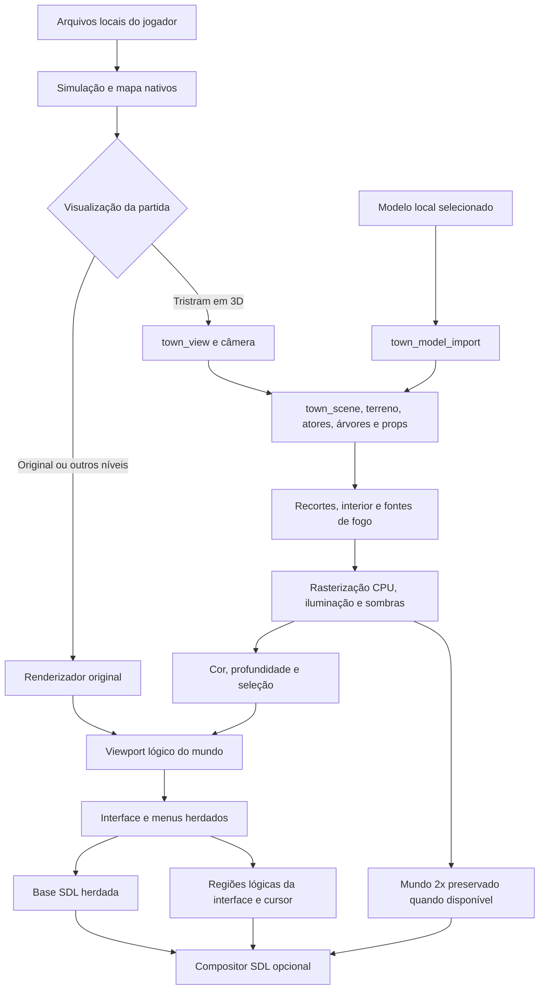
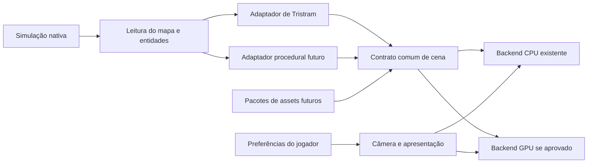
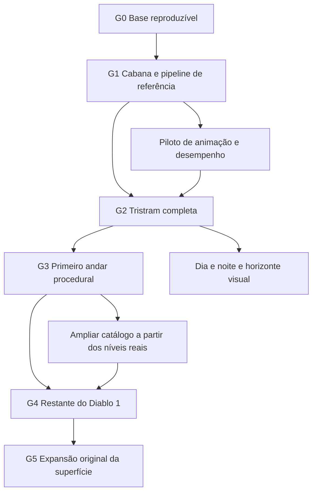
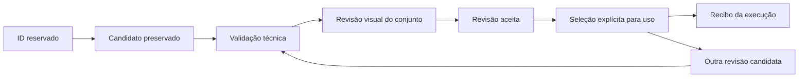

# Arquitetura e execução do Diablo 3D

O objetivo é reconstruir **o Diablo 1 inteiro em 3D**, permitindo alternar a visualização na mesma partida. Tristram é o primeiro ambiente de validação. Depois vêm o primeiro andar procedural da Catedral, os demais ambientes, personagens, monstros e efeitos. A expansão original da superfície fica para uma fase posterior à reconstrução do jogo.

Este é o guia operacional do desenvolvimento. Antes de iniciar uma mudança, o responsável consulta a etapa ativa, os contratos e a fila abaixo; ao concluir, registra o resultado e a próxima ação. O [roadmap](ROADMAP.md) descreve os recursos desejados; este guia determina suas dependências e o que permite avançar. As instruções para os agentes estão em [AGENTS.md](../AGENTS.md).

## Estado de execução

Atualização: **8 de outubro de 2026**. **G0 — base reproduzível está concluído tecnicamente.** Etapa ativa e próxima entrega visual: **G1 — cabana completa como referência**. Isso ainda não representa a conclusão de Tristram.

| Entrega | Estado comprovado | Limite atual |
| --- | --- | --- |
| Alternância F4, órbita, zoom e deslocamento | Implementados no protótipo de Tristram | Outros níveis usam o renderizador original. |
| Comparação Home | Usa o backend original | Igualdade nessa posição não comprova fidelidade das meshes. |
| Cabana leste importada | Exterior e iluminação aprovados pelo usuário para continuar o trabalho | Aprovação parcial; interior, aberturas, telhado, base e conjunto em 360° ainda precisam de revisão final. |
| Recortes e interior da cabana | Implementados no código quando a importação é carregada | Não estão gravados dentro do arquivo do modelo; dependem também do executável. |
| Iluminação e sombras | Albedo importado iluminado em espaço linear; sombra direcional de arquitetura; duas velas na cabana | Sombras pintadas restantes, sombras de atores/árvores/props e ciclo dia/noite estão pendentes. |
| Suavização de bordas 3D | Configuração implementada, desligada por padrão; build candidato e diagnósticos aprovados tecnicamente | Custo alto na CPU; aprovação técnica não substitui avaliação na partida. |
| Apresentação SDL em camadas | Mundo 2× preservado até a saída; interface lógica por regiões opacas, cursor separado e fallback herdado; testes técnicos passaram | Primeiro incremento conservador; não adiciona arte HD nem escala independente à UI. Revisão na janela permanece pendente. |
| Modelos aceitos no catálogo colaborativo | Zero modelos autorais com aceitação integral registrada | Baseline local selecionada para revisão não equivale a `accepted`. |
| Rede e voz | Pesquisa documentada | Build local `NONET=ON`; nenhuma capacidade nova de jogadores ou voz validada. |

### Fila de trabalho

| Ordem | Trabalho delimitado | Dependência e evidência para encerrar |
| --- | --- | --- |
| 1 | **Concluído:** corrigir a seleção da cabana entre os perfis e registrar a baseline | G0: 20 testes aprovados, nove perfis preparados, modelo/luz verificados por hash e saves preservados. Ver [aprovação de assets](ASSET-APPROVAL.md). |
| 2 | Revisar a cabana selecionada, sem gerar outra versão automaticamente | G1: mesma câmera e frame, geometria forçada, giro completo, interior, janelas, telhado, chão e luz de vela. Registrar apenas os defeitos reproduzidos. |
| 3 | Corrigir esses defeitos no componente responsável | Reutilizar modelo, conversão e luz aceitos no seu escopo. Nova geração só se um defeito de geometria não puder ser corrigido de modo adequado no candidato existente. |
| 4 | Fechar o contrato de importação e a ficha de aceitação da cabana | G1: entradas, conversão, modelo, código de aberturas, iluminação e evidências identificados; aprovação visual do conjunto antes de promovê-lo a referência completa. |
| 5 | Medir desempenho em condição controlada e definir o orçamento de Tristram | G2: resolução, câmera, perfil, hardware e carga registrados; meta de tempo/memória definida antes de aceitar a ampliação da cena. |
| 6 | Produzir as famílias restantes de Tristram usando esse contrato | G2: reservar IDs existentes; trabalhar por objeto inteiro e registrar aceitação individual. |

A suavização já implementada não abre uma nova frente de funcionalidades. Permanece opcional enquanto as prioridades de seleção, qualidade dos objetos e custo do renderizador são resolvidas. Os perfis de apresentação são ferramentas de comparação; a direção do produto é oferecer os controles apropriados nas configurações do jogo.

**Prioridade explícita do usuário, 8 de outubro — concluída tecnicamente:** reunir a cabana selecionada e a melhor apresentação no perfil habitual. A auditoria confirmou que os executáveis normal e de qualidade tinham o mesmo código, mas a suavização estava desligada no perfil normal e o mundo 2× era reduzido antes da saída SDL. O compositor preserva agora esse mundo até a apresentação e sobrepõe regiões explícitas da interface lógica, com canal transitório do cursor. Componentes: `town_view`, novo `town_presentation`, registro de regiões da UI, `scrollrt`, `dx` e ciclo de recursos SDL. Fixtures de densidade, preto opaco, clipping, paleta, invalidação, renderer/resize e regressões de seleção passaram; cabana/luz/save foram preservados e o normal recebeu a opção ativada uma vez. Limites e evidência em [DISPLAY-PRESENTATION.md](DISPLAY-PRESENTATION.md). Próxima ação: revisão visual na partida habitual, seguida da revisão G1 da cabana; a ferramenta automática de janela falhou antes de abrir os jogos. Nenhum asset foi regenerado ou promovido a aceito, nem foi importada arte HD do Belzebub.

## Arquitetura em funcionamento

O código-base é o DevilutionX modificado. A análise local do Belzebub é uma referência de comportamento e apresentação; seu executável e seu código não integram a engine. Veja [bases e créditos](ENGINE-BASES-AND-CREDITS.md) e [análise do executável](BELZEBUB-BINARY-ANALYSIS.md).

O desenho mostra responsabilidades, não uma API de plugins já existente. No código atual há acesso direto ao estado global da engine; uma interface geral de cena para todos os níveis ainda precisa ser extraída gradualmente.

| Responsabilidade | Implementação atual | Regra de dependência |
| --- | --- | --- |
| Regras, mapas, colisões, progressão e saves | `Source/levels`, jogador, monstros, NPCs, quests e demais sistemas herdados | Continuam autoritativos. A renderização não altera seu estado nem consome seu RNG. |
| Escolha do backend e composição da tela | [scrollrt.cpp](../Source/engine/render/scrollrt.cpp) | Desenhar o mundo antes da interface; preservar o retorno ao original. |
| Apresentação de maior densidade | [town_presentation.cpp](../Source/engine/render/town_presentation.cpp), `ui_overlay_regions.*` e `dx.cpp` | Somente fluxos da partida autorizam camadas; usar um mundo 2× com epoch válido, paleta ativa e regiões UI explícitas. Liberar texturas antes do renderer; falhas opcionais voltam à base herdada. |
| Câmera, rasterização, caches e picking | [town_view.cpp](../Source/engine/render/town_view.cpp) | Câmera e mouse usam coordenadas lógicas. Em 2×, cor agrega quatro subamostras; profundidade e entidade selecionada vêm juntas da subamostra visível mais próxima. |
| Objetos inteiros e interiores | [town_scene.cpp](../Source/engine/render/town_scene.cpp) | Identificar composição e footprint antes de modelar. Aparência não redefine a colisão nativa. |
| Importação estática | [town_model_import.hpp](../Source/engine/render/town_model_import.hpp) | `D3DMESH1` valida limites, UVs e geometria; ainda não contém esqueleto, skin ou clipes de animação. |
| Materiais, fogo e sombras | `town_lighting.*`, `town_shadow.*`, `town_lighting_profile.*` | Luz e sombras compartilham coordenadas do mundo; órbita não move a fonte. |
| Atores e vegetação | `town_actor`, `town_body`, `town_volume`, `town_vegetation`, `town_props` | Reconstruções atuais não estabelecem uma pipeline de animação esquelética concluída. |
| Preferências do jogador | [options.cpp](../Source/options.cpp) e menu de configurações | Persistir por perfil; definir quando cada opção pode ser aplicada. |
| Baseline e comparação | Launcher, manifesto de revisão e [town_view_smoke.cpp](../tools/town_view_smoke.cpp) | Identificar os mesmos componentes antes de comparar resultados. |

### Contratos que toda mudança deve preservar

1. **Uma partida, duas visualizações.** F4 não recria mapa, personagem ou seed. Comandos de movimento e interação continuam chegando à simulação nativa.
2. **Fidelidade por objeto completo.** Comparar meshes forçadas com a referência na câmera original e também em 360°. Portas, janelas, escala, telhado, chão e posição precisam pertencer ao mesmo objeto coerente.
3. **Comparação nativa separada.** Home testa o caminho original. Capturas com geometria forçada testam a reconstrução. Não misturar os dois resultados numa afirmação de igualdade.
4. **Luz física consistente.** Velas, candelabros e fogo têm fontes, cores, atenuação e oscilação próprias. Aberturas precisam existir na geometria. Textura amarela ou sombra desenhada não substitui esse sistema. Detalhes em [BUILDING-OPENINGS.md](BUILDING-OPENINGS.md).
5. **Seleção acompanha a imagem.** Mudanças de viewport, painéis, zoom ou qualidade invalidam buffers antigos. Após redução de amostras, profundidade e ID vêm da mesma subamostra.
6. **Versões explícitas.** Geração cria um candidato. Alterar o arquivo mais recente ou trocar resolução não promove outro modelo. O conjunto da revisão inclui modelo, conversor, executável, aberturas e iluminação.
7. **Dados privados ficam locais.** Não publicar credenciais, saves, arquivos do jogo, extrações ou modelos privados. Publicar código, contratos, metadados permitidos e resumos sanitizados de validação.

## Evolução da engine e suporte a modders

A evolução deve aproveitar os módulos existentes. Não há necessidade de reescrever toda a engine antes de terminar a cabana. Extraímos uma fronteira quando o segundo uso concreto a exigir, preservando o caminho anterior até o novo estar validado.

Este segundo desenho é a arquitetura de destino. O contrato comum de cena, os pacotes e o backend GPU não estão implementados como interfaces gerais.

| Fronteira a consolidar | Conteúdo e responsabilidade | Momento de execução |
| --- | --- | --- |
| Leitura da partida | Mapa vivo, peças, entidades, frames e IDs de interação, sem escrita ou novo RNG | Ao introduzir o segundo adaptador, no G3. Usar a extração mínima que elimine dependências exclusivas de Tristram. |
| Cena visual | Transformações, malhas, materiais, instâncias, luzes e vínculo de seleção com entidades nativas | Estabilizar o contrato estático no G1; generalizar no G3. |
| Pacotes de assets | IDs estáveis, versão de formato, dependências, origem, seleção explícita e validação | O catálogo atual coordena contribuições. Loader geral de modpacks será uma entrega própria; não tratar o JSON atual como esse loader. |
| Animação | Esqueleto, skin, clipes e eventos visuais vinculados ao estado e frame nativos | Piloto com um ator durante G2; usar o resultado antes de produzir todos os personagens. |
| Backend gráfico | Receber a mesma cena e produzir cor, profundidade e seleção equivalentes | Decidir CPU/GPU após medição controlada; preservar a referência CPU durante qualquer migração. |
| Extensões de gameplay | Alterações explícitas de regras, saves e protocolo, com versão e compatibilidade | Separadas da conversão visual. Expansão e aumento de jogadores exigem projetos de implementação delimitados. |

Para os níveis procedurais, cada instância visual deriva do **mapa realmente gerado**, incluindo portas, escadas e alterações durante a partida. O seed auxilia a repetição dos testes; não substitui a leitura do mapa vivo. Uma variação puramente visual deve usar dados determinísticos próprios, sem avançar o gerador aleatório da simulação.

O piloto de rig deve mapear estados como parado, caminhada, ataque e morte ao tempo do jogo. Rig automático, inclusive pelo Meshy, é uma etapa de produção; não garante sincronização de ataques, contato dos pés ou anatomia correta. Primeiro validar um ator e suas transições, depois ampliar a família.

## Configurações dentro do jogo

Separar **preferências do jogador**, **definições artísticas do asset** e **diagnósticos de desenvolvimento** evita que um atalho de resolução troque uma casa ou sua iluminação aprovada.

| Controle | Situação atual | Política de evolução |
| --- | --- | --- |
| F4, órbita, inclinação, zoom e deslocamento | Aplicados durante a partida em Tristram | Manter resposta imediata e oferecer ajustes de sensibilidade, limites e restauração quando implementados. |
| Suavização de bordas 3D | Opção em Gráficos, aplicada no próximo desenho; desligada por padrão | Mostrar limitação efetiva quando o orçamento recua para 1×; não prometer disponibilidade em qualquer resolução. |
| Filtro de ampliação | Opção gráfica herdada | Preservar a distinção entre filtro da saída e amostragem do mundo. |
| Resolução interna, fullscreen e ajuste à tela | Opções herdadas restringem alteração durante a partida e recriam a interface | Tornar dinâmicas somente após validar tamanho, recursos, seleção e retorno seguro. Até lá, respeitar as flags existentes. |
| Intensidade, perfil de luz e qualidade de sombras | Luz em perfil técnico de arquivo; qualidade da sombra definida em código; sem painel geral durante a partida | Criar opções limitadas e persistentes; definir invalidação dos caches e custo antes de expor controles. |
| Escala independente da interface | Planejada | Exige layout, texto e áreas clicáveis coerentes em diferentes proporções. |
| Modelo e aberturas de uma casa | Seleção de conteúdo, não preferência gráfica | Gerenciar por revisão/asset pack; uma preferência de qualidade não troca silenciosamente a revisão artística. |
| Congelar fogo, forçar geometria e capturas | Diagnósticos | Permanecer separados da experiência normal do jogador. |

Cada nova opção precisa declarar valor padrão, persistência, faixa válida, aplicação imediata/reconstrução/reinício e fallback. Um controle que exige reinício pode existir no menu com indicação clara; não deve receber uma promessa falsa de alteração imediata.

## Marcos e dependências

Os marcos são critérios de passagem, não datas prometidas. Atividades independentes podem ocorrer em paralelo com responsáveis e arquivos separados. Um marco dependente só começa sua implementação principal depois de sua entrada estar satisfeita; pesquisa e inventário não significam início ou conclusão do marco.

| Marco | Entrada | Entregas e condição de saída | Estado |
| --- | --- | --- | --- |
| **G0 Base reproduzível** | Código e assets locais existentes | Seleção explícita da baseline; launcher consistente; recibo de execução; testes de divergência; preservação dos perfis; guia operacional acessível. | Concluído tecnicamente nesta atualização. Não equivale a aprovação visual do conjunto. |
| **G1 Cabana de referência** | G0 | Objeto completo e coerente na câmera original e em 360°, aberturas e interior corretos, cor/luz calibradas, sombra real sem duplicação no chão auditado, colisão preservada, conversão repetível e aprovação integral registrada. | Parcial. Exterior/luz já permitem continuar; não regenerar por ausência de registro integral. |
| **G2 Tristram completa** | G1 | Inventário do cenário de Tristram do Diablo fechado, com revisões aceitas das famílias desse escopo; terreno coerente, interiores visíveis necessários, NPCs e vegetação com volume, piloto de herói animado, sombras e oclusão corretas, picking e interação preservados; orçamento de CPU/memória atendido em fixtures declaradas. | Protótipo parcial; vários objetos ainda requerem reconstrução. |
| **G3 Primeiro andar procedural da Catedral** | G2 e contrato de importação estável | Adaptador do mapa vivo; conjunto reproduzível de seeds cobrindo salas, corredores, portas e escadas; variações e mudanças em jogo; seleção, colisão, transparência e alternância F4 corretas; orçamento medido. | Planejado. |
| **G4 Diablo 1 completo em 3D** | G3 | Demais andares e ambientes; heróis, equipamentos, monstros, bosses, estados, animações, objetos e efeitos necessários; fixtures de progressão, combate, quests e save/load sem regressões. | Planejado. Catálogo completo será derivado das fases auditadas. |
| **G5 Expansão da superfície** | G4 e proposta de gameplay aprovada | Definir mundo externo, progressão, geração/autoria, saves e compatibilidade; implementar uma região piloto antes de ampliar. | Visão futura, ainda sem escopo fechado. |

No início de G2, registrar a matriz de objetos, estados e fixtures do Diablo suportados, incluindo a identificação do cenário residual. Conteúdo `conditional-hellfire` fica separado. O gate exige completar o cenário desse escopo e suas interações; a biblioteca integral de classes/equipamentos e o conteúdo de outros ambientes pertencem ao G4. Não exigir aceitação indiscriminada de toda categoria do catálogo para liberar G3, nem ocultar objetos restantes de Tristram para declarar G2 concluído.

Dia/noite e horizonte podem ser desenvolvidos depois de G2 sem criar terreno jogável extra. A sombra deve acompanhar a fonte de luz; fog precisa respeitar profundidade e silhuetas. As decisões de rede/voz e de novo menu seguem trilhas próprias com seus pré-requisitos: não substituem os marcos visuais nem bloqueiam a conclusão de um objeto. O site/devlog pode acompanhar apenas resultados efetivamente entregues.

### Decisões abertas com momento de resolução

| Decisão | Evidência necessária | Resolver antes de |
| --- | --- | --- |
| Orçamento de frame/memória e viabilidade de GPU | Medição controlada do mundo e da partida, resolução de referência, hardware e qualidade registrados; custo dos passes identificado | Escalar a produção da cena em G2. O experimento atual não fixa uma meta de FPS. |
| Formato de atores e ferramenta de rig | Piloto com esqueleto, skin, ações e eventos nativos; tamanho e custo medidos | Produzir personagens em série no G2/G4. |
| Esquema geral de asset packs | Segundo uso real, dependências, versionamento, prioridade e fallback testados | Anunciar suporte público de modpacks. |
| Horizonte decorativo ou superfície explorável | Proposta visual para G2; proposta de gameplay separada para G5 | Introduzir qualquer nova colisão ou região jogável. |
| Mais jogadores e voz de proximidade | Protocolo, autoridade, sincronização, instâncias, saves, transporte e custos; [pesquisa de rede](NETWORKING-RESEARCH.md) | Modificar limites/protocolo ou integrar serviço de voz. |

## Aprovação e continuidade dos assets

O [catálogo existente](ASSET-CATALOG.md) e [assets/registry.json](../assets/registry.json) continuam sendo a fonte de IDs, reservas e aceitação colaborativa. Não criar um catálogo paralelo. O manifesto de baseline de revisão resolve outro problema: **qual revisão local está sendo usada agora**. Veja [ASSET-APPROVAL.md](ASSET-APPROVAL.md).

Uma aprovação parcial pode selecionar uma baseline para continuar a revisão, como ocorre com a cabana. Isso não a promove a aceitação integral. A revisão anterior permanece identificável para rollback. Nenhuma etapa deve escolher arquivos por data de modificação ou considerar a conversão mais recente automaticamente melhor.

Ao encontrar uma diferença, comparar primeiro modelo, executável, perfil de luz, câmera e estado. Se o modelo não foi carregado, corrigir a inicialização; se a abertura depende do código, corrigir esse componente. Não gerar outra casa para compensar uma falha de perfil, câmera ou luz.

## Rotina obrigatória de execução

1. **Ler o estado real.** Consultar este guia, instruções aplicáveis, registro do asset e arquivos relevantes. Verificar alterações locais, tarefas concorrentes e qual executável está realmente em uso.
2. **Escolher uma entrega delimitada.** Anotar na fila seu objetivo, dependências, arquivos sob responsabilidade, critério de conclusão e evidência necessária. Se uma dependência falhar, corrigir a causa antes de avançar.
3. **Preservar a referência.** Identificar revisão e hashes do conjunto existente. Respeitar o escopo já aprovado; manter candidatos e capturas separados. Não sobrescrever uma partida aberta para substituir seu executável.
4. **Implementar e validar o necessário.** Fazer verificações proporcionais à mudança. Repetir testes amplos somente por alteração relevante, falha nova ou risco ainda aberto. Manter os resultados técnicos separados da aprovação artística.
5. **Registrar e entregar.** Atualizar esta fila e o documento responsável pelo detalhe, com resultado, evidência, limitação e próxima ação. Publicar apenas os arquivos autorizados, após revisar o diff e verificar segredos. Atualizar o devlog com fatos entregues.

Uma etapa encerrada só reabre por **defeito reproduzido**, **mudança explícita de requisito** ou **dependência que mudou**. Registrar o motivo e limitar o retrabalho ao componente afetado. Recompilar ou revalidar uma dependência alterada não significa refazer toda a etapa artística.

### Evidências disponíveis nesta atualização

- A auditoria dos perfis identificou a regressão: atalhos comuns sem modelo importado carregavam a cabana procedural; os quatro perfis Meshy auditados continham o mesmo arquivo v2. Recortes e interior são adicionados pelo código somente após importação bem-sucedida. Relatório local: `diagnostics/profile-asset-audit/profile-assets.json`.
- A correção passou em 20 fixtures no Windows PowerShell 5.1. Nove perfis receberam/verificaram a mesma baseline e seus recibos foram renovados após a atualização do executável. Os sete saves existentes, duas cópias iniciais e o INI habitual foram preservados. Relatórios locais: `diagnostics/runtime-baseline-tests` e `diagnostics/runtime-baseline-prepare`. A preparação não modifica uma cena já cacheada numa partida aberta.
- O diagnóstico normal e `--quality` passaram. A revisão de qualidade preservou enquadramento, interface, seleção, retorno 1× → 2× → 1× e 75 amostras geométricas independentes. Relatórios/capturas locais: `diagnostics/quality-meshy-gog` e `diagnostics/quality-regression-meshy-gog`.
- Em 960×540, as medianas do experimento de CPU foram 41,8 ms em 1× e 136,9 ms em 2×, com duas instâncias do jogo abertas. Isso mede o desenho diagnóstico e não o FPS sustentado de uma partida. [Detalhes de apresentação](DISPLAY-PRESENTATION.md).
- O candidato `devilutionx-tristram-quality.exe` foi compilado separadamente enquanto o Windows mantinha o v4 aberto em uso. Depois que essas partidas foram encerradas, o executável habitual v4 também foi atualizado com os mesmos objetos já validados. O cache de compilação mantém o nome habitual.
- Em 8 de outubro, o incremento de apresentação em camadas passou nos fixtures sintéticos SDL, na revisão `--quality` (75 amostras geométricas, zero falhas) e na suíte de regressão com a cabana local selecionada. O jogo habitual foi recompilado; o alias de qualidade contém o mesmo binário. O perfil normal 960×540 conserva modelo, luz e save; a única mudança gráfica solicitada foi habilitar `3D Edge Smoothing`. Seu recibo registra as nove solicitações gráficas finais, sem presumir saída física ou fallback efetivo. O teste do launcher passou em 22 casos PS5.1. Relatórios locais: `diagnostics/presentation-layers-*` e `diagnostics/presentation-integrated-normal/final-20261008`.

Os caminhos de evidência acima são locais ao workspace, fora do repositório público. Uma captura antiga continua útil como histórico, mas não prova o estado de uma revisão diferente.

### Documentos responsáveis por cada detalhe

| Assunto | Fonte de verdade |
| --- | --- |
| Etapa ativa, dependências, decisões e continuidade | Este guia |
| Visão e recursos planejados | [ROADMAP.md](ROADMAP.md) |
| IDs, reservas e aceitação colaborativa | [ASSET-CATALOG.md](ASSET-CATALOG.md), [registry.json](../assets/registry.json) |
| Seleção de revisão e recibos | [ASSET-APPROVAL.md](ASSET-APPROVAL.md) e manifesto de baseline |
| Referências, conversão e geração Meshy | [MESHY-WORKFLOW.md](MESHY-WORKFLOW.md), [REFERENCE-SOURCES.md](REFERENCE-SOURCES.md) |
| Luz, interiores e aberturas | [TRISTRAM-LIGHTING.md](TRISTRAM-LIGHTING.md), [BUILDING-OPENINGS.md](BUILDING-OPENINGS.md) |
| Resolução, qualidade e medições | [DISPLAY-PRESENTATION.md](DISPLAY-PRESENTATION.md) |
| Compilação e contribuição | [BUILDING-D3D.md](BUILDING-D3D.md), [CONTRIBUTING.md](CONTRIBUTING.md) |

Atualizar o documento responsável e manter links nos demais. Não copiar estados e instruções para múltiplas listas independentes que possam divergir.
