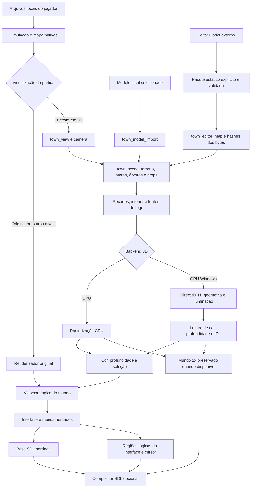
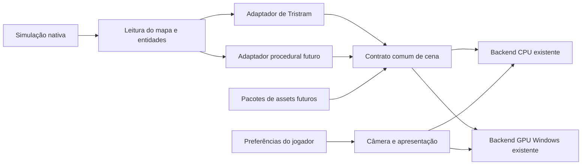
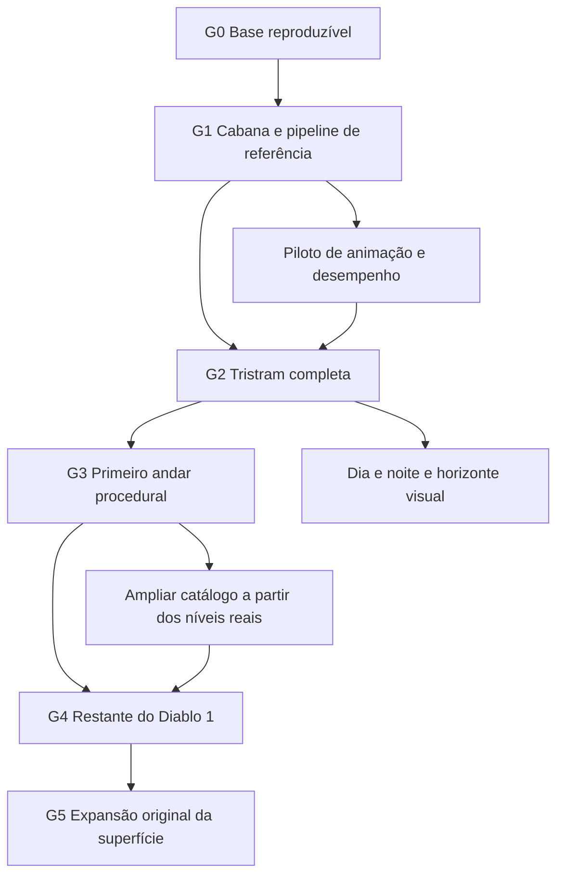
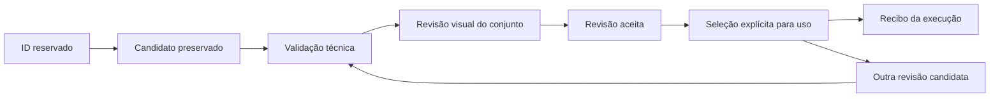

# Arquitetura e execução do Diablo 3D

O objetivo é reconstruir **o Diablo 1 inteiro em 3D**, permitindo alternar a visualização na mesma partida. Tristram é o primeiro ambiente de validação. Depois vêm o primeiro andar procedural da Catedral, os demais ambientes, personagens, monstros e efeitos. A expansão original da superfície fica para uma fase posterior à reconstrução do jogo.

Este é o guia operacional do desenvolvimento. Antes de iniciar uma mudança, o responsável consulta a etapa ativa, os contratos e a fila abaixo; ao concluir, registra o resultado e a próxima ação. O [roadmap](ROADMAP.md) descreve os recursos desejados; este guia determina suas dependências e o que permite avançar. As instruções para os agentes estão em [AGENTS.md](../AGENTS.md).

## Estado de execução

**Retomada de dois pilotos concretos, 9 de outubro:** o pedido humano de continuar o jogo antecipa a integração de um personagem existente e de um recorte pequeno do primeiro andar da Catedral, sem exigir arte perfeita de G1/G2. A frente de Personagens prepara Ogden com rig e idle já baixados; a frente de Procedurais prepara nove regiões próximas do mapa vivo, usando os módulos e consumidores privados aceitos. O principal aplica sequencialmente os patches, resolve o ponto comum em `town_view`, compila, valida e instala pelo launcher único. Não há geração paga, upload ou nova seleção automática de masters neste incremento.

**Ogden com rig e idle instalado, 9 de outubro, 14:16 (Brasília):** o mesmo **Iniciar-Tristram.cmd** usa agora SHA-256 `4dc510aac42ea81c86cdeb34a03593f5ecc9666c6e3a4af32505b9ee245fdb27`, 6.411.776 bytes, com aliases v4/quality/godot idênticos. A instalação acrescentou somente o pacote e a seleção exata de `tristram.actor.ogden/default`, revisão `ogden-idle-transport-r1-20261009`; preservou 44 arquivos existentes de conteúdo/tamanho/data, renovando depois somente o recibo do launcher. Os 12 vínculos arquitetônicos, a cabana leste, iluminação, configuração e saves ficaram intactos. Backups disponíveis, nenhum processo encerrado e nenhuma operação paga. Recibo privado `diagnostics/actor-procedural-integration-20261009/installed-20261009T171627Z/receipt.json`, SHA `75213b5dfdc4c0ce48212fb69cc01809ac6e64b19440225f656fb220954bd2c6`. Duas tentativas de preparo com ambiente incompleto foram revertidas e preservadas antes da instalação final verificada; o launcher não foi alterado.

O principal integrou o pacote congelado `4b634777…`, cinco módulos e hooks no relógio da simulação nativa. Passaram 194 verificações do helper/clock/candidato, 246 de loader/pose/composição e **1.348 verificações do desenho nativo offscreen**, sem falhas. O gate final produziu 20 PNGs: oito CPU solicitada, 11 GPU Radeon RX 570 sem WARP e um quadro deliberadamente descartado. Conferiu os 13 imports arquitetônicos reais, 333 chamadas de `ProcessTowners`, pausa/interpolação, picking/depth, recusas de pacote/seleção/estado, descarte da captura GPU parcial sem redraw CPU, recuperação na GPU e Home byte-exato. Evidência privada `ogden-render-root-r3/ogden-idle-evidence.json`, SHA `559555e796b1c1ccdd0abeb5094f82b04a3ccdf1345457b18196172fef690a36`, dentro do diretório acima. A primeira execução do renderer foi preservada como incompleta: duas cópias de teste exigiam separador final no override path; a correção atingiu somente a fixture.

O idle autoral mantém quatro segundos, sem esticá-lo para a sequência original de 16,65 segundos. Esse é um protótipo técnico: diffuse RGB 2048, skinning CPU, sombra nativa simples e yaw fixo; materiais PBR, sombras da malha animada e outros clipes ainda não estão implementados. O teste offscreen não prova gameplay física, diálogo, loop externo de pausa, FPS sustentado nem aprovação artística integral. Os demais atores continuam em volumes de sprites.

**Revisão humana e prioridade do herói, 9 de outubro:** Douglas aprovou a aparência do Ogden instalado e identificou o idle genérico semelhante ao herói. Esclareceu que o NPC não repete comandos de andar/atacar; a leitura do pacote confirma o clipe `Armature|Idle|baselayer`, sem ligação ao input/animação do jogador. A aprovação visual parcial conserva o modelo; o comportamento/animação ainda precisa de gestos próprios da referência nativa. Douglas aceitou deixar essa correção de idle na fila e pediu ver o herói em 3D. A mesma frente de Personagens prioriza o Guerreiro: ao abrir essa etapa havia referências e sprites, sem GLB/rig/clipe confirmado. O handoff privado do Guerreiro foi recebido em `diagnostics/characters-rigs/tripo-warrior-submission-20261009/r1/handoff.json`, SHA `8db7d49862691ef59533f858b90dccf5452a5136c0847073e8381f5de6299d7d`: variante light-unarmed, rig de 52 joints ponderados, diffuse 2K, 11.039 triângulos e zero clipes. A derivação corrigida mantém os masters e exige ainda compatibilidade da extensão `FB_ngon_encoding`, transporte/binding nativo e animações. Não anunciar idle, caminhada ou ataque inexistentes; não repetir geração paga. O herói ainda não foi integrado ou instalado. Após a avaliação local inicial, Douglas instruiu diretamente aquela frente a fazer como Ogden e usar agora Tripo; o principal verificou as mensagens humanas por `read_thread`. Essa autorização recente permite o fluxo Guerreiro r3 → modelo → rig pela Tripo, com um responsável único e identidade/custos registrados; não amplia orçamento de outras gerações, autoriza duplicações ou promove automaticamente o resultado. Não substituir um morador pelo herói. Runtime, build e instalação continuam sequenciais com o principal; a frente procedural segue em paralelo preparando fontes privadas.

**Catedral procedural — piloto técnico instalado, 9 de outubro, 15:54 (Brasília):** a mesma inicialização **Iniciar-Tristram.cmd** usa agora SHA-256 `87a441706d378d3583346023e53218c936304897900b6f610ad576e9830e21e5`, 6.525.440 bytes, aliases v4/quality/godot idênticos. R1/R2, recuperação de alocação e correção do enum de missão inativa foram integrados em 21 fontes/CMake; build 07 passou, com `/EHsc` efetivo em `town_view.cpp` e `town_gpu.cpp`. O piloto desenha nove regiões próximas no primeiro andar normal da Catedral. A entrada normal e F4 utilizam os hooks existentes; outros andares e níveis de missão continuam nativos. Piso/parede usam geometria e cores técnicas simples; texturas finais, cobertura artística completa e desempenho de gameplay ainda precisam de trabalho. Ogden e as seleções de Tristram foram preservados. A instalação trocou somente três executáveis, com backups e nenhum processo encerrado; preservou 48 arquivos do perfil por conteúdo/tamanho/data e renovou somente o recibo derivado do launcher. Recibo privado `diagnostics/actor-procedural-integration-20261009/cathedral-install-preparation-r1/installed-20261009T185440Z-df9c76ab375e49d4bbe9be905ecdea15/receipt.json`, SHA `d85d7f1e04d613f66e6edf5db5cf2f3d98ff1f086b926d99ad032e4a4dec7fe7`. Build congelada em `diagnostics/actor-procedural-integration-20261009/cathedral-combined-build-r4/receipt.json`. O recibo histórico R1 de 922 checks/22 PNGs permanece distinto dos novos gates do principal.

A frente procedural entregou R2 `475cd3ee…`, com paleta nativa 0–15, TRN, blend destino/origem e transparência técnica no backend GPU. Passaram 86.037 verificações de paleta, 1.424 de cobertura e 189.109 de frame/SOL/portas. A alocação tardia foi corrigida pelo suplemento `38119d3d…`: descarta o quadro parcial, limpa picking/HD/caches e permite retry imediato na GPU. O gate isolado do backend passou 8.359 checks/27 frames, 14 publicações e 13 recusas; imagens em códigos de paleta, sem aprovação artística. O mapa real passou o gate R3 de quatro falhas, depois repetido seletivamente no build 07 porque duas fontes de elegibilidade/captura mudaram. O enum global de missão inativa continua intacto, e somente o DTO capturado é canonicalizado; os consumidores recusam DTOs de missão. O gate final R4 na RX 570 sem WARP passou 157 verificações do harness, 188 seletivas e 93 de alocação: nove enums inativos aceitos, nove ativos recusados, 42 recusas de consumidores, uma transição de freshness, um DrawGame residual GPU real e quatro controles/falhas/retries, três warm e um cold. Sete PNGs e witness local de 290.243 bytes ficaram consistentes; nenhum RNG/mapa/SOL/TransList nativo foi alterado. Recibo `cathedral-native-root-execution-r4/execution-receipt.json` SHA `88753d266b8a6aa1f85f743b411ab21ff0cc9ef4b0f5fb9eccacf0f58040cc35`, checks SHA `45b4655c1b7df864208d339fcc1282957ba9e7f265cc84b090ab2371b84a5a23`, no diretório privado acima. Inicialização parcial com atores nativos staged e cenário parado: não comprova AI, save/load físico, gameplay, HUD, qualidade final ou FPS. A regressão justificada de Ogden passou as mesmas 1.348 verificações e 20 PNGs byte-exatos com o gate anterior; não foi repetida após a alteração exclusiva de contexto da Catedral. Próximo passo: testar a entrada física, movimento/combate/transições e medir o orçamento antes de ampliar o piloto e sua arte.

**Catedral — materiais nativos e otimização instalados, 9 de outubro:** o pedido humano de aproximar o primeiro andar do original reabriu somente os materiais do piloto e o custo da transparência. **Iniciar-Tristram.cmd** agora usa SHA-256 `929a78f6c15d7e642225c11bc035462c5d93009a87786165eddf9d48746be652`, 6.559.744 bytes, com três aliases idênticos. Build 09/r6 passou; sete fontes foram alteradas/adicionadas. A instalação trocou somente executáveis, preservou 48 arquivos de conteúdo/configuração/saves por bytes/tamanho/data e renovou somente o recibo derivado do launcher. Nenhum processo foi encerrado, nenhum payload instalado e nenhuma operação paga realizada. Recibo privado `diagnostics/actor-procedural-integration-20261009/cathedral-textures-perf-20261009/install-preparation-r1/installed-20261009T203355Z-d68943889fb9424d85a1fff7b3861eca/receipt.json`, SHA `386b08a5ffd6b681b9b24243eb6a45c5896225e80c7d654d05e8a4e7b16a0587`.

O piso usa CEL/MIN já preparados pela engine, bitmap nativo 64×32 e cobertura independente; o footprint visual corrigido fica separado da malha física original. Alvenaria usa faixas nativas orientadas por face/fonte SOL, com cisalhamento e inversão separados da coluna MIN; madeira vem de um pequeno patch do CLX da porta. Materiais repetidos, doadores, caps e faces sem referência continuam **aproximações**, sem afirmar fachadas, alturas, arcos, escadas ou detalhes finais. Picking mantém seus bindings nativos; a cobertura visual do piso muda deliberadamente em relação ao quad técnico antigo. Cache separado de Tristram: 72 entradas/162.304 bytes de pixels+coverage no recorte testado, sem novas decodificações nos quatro redraws mornos. Limites 512 entradas/8 MiB, sem eviction nesta etapa; esgotamento exige fallback nativo até reset/novo epoch, dependência antes de ampliar o orçamento do andar.

O gate material passou **168.022 verificações**, comparando 81.152 texels com os rasterizadores nativos reais, dois pisos assimétricos adjacentes, paredes perpendiculares, joins, madeira fechada e cold/warm/epoch. Oito publicações RX 570 sem WARP, sete capturas com geometria forçada, witness nativo exato de 290.243 bytes e física estável dentro do candidato. Porta aberta não estava presente na fixture: sua operação não foi testada. Recibo `cathedral-native-texture-root-execution-r1/execution-receipt.json`, SHA `2752fc9fe5c96039b568f2cfe5cc4e50bcd663a9a10631b19e025d2011bc57e3`. O gate de contexto/alocação separado passou 157+188+93 checks e quatro falhas/retries imediatos na GPU sobre o novo build (`cathedral-native-root-execution-r5`, recibo SHA `cdd24a31702b05d107a6a60ecb82c2da868331d9c541dcf81b0ae605bb80d507`). Ogden/Tristram repetiram 1.348 checks e 20 PNGs byte-exatos, sem alterar seleções.

A transparência agora copia somente a área conservadora de cada triângulo, preservando ordem, shader, LUT, profundidade, seleção e os limites anteriores. A/B isolado: nove buffers completos/1.334.272 pixels de cor/pick/depth byte-exatos. A/B nativo do backend: 12 PNGs idênticas. Na versão texturizada final, seis poses/qualidades, cinco warmups e 20 amostras por caso mantiveram GPU real e zero uploads mornos de texels/LUT. Medianas do custo do renderer: perto sem AA **13,42→10,27 ms**, longe com AA2x **77,73→65,86 ms**; os demais casos e p95 estão em [GPU-RENDERER.md](GPU-RENDERER.md#catedral-materiais-nativos-e-cópia-regional--9-de-outubro). O quadro frio inclui criação de recursos; os 1.131 ms históricos não eram FPS estável. Estas medições excluem gameplay, HUD/apresentação e preparação nativa externa; não prometem FPS sustentado. Evidência `cathedral-textures-perf-20261009/textured-comparison-r1.json`, SHA `25e70d64ea281927da184c20b402bf6c1b588a41160930f375dd8b3483e9c563`, no mesmo diretório privado. Próximo passo da mesma fila: testar entrada/movimento/combate/transições e portas na partida, revisar formas/detalhes no primeiro andar e medir comandos/readback/cache antes de ampliar os níveis. Home continua usando o desenho original; não comprova fidelidade da geometria.

**Catedral — revisão humana e continuidade, 9 de outubro:** Douglas relatou que o primeiro andar está funcional e até jogável nesta fase, mas em alguns trechos caminhados a visão volta de 3D para 2D e as paredes não correspondem à composição original. Um segundo teste humano também mostrou outra seed em 3D, sem informar seu ID. São relatos de gameplay, sem equivaler a QA integral, aprovação de todas as paredes ou cobertura de outras seeds. O defeito reabre somente continuidade do piloto e materiais por peça/face; criaturas e objetos interagíveis ficam preservados. O executável correto `929a78f6…` e os três aliases foram conferidos. As nove regiões são selecionadas novamente em torno do jogador, portanto sair do recorte inicial não é uma causa comprovada de fallback.

A triagem confirmou que a alvenaria seleciona somente a primeira faixa MIN superior utilizável, retifica 32×16 e a repete; em falta de faixa usa doadores 4/0 por eixo. O oracle anterior valida esses texels transformados, sem provar fachada completa, faixas de altura e detalhes. A causa específica da volta ao 2D ainda não foi reproduzida: recusas precoces de preparação/desenho perdem o motivo detalhado ou retornam antes do trace final. O log real da sessão registrou um episódio de capacidade do cache GPU seguido de recuperação, mas não contém andar/posição/horário por linha e não comprova esse evento na Catedral. Host-cache, proveniência, freshness, capacidade de texturas GPU e admissão de overlays são candidatos distintos, sem atribuição automática ao relato. O humano respondeu diretamente que não consegue identificar o ponto; não repetir a pergunta, e preparar diagnóstico limitado antes da recusa precoce. Evidência privada somente de leitura: `diagnostics/cathedral-gameplay-triage-20261009-r1/receipt.json`, SHA `87c3e8610189a9d3919d9774b7c2c13ced5421573b50849f410983d708206352`; sete fontes estáveis, aliases identificados e subset seguro do log live, sem execução de jogo/build/GPU, escrita no perfil, encerramento de processos ou operação paga.

**Próximo incremento da fila procedural:** o mesmo especialista prepara diagnóstico/repro privado e bases reservadas; o principal conserva Source/CMake/build/GPU/instalação/Git/guia. Primeiro registrar causa/contexto de recusas e reproduzir uma rota curta de movimento/troca de região/porta; corrigir a causa comprovada sem publicar um quadro parcial inválido. Em paralelo ao diagnóstico, revisar o vínculo de cada face com peça/coluna/faixa MIN e referência nativa, distinguindo faces conhecidas de aproximações para partes não vistas, sem trocar por doador incorreto. Validação proporcional: witness da simulação, rota reproduzível, correspondência de materiais e cache morno; não duplicar gates amplos nem gerar novos assets. A partida observada em execução foi preservada. O novo requisito de câmeras abaixo não interrompe esta prioridade.

**Catedral — diagnóstico de continuidade instalado, 9 de outubro, 18:48 (Brasília):** o mesmo **Iniciar-Tristram.cmd** usa agora SHA-256 `2ff14e24d597a667c794c82f448b218d37a44d9833409efff6ba2d6432dbe89a`, 6.573.056 bytes, com aliases v4/quality/godot idênticos. Duas fontes acrescentam observação antes das recusas, sem mudar políticas de fallback, câmera, geometria, materiais ou limites dos caches. Registra seed, posição inicial/atual, etapa, peça/eixo/coluna quando disponíveis e estado GPU anterior à limpeza. POD sem alocação, logger protegido e frequência limitada; preparação aceita nunca anuncia recuperação, e só publicação completa registra `Published3D`. O retorno indevido durante gameplay continua aberto: nenhum ponto físico foi reproduzido nem causa específica atribuída. Detalhes e coleta em [CATHEDRAL-CONTINUITY.md](CATHEDRAL-CONTINUITY.md).

Build separado passou e foi congelado em `diagnostics/cathedral-gameplay-triage-20261009-r1/compiled-r1/receipt.json`, SHA `8f9542e24c0bd36a7f0f1627309b7bcb29b646fee725edc34ecaabf576ecaf2d`. A revisão independente não encontrou bloqueador. Gate CPU: **121 verificações**, oito recusas reais de `new`, três preparações aceitas sem falsa recuperação, duas linhas SDL e falha de formatação contida. Gate GPU: **196 verificações**, somente BeforeOpaque/BeforeReadback warm, dois retries imediatos e quatro linhas SDL de falha/recuperação na Radeon RX 570 sem WARP nem redraw CPU3D. Cor lógica/HD2× byte-exata com os controles, picking/depth exatos em um probe real; witness nativo de 290.243 bytes intacto. Receipts CPU `cpu-gate-r1/execution-receipt.json` SHA `8cb5c7755bc9f847cfac49c1ec578dce7613b3bfbdada8648087afbdd88bf0a5` e GPU `gpu-gate-r1/execution-receipt.json` SHA `9eaa079408eca2e4a67cb8057f50863c8046562ed8b4342d1efb109442026463`, no diretório privado acima. Uma seed, inicialização parcial com atores staged; não comprovam gameplay completa, perdas físicas do device ou FPS. Nenhuma suíte ampla foi repetida. A instalação preservou **49 arquivos atuais do perfil** por bytes/tamanho/data, renovou somente o recibo derivado e trocou três executáveis com backup, sem payload, encerramento de processo ou custo pago. Recibo `install-preparation-r1/installed-20261009T214803Z-77202c29d25a45fb99d001946be3c9b7/receipt.json`, SHA `b5f3240f12209c12cf4855a527762de54d1e69a16bfad368b06369482180630a`.

O mesmo runner reconstruiu uma única vez o frame do Snapshot/Scene corrente após controle GPU saudável: identidade/contagens conferidas com o diagnóstico publicado, witness e todos os contadores de textura intactos. Ledger privado: 846 triângulos, 192 cutaways, 72 materiais preparados e 24 doadores, zero ausências/divergências de vínculo. JSON validado em 273.686 comparações estruturais, sem afirmar fachada completa, pixels visíveis, frame interno ou submissão GPU de cada face; pose não especificada. Ledger `gpu-gate-r1/run-01/native-material-ledger.json`, SHA `36880e11e889c2e93cd496f02f4c76ccb09abbd6b716694e80c28daf4710faf0`. A mesma frente procedural recebeu esses dados para preparar a correção de camadas/UV por peça e face, preservando orçamento e colisão. Próxima ação de continuidade: coletar o novo trace antes de outra inicialização e reproduzir a classificação observada; não repetir a pergunta sobre posição que o humano já não soube informar.

**Upstream — revisão isolada, 9 de outubro:** a autorização humana encaminhada pela coordenação permite aproveitar correções úteis sem sincronização cega. Os commits oficiais `bf574c9b74f1d718b0bcee15d648b20a8bfc927c` e `a45c53bd5994c87ab75a433867ce3d724cbf4e0f` foram obtidos e analisados somente para leitura. Party portraits corrige divisor de mana máxima zero e TRN/offsets de retratos multiplayer; é útil, requer loader e seis tabelas juntos e não equivale ao defeito de cores na seleção de herói. Tártaro tem catálogo parcial e requer acrescentar `tt` à lista explícita de empacotamento. Nenhum desses patches foi aplicado ou instalado nesta revisão. Integração mínima e teste específico ficam na fila do principal, com autoria/licença herdadas e sem tocar candidatos de HUD/câmera. A janela CPU de uma thread foi liberada para finalizar o vídeo horizontal privado antes de novas rodadas de engine.

**Câmera — duas vistas e obstrução local, novo requisito de 9 de outubro:** Douglas pediu somente terceira pessoa acompanhando o personagem e primeira pessoa no ciclo/interface de gameplay, conectadas pela roda do mouse. A aproximação segue o eixo cabeça/olhos calibrado por classe/altura; o limiar próximo entra em primeira pessoa e afastar retorna à terceira. Outros modos saem do ciclo de gameplay, conservando ferramentas de diagnóstico necessárias. A câmera deve continuar seguindo e atravessar o cenário; objetos que a contêm ou obstruem ficam temporariamente ocultos somente para o jogador local e voltam ao sair. Colisão/comandos do personagem e visibilidade compartilhada/multiplayer permanecem nativos. O candidato privado único foi recebido em `diagnostics/camera-follow-visibility-20261009/r1/candidate-handoff.json`, SHA `43791700bb4c3682f379e575803483acb6bb9395382f0ec00cfd92c44120d227`, com 11 arquivos/19 blocos reservados. Exige rebase por blocos em `town_view` para preservar o diagnóstico recém-instalado, compilação e validação proporcionais; não copiar a fonte inteira. V1 oculta somente arquitetura local de Tristram, sem árvores/props/resíduos/Catedral e sem calibração real por classe. Pedido humano de aplicar está autorizado; integração sequencial pelo principal após a prioridade atual e a janela do vídeo, sem nova pergunta. Preparado, ainda não compilado/testado/instalado nesta revisão.

O requisito visual adicional deste incremento é comparar a paleta das estruturas e a proporção da Catedral exterior com o original, casas e personagem. A frente existente de Modelos prepara somente um candidato privado baseado nessa evidência; preserva perfis, masters, composição aceita e os resíduos da taverna já corrigidos. A revisão visual não autoriza reduzir malhas arbitrariamente ou bloquear o pequeno teste procedural. Capturas offscreen e ilustrações CPU existentes continuam identificadas como tais, sem serem anunciadas como gameplay da versão instalada.

**Novas frentes por pedido explícito de Douglas, 8 de outubro — montagem de Tristram e piloto procedural:** as capturas humanas da taverna mostram uma parede isolada e uma pedra entre a fachada esperada e a construção aplicada. O defeito reabre a composição dessa instância, sem justificar regenerar seu master. O chat **Map Builder — montagem e revisão de Tristram** (`01a11e8d-b03c-7ca3-9389-14b6df0d721c`) assume a revisão de posicionamento, orientação, escala uniforme e identificação dos resíduos, começando pela taverna. Reutiliza o editor, o snapshot, os IDs e a ponte Godot existentes; salvar/exportar não promove aprovação nem altera colisão. A geração de arte permanece com a frente de Modelos.

Douglas também pediu começar agora os níveis procedurais com um especialista dedicado. O chat **Níveis procedurais — especialista em Catedral 3D** (`01a11e8d-0494-76d0-9dbb-d362fb54b2df`) inicia o piloto do primeiro andar da Catedral em paralelo a Tristram. Esse novo requisito antecipa a preparação de G3; não conclui G1/G2. A primeira entrega é um adaptador privado do mapa vivo e um conjunto modular técnico com fixtures de seeds, salas, corredores, cantos, portas e escadas. Gerador, mapa, SOL, RNG, simulação e saves nativos permanecem autoridades. A arte técnica de validação não é arte final. Não há nível 3D instalado ou validado nesta abertura de frente. Integração produtiva, build compartilhado, instalação, Git e este guia continuam com o principal; fontes compartilhadas são preparadas em cópias privadas com reserva e hashes. Nenhuma geração paga é autorizada por este incremento.

**Taverna — resíduos corrigidos e instalados, 9 de outubro, 00:44 (Brasília):** o principal integrou somente a supressão de 20 células da fachada nativa antiga e de uma pedra com identificação exata de quatro tiles. Os dois D3Ds selecionados, master, proporções, texturas, iluminação, mapa, SOL e atores foram preservados. O replay próprio repetiu 113 verificações por variante, 54 comparações e oito ângulos; as imagens nativas e os snapshots de arquitetura/mapa ficaram byte-exatos, e os resíduos desapareceram. A baseline sem modelo e os demais casos de loader foram revisados nos recibos do responsável, sem nova execução desses casos pelo principal. A suíte ampla conserva uma falha histórica de footprint da Catedral em ambas as versões; não foi declarada aprovada.

Instalado no mesmo **Iniciar-Tristram.cmd**, SHA-256 `6f6c6c15bbffc67b0dcf27e7fbdc741a3aa31a1159f124ab55fe3a6709fca72f`, 6.334.464 bytes, aliases v4/quality/godot idênticos, backups e zero processos encerrados. Os 44 arquivos do perfil preservaram conteúdo/tamanho/data na instalação; o preparo posterior mudou somente `runtime-baseline-receipt.json`. Recibo privado: `diagnostics/tristram-map-builder-20261008/root-review-20261009/installed-20261009T034437Z/receipt.json`. Código publicado em `feb9ca77e73e66c2cc209af51ca9bb9b3504e6c1`, somente dois arquivos e 27 linhas adicionadas. Sem nova execução GPU, benchmark de FPS, teste físico ou aprovação artística integral. Próxima ação: confirmar a composição na partida e continuar a revisão dos demais objetos com o Map Builder. O addon ainda não foi ativado: a revisão encontrou divergência de identidade entre snapshots e estado aplicado antigo após falha; a frente prepara R2 privado, incluindo preservação dos demais vínculos na aplicação por item.

A revisão privada R2 do Map Builder foi recebida em `diagnostics/tristram-map-builder-20261008/tool-r2/handoff.json`, SHA `68e5099e3e7007ac805e069cc98b0df451f0ba57db8e9615eb70e8389974020b`. A revisão independente somente por leitura conferiu os cinco candidatos/bases/patch e 21 evidências, sem novo bloqueador: vincula identidade completa, limpa estados antigos em falhas e aplica um item preservando os outros 11, com lock/revalidação e rollback de bytes. Os recibos do responsável distinguem 66 checks core, 117 callbacks headless, 55 negativas mais cinco de autoridade, 37 de ponte hermética e 32 comparações C++; o principal não reexecutou essas provas. O addon continua desativado, sem nova instalação, revisão artística ou prova de GPU/FPS. Próxima ação dessa frente: gates próprios delimitados e integração da ferramenta, preservando a taverna já entregue.

**Piloto procedural entregue para revisão, 9 de outubro:** o especialista congelou 35 inputs no manifesto privado `diagnostics/procedural-cathedral-20261008/reports/handoff.json`, SHA-256 `261925806df299479bfbf9bb75f3baf5c5880e4292ada3795c7cb4bbffe5cfe3`. O principal conferiu a identidade desses inputs e do patch, sem executar os testes nesta passagem. O responsável reportou 22 snapshots nativos de duas seeds, 1.267.379 verificações do adaptador e duas cenas privadas salvas/reabertas no Godot. São evidências técnicas privadas, sem nível instalado ou jogável. Permanecem pendentes a classificação visual completa dos tiles, os encaixes — incluindo uma parede técnica que encobre parte de uma porta aberta —, luz/transparência e integração ao runtime existente. O contrato e os limites estão em [PROCEDURAL-CATHEDRAL.md](PROCEDURAL-CATHEDRAL.md). Próxima ação: revisão independente do pacote e fechamento desses casos em uma nova revisão privada, preservando o gerador e o pacote congelado.

A frente procedural também entregou uma revisão privada dos encaixes em `diagnostics/procedural-cathedral-20261009-doorfit-r1/reports/handoff.json`, SHA-256 confirmado `b8c6778890591d892d218dd9a631eef2fda16bc326896e67ec015bfc4769df0f`. A revisão independente, somente por leitura, conferiu 143 inputs, o ledger de 237 cenas e a preservação dos 35 inputs anteriores; não encontrou novo bloqueador no núcleo do recorte. O código e os logs cobrem 76 snapshots e 24 ciclos nativos, abrindo uma porta por vez; os casos entre regiões são sintéticos, e parte do batente continua visível. Isso não equivale a nova execução pelo principal. Foi identificado um bloqueador nos consumidores antigos: o glTF guarda escala apenas em metadados e tem uma paleta insuficiente para os módulos novos; o importador Godot ignora escala e não recusa schema desconhecido. O especialista recebeu a próxima entrega delimitada: novos exportadores privados compatíveis com schema 2, escala/proveniência e bounds conferidos após salvar/reabrir, preservando os pacotes congelados. Nenhum módulo procedural foi integrado ou nível habilitado na partida.

A nova revisão privada dos consumidores schema 2 foi recebida em `diagnostics/procedural-cathedral-20261009-consumers-r1/reports/handoff.json`, SHA `a06195d7d98efb171ef996f217da3ab818a3d12a8649aae6ecce4ba23a1c7650`. A revisão independente somente por leitura confirmou 459 inputs/cópias, 270 saídas, os pais 35/143 e o ledger anterior de 237 registros, sem divergência. Os recibos do especialista cobrem 85 glTF reabertos, 85 cenas Godot salvas/reabertas, 40 recusas de entrada e oito recusas de saídas adulteradas; são cenas nativas reutilizadas e casos sintéticos identificados, sem novo gerador ou gameplay. Escala efetiva, 16 módulos, proveniência e bounds por vértices transformados estão consistentes. Foram encontrados dois bloqueadores no exportador Python isolado: aceita revisão positiva desconhecida e permite fragmento com `sourceInstanceId == id`. Godot e o verificador glTF independente já recusam ambos, protegendo os 85 resultados finais; as negativas de entrada ainda não os incluem. Auditoria privada `root-review-20261009/audit.json`, SHA `9f6ca395adc9f89033d04f587dcb86888a4ebfc55dcbee37fadcf71c51b30bdc`. Esses dois defeitos motivaram a revisão mínima R2 dos contratos e negativas correspondentes descrita em seguida. Nenhum consumidor ou nível foi integrado; serialização técnica não comprova arte, luz, GPU, desempenho ou nível jogável.

O especialista entregou em seguida consumidores R2, manifesto privado `diagnostics/procedural-cathedral-20261009-consumers-r2/reports/handoff.json`, SHA `156da1bda7971e21ad93db2d10b8184b8fef9ad5c3cffecb68d2cc2a6557fc0c`. O delta declarado é somente a recusa das duas identidades inválidas no Python, com quatro novas mutações negativas. Reportou 24 entradas recusadas antes de criar saída, quatro recusas adicionais no Godot inalterado, um controle Godot válido e 85 glTF/BIN reexportados/reabertos, com 170 arquivos byte-exatos com R1. Godot e verificador permanecem inalterados; não repetiu os 85 casos Godot sem mudança. Os 226 inputs e 179 outputs R2 incluem oito saídas inválidas deliberadas da baseline, explicitamente separadas. A revisão independente do principal, somente por leitura, concluiu sem bloqueador: conferiu os 226 inputs/cópias, ledger 179, pais preservados, 170 arquivos idênticos e as 24 recusas antes de criar saídas, em 2.870 comparações de identidade sem divergência. Auditoria privada `root-review-20261009/audit.json`, SHA `a535a06c89b3bb2e70361c5077b4a8289cc3d80bd825c9c68e96d3b3aa1a15ab`. Os consumidores/testes não foram reexecutados pelo principal. O contrato privado está aceito; nenhuma integração, arte final, gameplay ou execução GPU é anunciada. Próxima ação: delimitar o gate de integração do piloto na fila existente, preservando os pacotes e sem edição concorrente de Source/CMake/build.

**Remapeamento de movimento — R2 instalado, 9 de outubro, 01:35 (Brasília):** a revisão de R1 encontrou o primeiro S após gamepad escapando para magias pela ordem de classificação do dispositivo. R1 foi preservado e recusado; a frente de câmera entregou R2 privado, manifesto `d4fde9f8bf340eb28a61af1e4324eaa24b62605a51ff2c4865b4469306a458dc`. Após revisão independente, o principal conferiu as 16 bases e os cinco arquivos novos, integrou a proposta completa preservando EOL/dependência idêntica e acrescentou somente um include de teste e quatro conversões explícitas de texto exigidas pela compilação. Release compilou/vinculou. Passaram 5.341 verificações de input puro, 60.944 de configurações, 3.792 de runtime, 29 de colisão, 946 do HUD e o gate separado de câmera com 24 PNGs CPU/GPU offscreen. Recibo técnico corrigido `diagnostics/movement-keymapping-20261008/root-review-20261009/technical-gates-r2-02.json`, SHA `956faf552c6ab9fc06b6393c555839b2a04908feb45b8f511689b38f2bdb07e5`; revisão 01 preservada.

O menu principal real passou **3.324 verificações** em português/inglês e 640×480/1920×1080, incluindo conflitos, captura, solturas/repetições, Escape, desassociação e reset completo/parcial. Quatro pares escritor/leitor confirmaram persistência pelo INI sem regravação na leitura. A fixture privada 03 corrige dois pressupostos do diagnóstico anterior — acesso a campo privado e suporte inexistente de Return —, sem alterar produção. Recibo final `final-gates-r2-01.json` no diretório acima, SHA `49f8ea09924d683403e5c6ddc1f3541383c718aecfefc19e5c0f4a64be7ecdd7`. Duas ações efetivamente editadas e oito IDs/defaults conferidos; idioma carregado do INI, sem clique de troca. As 20 capturas indexadas não incluem o fundo RGB final. Duas amostras PT-BR foram inspecionadas; instruções/descrições nativas longas podem recortar em 640×480. Input/runtime simulam os serviços físicos SDL; nenhuma prova de input/foco/Alt+Tab físicos, gameplay humana ou FPS sustentado.

Instalado no mesmo **Iniciar-Tristram.cmd**, SHA-256 `1a037ebe62c0db0048d7538a53796e8b1aa42ec954dcd7863f6090b5b4e27adc`, 6.348.800 bytes, três aliases idênticos, backups e zero processos encerrados. Os **44 arquivos do perfil** preservaram hash/tamanho/data; o preparo posterior mudou somente `runtime-baseline-receipt.json`. Recibo privado: `diagnostics/movement-keymapping-20261008/root-review-20261009/installed-20261009T043543Z/receipt.json`. Publicado em `a4a87d20e58781395ed33bda6f9298c71aa589ad`, 20 fontes e o documento responsável, preservando o índice/trabalho das demais frentes. O Site publicou o devlog PT/EN em `152ed186a`, preservando os fatos e limites; o responsável reportou 72/72 verificações públicas. O principal conferiu o commit, sem repetir os testes do site. Detalhes em [TRISTRAM-FIRST-PERSON-INPUT.md](TRISTRAM-FIRST-PERSON-INPUT.md). Próxima ação: validação interativa pelo launcher único; o HUD exclusivo permanece em gate privado separado. A frente de Configurações recebeu o defeito visual compacto para investigar uma proposta privada mínima, sem writer concorrente de captura ou Source; essa proposta foi pausada pelo novo pedido humano de auditoria da qualidade das malhas.

**Limpeza nominal concluída, 9 de outubro:** os sete executáveis históricos foram decididos por caminho, consumidor, tamanho e SHA. Foram reciclados individualmente `devilutionx-tristram-door-window.exe`, `devilutionx-tristram-v3.exe`, `devilutionx-tristram.exe` e `devilutionx.exe`, todos em `build/`: **23.268.864 bytes permanecem recuperáveis na Lixeira**. Foram retidos os três `devilutionx-tristram-v4-before-{animated-logo,lighting,meshy-review}.exe`, **17.775.104 bytes**, com consumidores históricos concretos. Não houve exclusão permanente, esvaziamento/enumeração da Lixeira ou alegação de espaço livre recuperado.

A prova própria criou, reciclou e restaurou nativamente um único descartável de 169 bytes no disco D, mantendo caminho, ID e SHA. O primeiro callback recebeu sucesso não zero `0x00270008`; o helper antigo o interpretou incorretamente como falha e comparou o pai físico com a pasta virtual. Os recibos anteriores foram preservados, e a recuperação só ocorreu depois de resolver o item virtual pelo caminho físico exato e conferir identidade, origem e verbo `undelete`. O novo operador nominal foi revisado independentemente por leitura, compilado e passou preflight sem mutação; cada uma das quatro execuções teve processos conferidos novamente, callback/PIDL durável, bytes/SHA/FileID/propriedades originais e `undelete` habilitado, além de ausência do caminho antigo. Nenhum processo foi encerrado. Cada item tem recibo e PIDLs próprios para recuperação; não foi restaurado e reciclado novamente para fabricar prova.

As **32 testemunhas protegidas** — launchers, quatro executáveis atuais, três backups, controles/cache do build e 21 fontes/dependência da entrega — e os **44 arquivos do perfil habitual**, incluindo saves e caches de modelos/mapa, ficaram idênticos em bytes/tamanho/data. Os demais modelos, masters/LODs, assets, áudio, fontes, bibliotecas, objetos, perfis e diagnósticos ficaram estruturalmente fora da allowlist, sem nova hashagem integral dessas árvores. O iniciador único e o executável atual `1a037ebe…` foram preservados. Recibo final privado: `diagnostics/build-cleanup-20261008/root-review-20261009/root-cleanup-final-01.json`, SHA `d5c86a969a5bd5ea26e595c387f51bc05a6938f3904acbff6739edad00eab622`. Limpeza encerrada; não ampliar os alvos sem nova decisão nominal.

**Complemento da limpeza, 9 de outubro — somente a build atual na pasta operacional:** o novo pedido humano de manter a versão mais atual reabriu nominalmente apenas os três backups antes retidos. `devilutionx-tristram-v4-before-animated-logo.exe`, `devilutionx-tristram-v4-before-lighting.exe` e `devilutionx-tristram-v4-before-meshy-review.exe` foram reciclados individualmente, somando **17.775.104 bytes recuperáveis**. Não houve dependência corrente ou processo desses executáveis identificado; os antigos auditores que os usavam como testemunhas continuam históricos, com recibos intactos, e não devem ser repetidos com os pressupostos antigos. A promessa de localização do backup da logo no README da raiz foi atualizada para o recibo recuperável; as referências às auditorias antigas foram preservadas. A operação nativa comprovou SHA/tamanho/FileID, propriedades de origem, PIDLs duráveis e `undelete` habilitado por arquivo, sem executar restauração. Os **101 arquivos protegidos**, **44 arquivos do perfil** e os **quatro itens já reciclados** ficaram iguais em bytes/tamanho/data; a comparação inicial dos 49 registros do coordenador também não teve divergência. O executável atual e seus aliases continuam em `1a037ebe…`, 6.348.800 bytes, e o launcher único foi preservado. Nenhum processo foi encerrado; sem exclusão permanente, esvaziamento/enumeração da Lixeira, novo runtime, teste de jogo ou GPU. Os sete executáveis históricos nominais somam **41.043.968 bytes na Lixeira**, sem alegação de espaço livre recuperado. Recibo aditivo privado: `diagnostics/build-cleanup-20261008/root-review-20261009/root-cleanup-three-final-01.json`, SHA `a862fd50a5ac0006db4646fabd5c859a095eee43664cb9644aa18bd27103df01`. O recibo anterior `root-cleanup-final-01.json` permanece byte-exato em `d5c86a969a5bd5ea26e595c387f51bc05a6938f3904acbff6739edad00eab622`. Escopo encerrado; nenhuma outra build, cache, asset, master, modelo, áudio, fonte ou perfil foi alvo deste complemento.

**HUD R1 exclusivo — candidato privado em revisão, 8 de outubro:** Douglas pediu que a interface do projeto seja a única carregada/apresentada, preservando suas funções. A auditoria confirmou uma única skin R1 no quadro HD normal, mas também carga/preparação decorativa antigas e retornos à aparência herdada em estados incompatíveis ou falhas. Isso reabre somente essa dependência; não reabre a correção de paginação Gameplay, a arte R1, o mundo ou a base de desempenho aceita. A frente existente de HUD preparou cópias congeladas de 14 fontes modificadas e dois módulos novos; três headers adicionais permanecem idênticos como dependências da compilação privada. Manifesto privado: `diagnostics/hud-exclusive-20261008/candidate-r1/handoff.json`, SHA-256 `55889f2ed0f4b79faaa729cc917e7f61dc1cf29d660750694c06e6771d4d8a16`. O candidato compartilha uma fonte autoral R1 entre apresentação HD e recuperação CPU, congela os dados visuais por quadro e migra os consumidores decorativos sem repetir a lógica do jogo.

A fixture privada R1 foi entregue e sua identidade conferida; a revisão estática encontrou um bloqueador: falha ao reservar o scratch do cursor pode fazer a recuperação pintar sobre o cursor já desenhado e preservar um fundo incompatível. O R1 não será promovido. A frente HUD entregou a revisão privada R2, preservando R1, com captura anterior ao desenho nativo, recuperação ordinária após falha e asserções de remoção imediata do cursor, fase de submissão, receita congelada e estado após recuperação. Manifesto R2 SHA-256 `e19c5c30937388ec89364a5de2dbb63a2132031c8d3aa65bc6b4ff2ca5cf5f1c`; fixture R2 SHA-256 `4b808b5d7e9724fc85e4c16236c8364c1acf9a27b4a59b49114571af60231bdb`. A revisão estática independente não encontrou novo bloqueador, mas não equivale a execução. O principal acrescentou gates privados de erro PNG em `InitMainPanel` e do caminho real de `RenderPresent`, sem alterar a fixture do responsável. A primeira tentativa de compilar a baseline privada falhou na infraestrutura de includes: headers originais e copiados foram incluídos juntos por caminhos relativos. O helper privado V2 resolveu a duplicação e compilou/vinculou a baseline. A compilação do candidato parou na fixture privada por falta de include explícito de `primitive_render.hpp`; suas funções eram usadas pelo teste sem declaração direta. Uma nova cópia da fixture acrescenta somente esse include, preservando as asserções e os congelamentos anteriores. A baseline privada 03 compilou/vinculou e todas as unidades do candidato 03 compilaram; o link deste parou somente no alias `window` usado pelo suplemento diagnóstico, declarado no header mas sem definição no caminho SDL2. A nova cópia privada remove quatro referências redundantes, conserva `ghMainWnd` e a janela dummy oculta e não cria stubs. Sua recompilação/relink deve reutilizar exclusivamente as árvores/objetos 03 imutáveis, pois a correção independente da taverna já avançou no Source compartilhado. O helper de relink e suas bibliotecas foram conferidos. As duas tentativas privadas 04 pararam no bootstrap de validação: `Get-FileHash` não foi reconhecido no ambiente filho. Nenhum compilador, linker ou teste foi executado nessa tentativa; não é falha das fontes C++. Os diretórios 03/04 continuam imutáveis. A preparação privada HUD05 foi recebida em `diagnostics/hud-exclusive-20261008/runner-relink-preparation-r3/preparation-manifest.json`, SHA conferido `35bb0197cce6d35a854e3cc492c4c9a006e32e00ac3d8f738bb464305f4ff74d`. O responsável reportou análise sintática e preservação dos inputs 03/04; o bootstrap filho agora usa linguagem/.NET e os mesmos nove campos. O principal conferiu o manifesto e leu a receita, mas não executou o novo bootstrap, compilação, link ou testes. A preparação permanece pendente de revisão e execução próprias. Nenhuma fonte produtiva HUD foi alterada para contornar esses erros. **Nenhum teste de execução, instalação ou ganho de FPS foi comprovado para essa mudança.** O HUD exclusivo ainda não foi instalado; o HUD habitual foi preservado nas entregas independentes de taverna e controles descritas acima. Antes da integração: conferir identidade/origem dos includes, compilação privada, controles/hitboxes, Gameplay 1→2→1, SP/MP/chat/controle/compacto, cursor/UI tardia, resize/reset/fade, erro de recurso e recuperação após falhas de criação/upload/desenho. Não remover recursos funcionais, ocultar controles ou declarar exclusividade global das telas R2 ainda herdadas. Fontes produtivas, CMake, build compartilhado, perfis, instalação e Git continuam com o principal; a frente HUD é a única preparadora do candidato. A logo 3D e as demais famílias R2 ficam fora deste incremento. Próxima ação: revisar e executar o bootstrap privado 05, preservar a toolchain/bibliotecas resolvidas e os inputs 03, recompilar somente a fixture, relinkar as duas versões e executar os gates; somente promover após os critérios acima.

**HUD nas páginas Gameplay — correção técnica instalada, 8 de outubro, 19:51 (Brasília):** o novo relato reabriu somente geometria/paginação e convivência com o HUD existente. A reprodução própria confirmou que a página longa usava o limite legado de 128 px, invadia os globos e fazia o compositor recusar a arte HD; a segunda página menor não invadia. Desenho e capacidade agora compartilham `gmenu_settings_bottom()`, derivado dos footprints visíveis, inclusive Chat/Friendly em multiplayer e layouts autorados. Sem redesenho, alteração de arte/hitboxes/handlers, renderer ou assets. A frente HUD preparou o candidato e a fixture privados; o principal integrou, compilou, executou e instalou.

Passaram **59.916 verificações de configurações**, **2.777 de input** e **946 do HUD**. A comparação antes/depois usou o mesmo diagnóstico nativo original/SDL software em 36 quadros por versão, com 623 verificações estruturais por execução: páginas 1→2→1 repetidas, rodapé por Enter/mouse, painéis abrir/fechar e resize lógico. O baseline apresentou overlap e `Inactive`; todos os quadros elegíveis do candidato apresentaram a arte HD sem overlap/`Failed`. Os 13 retângulos do HUD ficaram idênticos entre versões e **14 retornos tiveram zero pixels inferiores diferentes**. Amostras Full HD/compactas foram inspecionadas visualmente. Instalado no mesmo **Iniciar-Tristram.cmd**, SHA-256 `b14993a682f85b4d3e8070ebfce59a4fddc517224ce1ee27efb7a06dd57e1692`, três aliases idênticos, backup, 44 arquivos do perfil preservados e nenhum processo encerrado; preparação mudou somente `runtime-baseline-receipt.json`. Recibo privado: `diagnostics/hud-ui-transition-20261008/installed-20261008T225108Z/receipt.json`. As imagens humanas da Library não foram visualizadas/comparadas; não houve GPU física, input/foco físicos, teste prolongado de gameplay nem benchmark. A confirmação do defeito humano na partida continua pendente. Próxima ação: conferir Jogabilidade e os demais painéis na sessão habitual; manter revisão visual e desempenho na fila existente. Detalhes em [INGAME-SETTINGS.md](INGAME-SETTINGS.md#convivência-com-o-hud-hd--8-de-outubro).

O registro público [Jogabilidade: trocar de página preserva o HUD](devlog/2026-10-08-hud-paginas-jogabilidade.md) e sua tradução integral para inglês documentam essa correção com fontes fixas em `1e28d7b5a5cc90f4c40d9d2dfb59ee61fd71e8b1`. O site reutiliza somente a composição offscreen histórica, rotulada como anterior ao ajuste; não publica capturas privadas nem acrescenta evidência de gameplay. Destaque, tecnologia, roadmap, cartões e feeds acompanham a entrega, preservando câmera/WASD/roda, a base de desempenho, música/créditos e o funcionamento dos botões de play. Os 19 posts por idioma mantêm a confirmação humana e a revisão artística pendentes. Próxima ação desta publicação: conferir a versão pública e manter os relatos posteriores vinculados à fila existente, sem reabrir arte ou implementação já preservadas.

**Roda entre terceira/primeira pessoa, WASD e colisão visual instalados, 8 de outubro, 19:31 (Brasília):** este requisito novo reabriu somente câmera/input, preservando assets e a base de desempenho aceita pelo jogador. A roda aproxima a terceira pessoa até entrar na primeira e afasta de volta com interpolação visual e yaw/pitch preservados. WASD coexiste com as setas, com posse independente de cada tecla e a mesma cadência/colisão nativa. A câmera consulta os triângulos reais da arquitetura em BVH por revisão da cena, incluindo a esfera da near-plane e varredura temporal; isso não altera SOL/navegação do personagem. Cliques após roda/giro aguardam o picking fresco, preservando a ordem de pressões e solturas. A frente existente preparou os módulos privados e fez revisão; o principal integrou, compilou, testou e instalou, sem writer paralelo.

Passaram **253 verificações de câmera, 1.239 de input puro, 29 de colisão, 2.777 de input produtivo, 946 do HUD e 59.452 das configurações**. A fixture CPU do pacote selecionado percorreu 34 quadros, 14 com câmera limitada, zero sem posição segura e um BVH para 82.086 triângulos; a entrada sem avanço de tempo manteve imagem/paleta exatas. Instalado no mesmo **Iniciar-Tristram.cmd**, SHA-256 `550257d4f4eab6ccc8ee1115151947cab5a33278ac8f631fd4865664e7e55410`, aliases v4/quality/godot idênticos, com backup e nenhum processo encerrado. Os **44 arquivos do perfil** preservaram hash/tamanho/data; a preparação posterior alterou somente `runtime-baseline-receipt.json`. Recibo privado: `diagnostics/camera-wheel-20261008/installed-20261008T223057Z/receipt.json`. Não houve execução GPU, medição de FPS nem teste físico de captura/Alt+Tab nesta entrega; colisão visual não inclui árvores, rochas ou atores. A instalação de HUD descrita acima preserva este incremento e repetiu as 2.777 verificações de input. Próxima ação: conferir roda, WASD, mouse/foco, NPCs e itens na partida. Detalhes e limites em [TRISTRAM-FIRST-PERSON-INPUT.md](TRISTRAM-FIRST-PERSON-INPUT.md).

**Prioridade humana atualizada em 8 de outubro — fidelidade visual antes de interiores:** o coordenador repassou a decisão de Douglas de primeiro aperfeiçoar o conjunto de Tristram: modelos, texturas, iluminação, chão, proporções e câmera, preservando desempenho. Interiores transitáveis e telhados separados/ocultáveis ficam somente no backlog futuro; a preparação privada de Adria foi suspensa sem alterar mapa, navegação ou colisão. O gate de piso/passagem não foi concluído. A altura ocular baixa diante dos NPCs recebeu o ajuste delimitado registrado abaixo. Modelos e Personagens mantêm inventário, sem geração/reserva paga nesta passagem. A frente existente de Itens pode preparar localmente um pequeno lote de ícones/modelos e seu manifesto; isso não autoriza promoção ou instalação automática. O novo steering do Tripo suspende o lote 3D e qualquer consumo API: preparar somente o preflight de um modelo Smart Mesh na sessão Studio existente, sem executar, subir arquivos ou reservar créditos. Nome/modelo exato, custo real exibido e teto precisam ser conferidos e apresentados ao usuário antes de gasto; saldo Studio não comprova saldo API. Nenhum master aceito é reaberto automaticamente.

**Altura de primeira pessoa ajustada e instalada, 8 de outubro, 18:18:44 (Brasília):** a altura provisória de 1,1 unidade era compartilhada com o alvo da terceira pessoa. A primeira pessoa agora usa uma altura independente de **1,7**, mantendo a terceira em **1,1**. Passaram 202 verificações puras, a comparação CPU de um ponto diante de Griswold em 640×480 e 1.652 regressões dos controles. A imagem indexada/paleta da terceira pessoa ficou exatamente idêntica; geometria, texturas, frames nativos, mapa/colisão e RNG foram preservados. A amostra foi revisada visualmente, sem novo bloqueador técnico; 1,7 continua calibração inicial, com avaliação artística na partida pendente. Não houve execução GPU nem benchmark de FPS nesta entrega.

Instalado no mesmo **Iniciar-Tristram.cmd**, SHA-256 `f442b771d01b2b12a275eecce7027c31093ee60c43f55c64861682a15eb894a2`, com três aliases idênticos, backup e zero processos encerrados. Os **44 arquivos do perfil** preservaram hash/tamanho/data; a preparação posterior alterou somente `runtime-baseline-receipt.json`. Recibo privado: `diagnostics/first-person-eye-height-20261008/installed-20261008T211833Z/receipt.json`. Evidência e limites em [TRISTRAM-HORIZON-CAMERAS.md](TRISTRAM-HORIZON-CAMERAS.md#calibração-da-altura-ocular--8-de-outubro). Próxima ação: conferir a altura na partida junto dos NPCs e preservar a fila de fidelidade visual; interiores transitáveis continuam futuros.

Atualização: **8 de outubro de 2026**. **G0 — base reproduzível está concluído tecnicamente.** A cabana atual fica congelada. Após avaliar o primeiro lote, o usuário considerou a maioria das construções insatisfatória e pediu conferir todos os modelos gerados e aplicados. A prioridade do mundo é agora **revisão por arquivo e por objeto no Godot, com inspector e catálogo públicos para colaboração**; novas gerações e aplicações ficam suspensas. O exterior atual da Catedral foi aprovado, restando altura e fragmentos antigos próximos. A aceitação integral G1 continua parcial. O reparo do HUD, dos fundos/centragem dos menus, da continuidade da música e da troca de idioma foi instalado no launcher habitual após validação técnica; a avaliação artística na partida continua com o usuário.

**Ocorrência de FPS e menu de créditos de 8 de outubro — incremento instalado:** o relato de queda com mais objetos reabriu a otimização sem reduzir assets. O executável auditado `a6e78ae4…` já tinha cache/LUT/culling, mas ainda preparava as faces dos volumes a cada quadro. Agora props e árvores em câmeras de perspectiva usam buffers imutáveis/indexados residentes na GPU; arquitetura importada, scenery individual, atores e modo ortográfico conservam o caminho projetado. O orçamento independente é de 256 MiB; quadros aquecidos passaram sem uploads de geometria/texels/LUT ou descarte. O ortográfico residente foi excluído após uma divergência de recorte não classificada, preservando o comportamento validado; não se ampliou tolerância para liberá-lo. O backend sintético passou 1.768 verificações e a cena real passou quatro modos × suavização desligada/ligada. Em 960×540, uma diferença central de borda da terceira pessoa sem AA foi classificada pelo mesmo pixel da referência projetada com deslocamento subpixel limitado a 1/256; demais casos preservaram cores/IDs centrais. Na comparação final Full HD/RX 570, terceira pessoa caiu de **229,18 para 77,82 ms** e primeira pessoa de **214,15 para 68,65 ms**, com cores/IDs centrais exatos, seleção/profundidade dentro do contrato, sombra completa e estado/RNG preservados. São medianas de quatro pares AB/BA do desenho do mundo, não FPS sustentado. Detalhes, limites e próxima investigação em [GPU-RENDERER.md](GPU-RENDERER.md).

O novo **Suporte e Créditos ao Projeto** mantém Suporte e Exibir Créditos, acrescenta **Créditos do Diablo 3D** com autoria/direção de **Douglas Pan** e links GitHub/site/Discord, em PT-BR/EN. Preserva conteúdo herdado, foco ao voltar e fluxo de música. A cena Godot acompanha as cinco ações e o título longo se ajusta à largura disponível. Passaram **1.193 verificações nativas**, 26 capturas revisadas e **103 verificações Godot**; gamepad físico e reprodução sonora não foram testados nesta rodada. Contrato e evidência em [GODOT-EDITOR.md](GODOT-EDITOR.md).

Instalação às **15:01 (Brasília)**, sem partida aberta: candidato e aliases habitual/qualidade/Godot têm SHA-256 `7f277f06c06edc339ad39bc17c555cba61d435d359b635d9fa75a4dab44c8ff4`. Os 40 arquivos do perfil habitual conservaram hash, tamanho e data; a preparação posterior alterou somente seu recibo esperado. Backup e recibos privados em `diagnostics/resident-menu-installed-20261008-150101/`; cena final em `diagnostics/resident-scene-20261008/r10-final-fullhd/`. **Iniciar-Tristram.cmd** continua a entrada única. Próximo passo de desempenho: medir a partida real com o log periódico de backend/tempos efetivos e avançar sobre o gargalo remanescente (arquitetura/scenery/readback), antes de integrar LOD ou alterar qualidade. Revisão artística do usuário permanece pendente.

O registro público desta instalação está em [Créditos do projeto e menos trabalho por quadro](devlog/2026-10-08-creditos-e-geometria-gpu.md), com tradução integral para inglês e fontes fixadas em `fc9642982da2b74b37af366f74c75e966aad4578`. As quatro imagens selecionadas são diagnósticos nativos offscreen da interface, sem gameplay; os tempos AB/BA permanecem separados do FPS sustentado. A publicação preserva os registros históricos e não altera o jogo, o perfil ou os assets.

**Defeito de zoom corrigido e instalado, 8 de outubro, 15:30:** o log da partida confirmou fallback CPU ao alcançar 1.048.576 triângulos, misturando residentes e projetados no limite do stream temporário. O backend agora limita apenas o stream projetado, conserva os limites reais de bytes/índices e preserva a primeira causa com tipo explícito. Falhas de capacidade podem recuperar automaticamente após mudança de carga e intervalo de um segundo; falhas de dispositivo e entrada inválida mantêm tratamento separado. O teste Full HD com o pacote selecionado concluiu oito poses, até **1.185.392 triângulos**, em GPU de hardware e sem rasterização CPU; 1.843 verificações sintéticas e a recuperação real após reduzir viewport, sem OFF/ON, passaram. Cor, seleção/profundidade, sombra, preferências, simulação e RNG foram preservados. Instalado no mesmo `Iniciar-Tristram.cmd`, SHA-256 `d0b11b1138fde58e4aeda59c3d96284d6928dcb1c75ee13c6e95feb1355b52c8`; recibo privado `diagnostics/gpu-zoom-20261008/installed-20261008-153045/receipt.json`. Os 40 arquivos do perfil preservaram bytes e datas durante a instalação; a preparação alterou somente o recibo de runtime esperado. Nenhum modelo/textura foi alterado. Isso corrige a troca indevida, sem comprovar FPS sustentado ou perda física de dispositivo; o fallback integral de segurança permanece para falhas reais. Próxima ação na mesma fila: medir preparação CPU/readback e orçamento de memória da GPU, preservando a qualidade dos masters. Detalhes em [GPU-RENDERER.md](GPU-RENDERER.md#zoom-com-mais-objetos--correção-do-bloqueio-indevido).

O usuário relatou **grande melhora no desempenho** após a correção do bloqueio de GPU. É avaliação da partida pelo jogador; não substitui uma medição comparável de FPS sustentado.

**Controles de primeira pessoa instalados, 8 de outubro, 20:30:00 UTC:** a frente existente de câmeras entregou o handoff congelado; o principal integrou, corrigiu a ordenação motion→click→motion e o cancelamento de comandos de caminhada ainda pendentes, compilou e instalou no mesmo `Iniciar-Tristram.cmd`. SHA-256 `30701f820a9908e4a81205e5e560acb1e901f6e29be1cead7737b58ae7c0e8f5`; aliases v4/quality/godot idênticos, nenhum processo encerrado. Os 41 arquivos do perfil preservaram hash/tamanho/data na instalação; a preparação posterior alterou somente `runtime-baseline-receipt.json`. Passaram 673 verificações puras, 1.652 produtivas, 946 do HUD e 59.452 de configurações. O teste usa handler/comandos/colisão/cadência nativos e picking de chão CPU, com serviços físicos SDL simulados. Não comprova captura física, Alt+Tab, composição do novo retículo, todos os alvos/interações nem FPS. Modelos, materiais, iluminação, GPU, músicas, preferências e saves preservados. Recibo privado: `diagnostics/first-person-integration-20261008/installed-20261008T202953Z/receipt.json`. Próxima ação desta frente: teste interativo de mouse/cursor/interfaces/NPC/itens, com K para primeira pessoa, setas para mover, Esc para liberar e clique no mundo para retomar; detalhes em [TRISTRAM-FIRST-PERSON-INPUT.md](TRISTRAM-FIRST-PERSON-INPUT.md). A fila de desempenho continua separada e não recebeu novo benchmark nesta entrega.

**Créditos musicais — requisito novo integrado e instalado, 8 de outubro, 15:53:** o crédito das regravações distingue composição original de **Matt Uelmen, para Diablo (Blizzard Entertainment)** e produção da regravação/reinterpretação de **Douglas Pan com auxílio de IA**, com escopo Menu principal/Tristram, em PT-BR/EN. As telas herdadas permanecem intactas. Build e **2.051 verificações nativas** passaram em 640×480, 853×480, 960×540 e 1920×1080, com 34 capturas técnicas e quatro inspeções finais; incluem tradução/conteúdo completo, limites/sobreposição dos textos, links simulados, foco e retorno. Instalado no mesmo `Iniciar-Tristram.cmd`, SHA-256 `8435b11fbc96b7e4b0d5ac1081460e316eb5b51f0dc565a468e578cb1542f362`, com aliases idênticos e backup. Os 40 arquivos do perfil conservaram bytes/datas; a preparação alterou somente o recibo de runtime. Não alterou áudio/tags, modelos, texturas, simulação ou o renderer validado. Recibo privado `diagnostics/music-credits-integration-final-20261008/installed-20261008-155304/receipt.json`. Fonte original, limites e mapeamento em [MUSIC.md](MUSIC.md#créditos-das-regravações-no-jogo--8-de-outubro). Site/YouTube continuam com seus responsáveis; este recibo comprova somente a entrega do jogo. Não foram testados reprodução sonora, gamepad físico ou gameplay nesta alteração. Próxima ação: conferir os recibos de publicação das outras frentes sem duplicar seus writers.

| Entrega | Estado comprovado | Limite atual |
| --- | --- | --- |
| Alternância F4, órbita, zoom e deslocamento | Implementados no protótipo de Tristram | Primeiro andar normal da Catedral tem piloto de nove regiões; demais níveis usam o renderizador original. |
| Perspectiva, modos de câmera e horizonte | Quatro modos integrados CPU/GPU; roda entre terceira/primeira, interpolação visual e colisão contra arquitetura instaladas | Horizonte/altura ocular provisórios. Colisão visual limitada à arquitetura; a nova sequência foi testada na CPU, sem benchmark. |
| Controles de primeira pessoa — incrementos de 8 de outubro | Mouse relativo, WASD/setas relativos à câmera, seleção central, retículo e cliques ordenados após giro/roda instalados; 1.239 verificações puras e 2.777 produtivas passaram | Captura física/Alt+Tab e NPC/itens/combate ainda para teste na partida. Demos legadas e SDL1 ficam fora da captura. Backend GPU, assets, preferências e saves preservados. |
| Preferência inicial 3D | Ligada por padrão; opção persistente em Gráficos no menu principal, aplicada ao iniciar uma sessão | A câmera começa 0,15 rad além da referência, usando geometria real. F4 vale para a sessão; Home mantém a comparação nativa. Primeiro andar normal da Catedral tem piloto; demais níveis ainda usam o original. |
| Seleção da trilha sonora | Vanilla, Rock e Custom; menu Rock2/alternativa e três opções de arquivo em Tristram com novo sorteio a cada fim de faixa | Quatro ambientes do Diablo e dois do Hellfire ainda usam as originais. Cinco faixas próprias publicadas para ouvir/baixar no site e instaladas com Douglas Pan nas tags internas; cinematics não entram no seletor. |
| Contato com a comunidade | Inscrição voluntária PT/EN publicada no site, com idioma, consentimento obrigatório, respostas privadas e formulário de cancelamento | Coleta pelo Google Forms; cancelamentos processados manualmente antes de futuros envios. Nenhuma campanha ou automação de envio configurada. |
| Fundo dos menus e autoria Godot | Fundo RGB nos menus/submenus; Settings centra título/lista/descrição. Suporte/créditos reunidos com nova tela Douglas Pan e links; conteúdo herdado preservado. Cena 2D exporta os retângulos das cinco ações para desenho e clique C++ | Fontes e título animado continuam nativos; logo tem tamanho fixo no v1. Autoria dos retângulos dos submenus não está no formato Godot v1. |
| HUD principal e autoria Godot | Acabamento RGBA HD instalado, com arte autoral de pedra, metal, suportes e globos; controles nativos e 13 retângulos compartilhados com input/Godot preservados. Build, 946 verificações nativas e fixture produtiva 278/13 casos passaram | Ícones de itens/magias e fontes permanecem nativos; 15 capturas offscreen não constituem revisão artística na partida nem FPS sustentado. Submenus continuam em sua frente própria. |
| Demais interfaces — estudo R2 | Galeria de 65 arquétipos/223 estados rastreados; 60 novas composições e três peças sem texto. Configurações, inventário e comércio têm protótipos Control separados no Godot, com 819 verificações estruturais aprovadas | Arte candidata, sem integração ao jogo. Há 14 referências nativas em imagem e 51 capturas faltantes; comparação integral e revisão visual dos protótipos ainda pendentes. Créditos e HUD instalado preservados. |
| Troca de idioma | Catálogos compilados/entregues, fallback recuperável e callback de opções corrigidos; português brasileiro real verificado com persistência | Fonte adicional de alguns idiomas asiáticos é um recurso separado. Teste finito não substitui revisão de todas as telas em todas as línguas. |
| Comparação Home | Usa o backend original | Igualdade nessa posição não comprova fidelidade das meshes. |
| Cabana leste importada | Exterior e iluminação aprovados pelo usuário para continuar o trabalho | Aprovação parcial; interior, aberturas, telhado, base e conjunto em 360° ainda precisam de revisão final. |
| Recortes e interior da cabana | Implementados no código quando a importação é carregada | Não estão gravados dentro do arquivo do modelo; dependem também do executável. |
| Iluminação e sombras | Albedo importado iluminado em espaço linear; sombra direcional de arquitetura; duas velas na cabana | Sombras pintadas restantes, sombras de atores/árvores/props e ciclo dia/noite estão pendentes. |
| Suavização de bordas 3D | Configuração implementada, desligada por padrão; build candidato e diagnósticos aprovados tecnicamente | Custo alto na CPU; aprovação técnica não substitui avaliação na partida. |
| Apresentação SDL em camadas | Mundo 2× preservado até a saída; interface lógica por regiões opacas, cursor separado e fallback herdado; testes técnicos passaram | Primeiro incremento conservador; não adiciona arte HD nem escala independente à UI. Revisão na janela permanece pendente. |
| Rasterização 3D na GPU | Piloto Direct3D 11 no Windows validado na Radeon RX 570; Gráficos em Configurações na partida, seleção/profundidade e fallback CPU verificados | Ponte síncrona para a composição herdada; outros sistemas continuam na CPU. Medição do mundo não equivale a FPS da partida. |
| Visibilidade, cache e geometria residente | Culling/LUT compartilhada e buffers estáticos indexados instalados para props/árvores nas câmeras de perspectiva; comparação com o caminho projetado preserva o contrato de imagem/seleção/sombra | Arquitetura, scenery, atores e modo ortográfico ainda projetados. Readback síncrono permanece; LOD ainda candidato. Sem meta de FPS sustentado comprovada. |
| Configurações durante a partida | Opções sem aplicação imediata omitidas; páginas responsivas com 8 linhas em 960×540 e 18 em Full HD, rodapé horizontal e input unificado | Capturas nativas verificadas sem o HUD principal; alguns textos mantêm fallback em inglês. Menu principal conserva suas opções de inicialização. |
| Editor Godot e ponte estática | Cena real de arquitetura, referência de chão/colisão, identidade por hash, salvar/reabrir e exportação explícita validados pelo loader C++ | Editor externo; não é port do jogo. Colisão permanece nativa, materiais básicos e cabana com fogo protegida contra override no formato v1. |
| Primeiro lote do restante de Tristram | Nove construções novas e um poço aplicados ao perfil habitual em 12 vínculos, com 75.069 triângulos e identidades conferidas pelo loader real | Candidatos em revisão: escala, orientação, material, recortes e interiores pendentes. Poço importado somente na variante limpa. Árvores, rochas, props e personagens adicionais ainda não estão neste pacote. |
| Inspetor comunitário Godot | Catálogo de 130 arquivos GLB únicos, referências com proveniência, identificação dos 12 vínculos aplicados e da cabana leste, comparação local GLB/D3D e notas exportáveis | Código e metadados públicos; mídia separada. Prévia dos arquivos não reproduz paleta/luz da partida nem geometria acrescentada pelo executável. Não instala, edita ou aprova assets automaticamente. |
| Modelos aceitos no catálogo colaborativo | Zero modelos autorais com aceitação integral registrada | Baseline local selecionada para revisão não equivale a `accepted`. |
| Itens, equipamento e ícones | Catálogo rastreável de 168 registros base e 111 identidades únicas Diablo/Hellfire; primeiro lote de nove conceitos publicado e lotes seguintes em revisão na frente própria | 228 unidades propostas, com progresso atualizado no manifesto de conceitos; o saldo de 219 era o handoff inicial. Não são 228 malhas obrigatórias. Modelos, ícones finais e ponte por item equipado/chão ainda não implementados. |
| Rede e voz | Pesquisa documentada | Build local `NONET=ON`; nenhuma capacidade nova de jogadores ou voz validada. |

**Revisão solicitada após o lote:** o inspector público está em `editor/godot/review/model_inspector.tscn`, com uso em [MODEL-INSPECTOR.md](MODEL-INSPECTOR.md). O inventário cobre 130 GLBs por hash: 44 masters, 25 derivações, 43 versões pré-remesh, seis arquivos candidatos locais e 12 rigs/clipes. O catálogo distingue os 12 vínculos instalados e a cabana leste, sem confundir a cena Godot mais ampla com o pacote do jogo. Passaram 15 verificações do inventário e a leitura dos 13 D3Ds efetivos por SHA, triângulos, limites e origem; aberturas de Catedral, Griswold e catálogo público sem mídia, filtros e render da interface também passaram. Capturas privadas em `diagnostics/model-review-20261008/godot-inspector-final*.png`. O código e os metadados sanitizados podem ser publicados; a distribuição dos arquivos 3D tem escopo separado, ainda pendente. Nenhuma mídia ou credencial está incluída no catálogo público.

A auditoria confirmou correspondência dos arquivos instalados com suas fontes, mas identificou ajuste independente de eixos aos limites dos antigos substitutos procedurais e perda de dados de material na conversão. Não corrigir isso regenerando modelos sem necessidade. Revisar referência, orientação, proporções, material e aberturas separadamente. A Catedral mantém a aprovação parcial de exterior: preservar o GLB original, UVs e material; a correção autorizada de proporções aplica escala uniforme ao derivado. O usuário também apontou cabanas com a face voltada para o lado errado e sem luz interna. A auditoria identificou Farnham/Gillian e comprovou yaw relativo +90° para levar porta +Z a +X; ainda é necessário ajuste uniforme e ancoragem da soleira, sem girar cegamente o derivado deformado. Dormer quente ausente, recortes reais e fontes de vela/fogo continuam pendentes, separados da orientação.

**Catedral sem achatamento — correção local aplicada:** o derivado agora usa escala uniforme `9.587` e soleira ancorada na entrada nativa `[25,29]`. Mantém os 16.854 triângulos, UVs e atlas; o GLB original não mudou. O D3D selecionado tem SHA `de7ed5872d58ee5bede3879875ae776aaed7b7729ebc7a872bfefb238d9c195b`. As outras onze entradas, a cabana leste e sua luz foram preservadas. Loader e pacote passaram validação; a comparação foi feita em prévia sem iluminação, não é nova aprovação artística da partida. O catálogo do inspector e a transformação da cena Godot local foram reconciliados. O ajuste automático do editor também conserva proporções uniformemente, com 19 regressões aprovadas. Nenhuma escala uniforme alinha simultaneamente torre e nave com a referência: a proporção entre elas no GLB difere da arte original, limitação registrada para revisão.

**Auditoria de fidelidade das malhas, 9 de outubro — diagnóstico, sem troca de assets:** a frente de Configurações conferiu os 12 vínculos selecionados e quatro GLBs/fontes derivadas. Adria passou de 3.491.844 para 5.134 triângulos no remesh da API; o poço, de 748.858 para 2.992 na redução local. Os derivados reduzidos são os arquivos aplicados; não há LOD por distância integrado que recupere automaticamente o master ao aproximar. A auditoria identifica perda de detalhes, e o candidato denso de Adria ainda tem problemas de UV/material. Também registra limitações do D3DMESH1 para normais suaves/PBR. O principal conferiu o SHA do relatório e os defaults divergentes: `tools/meshy_multiview.py` usa `should_remesh=true`/6.000 polígonos, enquanto `tools/meshy_assets.py` usa `false`; não alterou essas fontes nesta passagem. Recibo privado `diagnostics/mesh-fidelity-review-20261009/20261009T045501362Z/audit.json`, SHA `6baf085a8185122f093cb1a0f902a1f653376256b5f0a149c2d0842269859aef`. O diagnóstico foi encaminhado às frentes existentes de Modelos e Masters/LOD. Próxima dependência da mesma fila: preservar a fonte densa e validar UVs, materiais, silhueta e aberturas antes de promover derivados, com detalhe próximo e redução distante explícitos. Sem geração paga, instalação, troca de seleção, nova redução ou alegação de qualidade corrigida nesta auditoria.

**Qualidade próxima e otimização — prioridade atual:** os masters são fontes preservadas, e reduções passam a ser derivados LOD revisados. Em Adria, a geometria pré-remesh tem 3.491.844 triângulos sem UV/texturas, enquanto o resultado texturizado da API e o D3D têm 5.134. A recuperação exige materiais/UV e evolução do renderer; não instalar o master denso sem esse trabalho. [GPU-RENDERER.md](GPU-RENDERER.md) fixa a sequência de culling, buffers persistentes/indexados, contrato de LOD, cache/streaming e controles de qualidade. Primeira pessoa foi relatada lenta; o teste Full HD/FOV80 reproduziu fallback CPU por limite do cache de texturas. A correção do cache e o descarte espacial passaram comparações nativas e estão instalados, sem reduzir modelos ou texturas. Props e árvores em perspectiva já usam volumes agrupados residentes na GPU. A preparação de construções e cenário ainda é cara; a próxima dependência é medir e ampliar esse caminho para os componentes restantes, demonstrando paridade antes de habilitá-los. Esta frase foi reconciliada com a entrega instalada acima durante sua publicação no devlog. Manter 2D e 3D disponíveis não desenha dois mundos normalmente: `DrawGame` retorna após o desenho 3D bem-sucedido.

**Frentes abertas por pedido do usuário, 8 de outubro:** o principal continua dono de integração, CMake/build, perfil, instalação e Git. Não executar builds concorrentes no cache compartilhado nem aplicar assets automaticamente.

| Frente | Chat | Escopo exclusivo e retorno |
| --- | --- | --- |
| GPU | `01a11af5-2a41-7663-aa0f-997c6f87d873` | Cache/LUT e depois buffers indexados persistentes; `town_gpu.*` e novos módulos. Adaptador `town_view` e build pelo principal. |
| Masters e LOD | `01a11af5-6ed5-7663-9553-9ef0fe2e34ee` | Novos contratos/exportadores/fixtures; recuperar detalhe/material em cópias, sem trocar o perfil. |
| Primeira pessoa | `01a11af5-af49-7e70-a5b4-b500a4fb3383` | Profiling isolado, GPU efetiva, cache, resolução/FOV/AA e estágios. Não implementar outro patch do backend. |
| Chão e materiais HD | `01a11b01-77a0-7f00-87fa-2bbebfd906c6` | Gerar materiais candidatos e comparar atlas por tile com terreno visual contínuo por chunks e mistura de materiais. Preservar a grade nativa de gameplay, referências, caminhos e água; piloto próximo/isométrico antes de integrar. Sem substituir o perfil automaticamente. |
| Menu de pausa | `01a11a9f-3342-7a91-ba63-d9cb5a64f981` | Retomar a frente existente: omitir opções sem aplicação durante a partida, aumentar linhas úteis e melhorar desenho/input em Esc e configurações. `ingame_settings.*`, `gmenu.*`, `gamemenu.cpp` e fixtures isolados; build e opções centrais pelo principal. |
| HUD principal novo | `01a11a24-ea4b-7d41-be62-b6ad88fc53c4` | Revisão HD concluída tecnicamente e instalada. Arte RGBA, handlers e autoria Godot preservados; otimização R3 mantém os 15 PNGs da primeira composição idênticos. Próxima ação: revisão artística na partida, separada dos menus Esc/configurações. |
| Itens, conceitos e inventário | `01a11b58-80a9-7e63-973b-47d72752ccc7` | Catálogo, referências, conceitos por item e contrato do mesmo master para ícone/equipado/chão; recebe o primeiro lote de nove artes, sem regenerá-lo. `docs/items-study/`, `docs/ITEM-ASSET-CATALOG.md` e `assets/concept-art/items/`. Coordena attachments com personagens; runtime, registro central, build e Git pelo principal. |
| Discord | `01a11af5-f4e4-7331-93ad-c31a6253bc9b` | Canais públicos em inglês no servidor oficial, preservando canais portugueses e permissões. README/site ficam com seus responsáveis. |
| Revisão na nuvem | `6ac76a0d-03dc-83e9-b035-bda55e6adea9` | Auditoria independente dos contratos a partir do código público; sem presumir acesso a GPU/arquivos privados nem duplicar implementação local. |

**Escopos adicionais para coordenação na nuvem:** ponto público de partida `https://github.com/douglasopan/diablo-3d`, branch `main`, commit `89e767d1fd0a7dfb848d95b2e1999cfe782d885f`. Confirmar ambiente disponível antes de despachar implementadores; os trabalhos locais ainda não publicados descritos acima ficam fora desse snapshot. Cada entrega deve trazer patch/commit identificado, comandos, resultados e limites, sem alterar o PC, aplicar modelos ou publicar PR automaticamente.

- **CI portátil da câmera/horizonte:** entrega isolada da nuvem `6ac76ff7-5d54-83e9-9dfa-e85ae5f7c372`, recebida pelo relay `01a11b09-c317-75b6-8184-b3a9e37bf015`. Propõe `.github/workflows/cloud-camera-cpu.yml` e `tools/cloud_camera_cpu/`. Na base pública acima, GCC Linux passou 239.811 assertions, repetidas com ASan/UBSan e 20 imagens sintéticas de hashes iguais. LeakSanitizer foi bloqueado pela sandbox; Clang e GitHub Actions não foram executados. O arquivo do patch foi materializado no PC e conferido independentemente: 12.216 bytes, SHA-256 `070eaf7fcc6f7db8f24b95ac49b81900f8c9c2c95f6866faaa100f0b1187138b`. Ainda não foi aplicado localmente e não prova comportamento retail, GPU ou FPS. Próxima ação: revisar conteúdo e compatibilidade com a base atual, depois integrar somente os três arquivos novos em lote separado.
- **Validação do catálogo comunitário:** entrega isolada `6ac77013-c068-83e9-80d6-53c384520970`, novos `tools/cloud_public_catalog/` e `tests/cloud_public_catalog/test_validator.py`. Relata zero erros no catálogo público da base, 10 testes aprovados e 188 avisos: 186 repetições exatas de metadados de prévias e duas contagens cujo universo precisa de definição. Não verifica bytes privados nem qualidade artística. O patch foi materializado no PC e conferido independentemente: 36.799 bytes, SHA-256 `9f17c13cc6044b62d1f39b71d055a3566658610d77932243f3c87f25ae594d91`. Ainda não foi aplicado; nenhuma reescrita automática do catálogo. Próxima ação: revisar contrato, avisos e compatibilidade com a base atual, depois integrar separadamente.
- **Experimento imagem→3D na nuvem:** `6ac77048-5770-83e9-897f-1de8f8ebfdb3`, sem imagem elegível transferida e sem GPU/Blender detectados. Nenhum modelo produzido nem crédito gasto. Depende de referência com identidade/proveniência e confirmação de não duplicar tarefas já pagas; não confundir com geração entregue.

### Fila de trabalho

**Extensão visual do HUD — requisito explícito, 8 de outubro:** o usuário pediu estudos gerados por imagem para todas as demais telas, comparados com a interface nativa, antes de transformar a arte em peças do HUD. O principal coordenou os lotes de frontend, painéis, configurações e comércio em [estudo R2](hud-study/r2/README.md): 65 arquétipos/223 estados rastreados, 63 arquétipos com proposta, 60 novas composições, três peças sem texto e a direção anterior do menu reutilizada. O HUD instalado, a direção de arte e o fundo já aceitos foram preservados; créditos não recebem redesign. Cada estado está vinculado às funções C++ atuais, inclusive a navegação de configurações durante a partida. Há **14 referências nativas em imagem e 51 lacunas**; as demais comparações mostram código, nunca um original sintetizado. As três cenas Godot separadas passaram 819 verificações de estrutura, geometria e sinais, sem render/revisão visual nem integração ao jogo. Grades raster divergentes de baú e comércio estão bloqueadas para promoção; texto e slots finais devem ser nós vivos. Esta entrega não muda executável, perfil ou aprovação de modelos. **Próxima ação:** revisão visual por família e captura nativa dos estados faltantes por fixture estendida ou sessão coordenada; depois promover componentes e integrar uma família de cada vez. A cobertura de conceitos está pronta; a comparação integral permanece pendente.

**Personagens — revisão privada, 8 de outubro:** Griswold e Ogden têm prévias estáticas de 35 segundos, 1920×1080/30 fps, com fontes preservadas por hash, decodificação integral, contact sheets e reprodução no navegador conferidas. Essa validação cobre o arquivo e sua apresentação. A auditoria do histórico principal e do registro não encontrou aprovação artística vinculada às revisões utilizadas; ambos permanecem protótipos, sem revisão aprovada no catálogo. Esse escopo não comprova ausência de aprovação em outras interações. Os vídeos ficam privados durante a revisão de identidade e qualidade pelo responsável de personagens; não são material de vitrine nem modelos instalados. A janela de GPU foi encerrada pelo responsável às 10:06:09 (Brasília). Um novo render ou benchmark exige nova coordenação.

**Pendências de documentação e validação:** o principal executa os lotes abaixo em sequência, mantendo os gates e as reservas da fila de engenharia. A revisão artística de personagens segue com sua frente, sem outro exportador ou gerador concorrente.

| Sequência | Entrega e responsável | Arquivos e critério de encerramento |
| --- | --- | --- |
| 1 | Direção técnica e estado do projeto — principal | `README.md` e este guia. Auditoria somente leitura concluída; explicitar simulação C++ → cena visual → renderer → composição SDL, D3D11 atual, protótipos e próximos gates. Reescrita e publicação ainda pendentes. |
| 2 | Revisão dos dois patches da nuvem — principal, um lote por vez | Primeiro os três arquivos novos de CI acima; depois `tools/cloud_public_catalog/` e seu teste. Bytes/SHA no PC já conferidos; revisar conteúdo, base atual e avisos antes de aplicar e executar os checks pertinentes. Aplicação e integração permanecem pendentes. |
| 3 | Vídeo real dos menus — frente de Configurações (`01a11a9f-3342-7a91-ba63-d9cb5a64f981`) prepara escopo/fontes; principal coordena captura | As capturas existentes são fixtures históricas; nenhum MP4 real foi confirmado. Definir sequência e executável/perfil, reservar execução fora dos benchmarks e concluir com vídeo real, identidade e revisão registrados. Publicação fica com o responsável já definido para o canal. |

**Instalação atual, 8 de outubro, 09:08:58 (Brasília):** executável SHA-256 `a6e78ae4301b2107572bfa54a90e060c1d7286640f3e83314c72c0c3a24e752e`, selecionado pelo mesmo `Iniciar-Tristram.cmd`, acrescenta o acabamento HD do HUD à baseline de cache/culling/câmera/menu. Os três aliases receberam bytes idênticos, com backup e duas verificações de ausência de partida aberta. Os 39 arquivos do perfil e o launcher ficaram intactos por hash/tamanho/data; modelos, iluminação, músicas, configurações e saves preservados. Recibo privado: `diagnostics/hud-hd-regression-20261008/installed-20261008T120858Z/receipt.json`.

A revisão HD passou build Windows, 946 verificações nativas do HUD, 59.452 de configurações e fixture com hooks produtivos: 278 verificações em 13 casos, 15 PNGs. A otimização de conversão/upload R3 preservou todos os pixels/bytes das capturas R1, inclusive a escala fracionária 853→1920. Mediana da apresentação SDL acelerada Full HD: 0,453 ms, p95 0,495 ms, com cinco aquecimentos/15 amostras, medindo somente submissão CPU de `RenderD3dHudPresentation` + `SDL_RenderFlush`; não inclui construção do foreground/mundo, GPU completion, cold pass ou FPS da partida. A fonte nativa e os ícones permanecem rasterizados; revisão artística final e uso prolongado estão pendentes. Detalhes e evidência em [HUD-IMPLEMENTATION.md](HUD-IMPLEMENTATION.md).

O [devlog de itens e novo HUD](devlog/2026-10-08-itens-do-conceito-ao-modelo.md), publicado no código em `1688012af`, reúne as nove folhas de conceito, o estudo do HUD e uma composição técnica offscreen identificada. A versão inglesa está no conteúdo do site. As imagens de itens são propostas em revisão; não representam modelos ou ícones instalados. O primeiro lote e seu catálogo estão em `f0102dc1b`, e a frente própria continua os conceitos restantes.

**Baseline anterior, 07:45:49:** SHA `a1e218fab604517f409557a5863352633b632f1f83e3f3c449b06393418140c9`, recibo `diagnostics/render-optimization-20261008/installed-20261008T104549Z/receipt.json`. Nessa instalação foi preenchida uma associação vazia `Town3DCameraMode=K`, após confirmar a tecla livre; a instalação do HUD não alterou esse ou outros valores.

Este lote contém cache/LUT compartilhada, culling conservador, travessia de tiles sem ordenação por frame, atalho K remapeável e menus responsivos durante a partida. Passaram 59.452 verificações de menu/atalhos, 540 de seleção musical, 20 capturas nativas de menu em 960/1920, matriz de 16 casos CPU/GPU/câmera/suavização e primeira pessoa Full HD. Nos quadros GPU aquecidos houve zero uploads de texels/LUT. Cor/depth/picking/sombras, reset e RNG foram comparados. Os tempos variaram fortemente com a carga compartilhada; não anunciar FPS sustentado. Malhas persistentes, LOD, chão HD e o novo acabamento do HUD permanecem frentes separadas. Os registros seguintes são históricos.

**Integração instalada, 8 de outubro, 06:30:46 (Brasília):** câmeras/horizonte, configurações completas durante a partida e limpeza da torre antiga da Catedral no executável SHA-256 `7720719712c89dab9a6dc0967e0adedbad30fafae27ebca1737b335578d6f14f`. `Iniciar-Tristram.cmd` permanece idêntico e único; v4/quality/godot receberam os mesmos bytes, com backup. Nenhuma partida estava aberta e nenhum processo foi encerrado. A instalação preservou os 26 arquivos do perfil por hash/tamanho/data. `PrepareOnly` posterior atualizou somente o recibo, conservando a seleção de modelos, luz, configuração e saves. Evidência privada: `diagnostics/camera-apply-20261008/installed-20261008T093046Z/receipt.json`. Passaram 849 verificações/78 capturas nativas de câmera e suplemento, 36.612 do menu, 535 de seleção e 55 de reprodução musical. [Câmeras](TRISTRAM-HORIZON-CAMERAS.md) e [menu](INGAME-SETTINGS.md) distinguem essa validação da revisão interativa e das medições de desempenho ainda pendentes. A escala/altura dos modelos não foi corrigida por esse executável.

**Responsabilidades simultâneas, 8 de outubro — divisão explícita para evitar duplicação:**

| Frente | Responsável | Reserva e limite |
| --- | --- | --- |
| Montagem e revisão de Tristram | **Map Builder — montagem e revisão de Tristram** (`01a11e8d-b03c-7ca3-9389-14b6df0d721c`) | Taverna primeiro; composição, transforms e resíduos por instância. Reutilizar editor/IDs/ponte; addon novo isolado e candidatos privados para arquivos compartilhados. Não gerar modelos nem alterar colisão. |
| Níveis procedurais | **Níveis procedurais — especialista em Catedral 3D** (`01a11e8d-0494-76d0-9dbb-d362fb54b2df`) | Piloto antecipado do andar 1, adaptador do mapa vivo e módulos/fixtures privados. Preservar gerador/RNG/SOL/saves; sem edição concorrente de Source/CMake/build nem trabalho sobre Tristram. |
| Arquitetura, vegetação, rochas, props e cenário de Tristram | **Tristram completa — geração de modelos com Meshy** (`01a11a73-340d-7ef2-83b5-ffde8400b465`) | Não submeter novos moradores, animais ou heróis. Pode consultar/baixar tarefas já pagas e manter prévias locais de seus candidatos. Montagem final e revisão das instâncias aplicadas ficam com Map Builder, sem edição concorrente da mesma cena. |
| Personagens, animais, heróis, rigs e clipes | **Personagens 3D — modelos, rigs e animações** (`01a11a8d-2875-7ce1-b575-058f4b96b2be`) | Proprietário único de novas tarefas dessas famílias. Recebe oito tarefas de vistas e o modelo Griswold já submetido; começar pelo reaproveitamento, sem outro POST para um resultado pendente. Conferir também candidatos de lotes anteriores por ID, variante, etapa e hash. |
| Horizonte e novos modos de câmera | **Tristram — horizonte e novos modos de câmera** (`01a11a81-36d0-74d1-b9ce-23cae9f2a522`) | Perspectiva real, primeira/terceira pessoa, órbita e horizonte visto de frente; primeiro módulos próprios e diagnóstico isolado, com integração CPU/GPU coordenada. Preservar terreno jogável, colisão e comandos nativos. |
| Configurações durante a partida | **Configurações durante a partida — músicas e opções completas** (`01a11a9f-3342-7a91-ba63-d9cb5a64f981`) | Reutilizar opções nativas e ampliar o menu Esc, com trilha sonora acessível, restrições de aplicação e persistência. Código candidato; integração, build e entrega coordenados pelo chat principal. |
| Integração e entrega | Chat principal do jogo (`01a1153a-cad1-7fb1-8326-225511ee918d`) | CMake/cache/build/instalação/Git/guia, HUD/menus/música/idioma. Os demais chats apresentam os arquivos compartilhados antes de editá-los. |

O handoff privado de personagens está em `diagnostics/tristram-production-20261008/actors/handoff.json`: oito tarefas de vistas (24 créditos) e uma de modelo Griswold (30), total 54 já comprometidos no momento da transferência. Isso não comprova rig, animação, aceitação artística ou integração. O responsável de personagens mantém os resultados e custos posteriores por etapa. Cada geração nova consulta tarefa/ID/variante/etapa, reservas e saldo real; a intenção do usuário de repor créditos não é confirmação de saldo nem autorização de compra. GLBs, referências, credenciais e resultados privados não entram no Git.

**Decisão de provedor mais recente:** o usuário escolheu a Tripo como próxima integração e pediu preservar o conhecimento Meshy. Em seguida autorizou um último lote com os **258 créditos Meshy já existentes**, sem recarga. Os tetos iniciais de 150 cenário/108 personagens passaram a **160 cenário/98 personagens**, após a revisão anatômica dispensar dois rigs e liberar dez créditos. O lote foi encerrado com **150 gastos no cenário e 98 nos personagens**; os dez restantes foram retidos, pois não havia necessidade concreta de outra geração paga. Débitos anteriores são contabilizados separadamente. Meshy está pausada, com scripts, documentação, credencial protegida e resultados preservados. A integração Tripo v3 tem planejamento offline, envio com estado durável, consulta e download autenticado separados, credencial local protegida e **31 testes offline**; nenhuma geração autenticada nesse provedor foi feita. Não regenerar objetos existentes apenas por trocar de serviço. Procedimento em [TRIPO-WORKFLOW.md](TRIPO-WORKFLOW.md).

**Reparo entregue, 8 de outubro — HUD, menus, música e idioma:** a faixa inferior usa os controles completos nativos, cinto sobre informações, magia separada e globos que apagam corretamente em 0%. O caso compacto multiplayer recua para o layout nativo quando encontra um painel. Passaram **946 verificações nativas/22 capturas**, **2.542 geométricas**, **1.517 Godot/7 renders** e **227 integradas/12 composições finais** em mundo real original/GPU, com camadas, picking, mapa e RNG preservados. As composições integradas foram inspecionadas; não são screenshots de uma janela nem aprovação artística do usuário. Contrato em [HUD-IMPLEMENTATION.md](HUD-IMPLEMENTATION.md).

O fundo aprovado agora acompanha categorias/opções, heróis, rede e diálogos, com fallback para a arte nativa quando ausente. Créditos permanecem nativos. Settings centra o bloco completo e reserva espaço para descrições. Passaram **196 verificações** de apresentação/layout e **102 verificações com 14 composições** dos menus reais em duas resoluções, inspecionadas visualmente. Fontes pequenas na resolução lógica alta e contraste da descrição sobre pedras continuam limitações artísticas; escala independente da UI não foi adicionada. Evidência privada: `diagnostics/menu-ui-20261008/menus-20261008-050806/REVIEW.md`.

A volta dos submenus usa refresh da música já ativa em vez de recriar o stream; retorno real de partida preserva a inicialização apropriada. Passaram **415 verificações de seleção** e **55 de reprodução**, incluindo continuidade no contexto de menu. A troca de idioma tinha catálogos ausentes neste build sem gettext e fallback inglês persistente; ambos foram corrigidos. O setter de callback também passou a construir novamente o wrapper de função, evitando referência a uma cópia local temporária. Passaram **160 verificações nativas** com o catálogo `pt_BR.gmo` realmente entregue e **61** do compilador de catálogos. CMake usa gettext quando disponível, ou Python 3.8+ e o compilador CPython licenciado incluído, entregando 25 catálogos. Catálogos incompletos voltam ao inglês sem prender trocas posteriores; `forceLocale` continua separado. Os testes não abrem rede, partida ou saves habituais.

**Instalação atual:** candidato e aliases têm SHA-256 `ccfeb4a13f42a9411d51cf9cbe5b995b8db852a6395096059928a0b0ec8b67d5`. `Iniciar-Tristram.cmd` continua a única entrada para jogar. A instalação preservou os **12 arquivos** do perfil por hash/tamanho/data, incluindo configurações, modelo, luz e saves. Recibo privado: `diagnostics/hud-regression-20261008/installed-20261008T081623Z/receipt.json`. A preparação posterior do launcher conferiu a baseline sem abrir partida e renovou o recibo de execução. O usuário abriu o v4 atualizado depois, às 08:20:33 UTC; escritas posteriores de config/log/save não pertencem ao snapshot da instalação e foram preservadas. Os registros de instalações abaixo são históricos, não a seleção atual.

**Aplicação de arquitetura, 8 de outubro, 08:47:43 UTC:** instaladas as casas de Gillian, Pepin, Adria, norte e Farnham, cabana oeste, catedral, taverna e ferraria no perfil habitual. São **nove construções/11 vínculos**, com arquivos identificados por hash e manifesto explícito. A aplicação usou o executável acima, sem recompilar fontes concorrentes, e preservou os **12 arquivos preexistentes** por hash/tamanho/data; nenhum processo foi encerrado. Recibo privado: `diagnostics/map-batch-20261008/installed-20261008T084743Z/receipt.json`. O loader confirmou todos os vínculos; **707 verificações** de renderização CPU/GPU física passaram, com revisão visual restrita à região leste. Não houve avaliação visual completa da cidade nem nova medição de FPS: o benchmark amplo parou antes do desenho por uma asserção antiga do menu. Catacumbas abertas excluídas por incompatibilidade com a variante nativa fechada. Poço, vegetação, rochas, props e atores permanecem em lotes adicionais. Candidatos não foram promovidos a aceitos; interiores/recortes e fidelidade artística continuam pendentes. Detalhes em [TRISTRAM-MAP-BATCH.md](TRISTRAM-MAP-BATCH.md). Próxima ação do mundo: revisar esses objetos na partida e no Godot, corrigir defeitos locais e aplicar os próximos pacotes validados; próxima integração da engine: câmeras/horizonte e configurações durante a partida, após link e testes dos candidatos.

**Acréscimo do poço, 8 de outubro, 06:00:51 (Brasília):** pacote habitual ampliado para **12 vínculos/75.069 triângulos**, preservando exatamente os 11 caminhos e hashes anteriores. O loader real confirmou os 12 no cenário com água limpa. O poço candidato tem 2.992 triângulos e conserva seu master privado. Seleção `clean-water` condicional: se a missão exige água envenenada, o jogo mantém o poço nativo; não há mudança de quest, colisão ou progressão. Com a partida aberta, a transação gravou somente o novo modelo imutável, recibo e manifesto, substituindo o manifesto atomicamente por último; não alterou executável, configurações, saves, cabana ou luz, nem encerrou processos. A cena em cache não foi modificada; o acréscimo vale na próxima carga. Recibo privado: `diagnostics/map-batch-20261008/well-installed-20261008T090051Z/receipt.json`. A aplicação anterior de 11 vínculos e seu teste CPU/GPU continuam como evidência histórica distinta. Vegetação, rochas, props e atores adicionais ainda aguardam integração própria; não forçar essas famílias nos vínculos de arquitetura.

**Produção do restante de Tristram, 8 de outubro — nova prioridade explícita:** o usuário encerrou os refinamentos da cabana atual e pediu um novo chat para gerar todos os demais elementos, seguido de uma cena Godot na qual possa corrigir item por item. Responsável: **Tristram completa — geração de modelos com Meshy** (`01a11a73-340d-7ef2-83b5-ffde8400b465`). Cada objeto deve conservar ID, GLB/master, revisão, hash, posição e estado de aprovação, como instância individual; não fundir a cidade numa malha única. Reutilizar candidatos e o fluxo Meshy existente; geração, referências e modelos ficam locais e privados. O usuário pediu nesse novo chat uma lista completa para conferir antes dos novos envios pagos. O chat anterior da cabana foi instruído a congelar também seu diagnóstico futuro de atribuição, preservando as evidências já prontas. A integração de múltiplos modelos e exportação explícita deve respeitar os limites reais da ponte, sem mudar mapa, colisão ou saves. Build/cache/instalação/Git e guia continuam coordenados pelo chat do jogo, atualmente no reparo do HUD.

**HUD, revisão da partida de 8 de outubro — correção visual em andamento:** o usuário rejeitou a composição instalada em `c87c2327`, com seis utilitários isolados no canto direito, glifos provisórios ampliados, magia desproporcional e ornamentação dos globos sem continuidade. A captura real reproduz os defaults do diagnóstico nativo em 1920 × 1080; não foi demonstrado erro de filtro, compositor ou perfil antigo. Os testes de handlers não comprovaram fidelidade à referência visual. A correção deve reunir os controles numa faixa inferior coerente com os conceitos 07/08, usando os seis controles e estados originais, cinto sobre informações e magia numa área própria, com o mesmo layout no C++ e Godot. Responsável pela apresentação: chat do HUD; integração, build e instalação: chat do jogo. Preservar o atalho único, configurações, saves e assets da cabana. A revisão artística anterior permanece pendente; verificar a tela composta antes de anunciar a próxima entrega.

**Tristram com três opções de música, 8 de outubro — concluída tecnicamente, áudios locais:** as fontes `06.wav` e `06 (2).wav` foram preservadas e convertidas para MP3 de alta qualidade; `06 (1).mp3` foi preservado e usado sem recompressão como Tristram 3. Os três arquivos passaram leitura integral, repetição exata e seek no decoder real. Rock usa Aleatório em Tristram; Custom oferece Original, Tristram 1, Tristram 2, Tristram 3 e Aleatório. Cada término provoca um novo sorteio uniforme entre os arquivos disponíveis, que pode repetir a escolha anterior; o RNG é exclusivo do áudio. Random conserva o ID persistido 3 e Third usa 4. O submenu da partida tem duas páginas com no máximo cinco linhas. `music_selection_smoke` passou **415 verificações**, e `music_playback_smoke` passou **38**, incluindo EOF real com somente a terceira instalada, fallback ausente/corrompido, contexto, mute e RNG nativo. Uma comparação local ao longo de 233,32 s encontrou correlação de 0,99962 entre a terceira fonte e a primeira em mono reduzido: são três opções de arquivo, sem afirmar três gravações distintas; o usuário foi avisado. Contrato, hashes e lista completa de produção 1–8 em [MUSIC.md](MUSIC.md) e [MUSIC-CATALOG.md](MUSIC-CATALOG.md).

**Menu de entrada, 8 de outubro — concluído tecnicamente:** a imagem aprovada `05-fundo-menus.png` foi aplicada como `assets/d3d-ui/menu-background.png`, sem deformação e com recorte proporcional. A UI indexada é sobreposta com transparência do índice zero, preto opaco nos demais índices, fade e cursor nativos. Recursos são descartados antes do renderer e falhas opcionais preservam os controles. `menu_presentation_smoke` passou **112 verificações**, incluindo recorte 4:3/16:9/ultrawide, cores, fade, recriação, fallback, layouts inválidos e dispatch de clique real após mover um retângulo. A cena Godot `ui/main_menu.tscn` passou **16 verificações** de exportação/âncoras/preservação do HUD; o aplicador passou **48 fixtures**, sem instalar perfis de teste. `Abrir-Menu-Godot.cmd` e `Aplicar-Menu-Godot.cmd` estão preparados na raiz. Uso, contrato v1 e limites em [GODOT-EDITOR.md](GODOT-EDITOR.md). Essas provas técnicas não são uma revisão artística da janela completa.

**Instalação e entrada única, 8 de outubro:** o atalho habitual **Iniciar-Tristram.cmd** é a única entrada de jogo apresentada ao usuário, sem parâmetros de comparação. Usa `devilutionx-tristram-v4.exe` e `perfil-tristram`; configurações ficam nos menus do jogo. Os três atalhos locais antigos de comparação foram arquivados em `diagnostics/legacy-launchers`, mantendo suas fontes de desenvolvimento. O wrapper usa os módulos padrão do Windows PowerShell para não herdar um caminho incompatível de outra sessão. A preparação nativa conferiu modelo, luz, perfil Atual e executável, sem iniciar partida. Candidato e aliases têm SHA-256 `c87c2327063f092aa68ac2df6bc89625b6a3b87866427dd34cc462255907ea08`. Na instalação final, os 11 arquivos do perfil habitual ficaram idênticos por hash/tamanho/data; a preparação posterior atualizou somente seu recibo esperado, preservando os dez demais. Evidências privadas: `diagnostics/town-music/installed-20261008-040945/receipt.json` e `diagnostics/canonical-launcher-validation.json`. Os três MP3 locais também foram conferidos no build. A inspeção artística da partida segue pendente.

**Paralelismo autorizado pelo usuário:** o chat **Implementação do HUD e edição visual no Godot** (`01a11a24-ea4b-7d41-be62-b6ad88fc53c4`) implementa primeiro a visão principal, com controles nativos funcionais e layout editável. Submenus são posteriores. O chat **Tristram 3D — revisão da cabana e do cenário** (`01a11a27-14bb-7f82-8dfb-97b4dd15e3ea`) cuida do G1 do mundo. O chat do jogo integra CMake/build/instalação/guia/Git; cada responsável conserva seu escopo, sem builds ou staging concorrentes. O estudo aprovado permanece no chat `01a11a08-c7e1-7ba3-871c-2189ab372140`. Nenhuma dessas frentes muda o objetivo de reconstruir o jogo inteiro.

**G1, revisão paralela de 8 de outubro — correção técnica delimitada:** as quatro barras reais das janelas redondas bloqueavam a visão, mas não a luz das velas. Agora os dois renderizadores consultam os mesmos bloqueadores opacos, derivados dessa geometria. `--cabin-review` passou **2.407 verificações**, com dez câmeras em CPU e GPU, sombras ligadas/desligadas, zero buracos de cobertura e profundidade/seleção/mapa/colisão/atores/RNG preservados. O chão efetivo passou a comparação RGBA das oito máscaras e 80 controles, incluindo três casos negativos. Modelo, iluminação, geometria montada e snapshot permaneceram idênticos por hash. O giro histórico 640×640 preservou oito poses exatamente; somente seis pixels dos túneis mudaram nas duas restantes. Evidência privada em `diagnostics/tristram-g1/window-bars-final-20261008/validation-summary.json`; resultado e limites em [TRISTRAM-G1-REVIEW.md](TRISTRAM-G1-REVIEW.md). As divisões importadas da porta não possuem oclusão própria; comprovar consequência visual atual antes de corrigir esse limite futuro. G1 permanece parcial e depende da revisão artística do conjunto; não gerar outra cabana automaticamente.

**Preferência inicial 3D e trilha selecionável, 8 de outubro — concluídas tecnicamente:** `Start in 3D` é verdadeiro por padrão, salvo em `[Graphics]`, e aplicado uma vez na entrada de cada sessão pelo menu principal. O ângulo inicial tem órbita de 0,15 rad para desenhar meshes/picking efetivos, sem acionar o atalho de referência nativa; Home/F4 e mudanças de nível conservam seus contratos. O usuário pode desligar essa preferência em Settings → Graphics ou Esc → Options → Video Options; mudar a preferência não altera a vista da sessão em andamento. Renderização fora de Tristram permanece nativa.

A nova composição `Main_Menu_Rock2.mp3` é o padrão local. A anterior permanece selecionável. Settings → Soundtrack e Esc → Options → Audio Options → Soundtrack permitem Vanilla/Rock/Custom e escolhas por oito ambientes, salvas em `[Music]`. Alterações individuais ativam Custom; mudanças da faixa atual são imediatas, enquanto arquivos ativos iguais não reiniciam. O contexto menu/partida é definido antes do carregamento, sem depender de `gbRunGame`; rotação Vanilla não herda as variantes Rock dos níveis. Ausência ou rejeição pelo decoder usa a original, e o loader não desreferencia streams ausentes. Menus têm no máximo cinco linhas; volume, velocidade e Gamma foram exercitados após reorganização. `music_selection_smoke` passou **178 verificações** de seleção, persistência, inicialização, navegação e MP3 inválido. Build Windows passou; leitura integral/repetição/seek da Rock2 passou no decoder real. Os executáveis habitual, qualidade e candidato Godot têm SHA-256 `3a58ac384ee52ec5adb27d72ea7ae81976e523b09b03ecf9f15a02572930ec29`; onze arquivos do perfil habitual, incluindo configuração/save/modelo/luz, ficaram idênticos por hash e data na instalação. Evidência privada em `diagnostics/music-selection/installed-20261008-025729/receipt.json` e `settings-smoke.log`. A inspeção automatizada da janela ficou indisponível por falha de inicialização da ferramenta; os testes não são aprovação visual ou escuta artística. Contrato e lista de produção em [MUSIC.md](MUSIC.md) e [MUSIC-CATALOG.md](MUSIC-CATALOG.md).

**HUD responsivo, 8 de outubro — primeira integração concluída tecnicamente:** a tela principal conserva funções, handlers, estados e arte nativos em composição responsiva. O usuário reforçou que esta etapa não deve adicionar funções; os quatro botões extras de magia foram retirados, preservando os atalhos originais. Vida/mana, oito células do cinto, magia preparada e utilitários consultam retângulos compartilhados com o input. A cena `ui/hud.tscn` exporta 13 elementos preservando o menu e retirando as quatro seções antigas. Passaram **697 verificações nativas**, **1.160 geométricas C++**, **962 Godot** e quatro renders da prévia. As 18 capturas nativas usam fundo sintético, sem iniciar partida; incluem globos 0/50/100%, quatro resoluções, cliques, hover, Shift/atalhos nativos, retirada/colocação, override sobre inventário oculto, XP/viewport, Level Up, durabilidade e dicas de gamepad. O teste confirma que a informação do HUD não encobre o menu ativo e que o dispatch de feitiço reconhece o mundo liberado; não executa a simulação de um feitiço. Nomes de itens e triggers receberam os mesmos gates de HUD, revisados por código. A configuração escrita pelo teste pertence exclusivamente ao perfil privado. Evidência em `diagnostics/hud/hud-runtime-499351574346400/receipt.json`; contrato e limites em [HUD-IMPLEMENTATION.md](HUD-IMPLEMENTATION.md). O gtest de viewport foi atualizado, mas não executado neste cache; seus casos passaram no diagnóstico nativo. Aprovação dos conceitos não equivale à aprovação artística da implementação; painéis/submenus são posteriores. G1 da cabana permanece a etapa visual do mundo.

### Registro da entrega anterior de música

**Nova faixa do menu, 8 de outubro — concluída tecnicamente, áudio local:** o usuário forneceu `Main_Menu.mp3` e autorizou conversão para OGG se necessária. O build atual já lê MP3, por isso o runtime preserva a fonte sem recompressão, no caminho opcional `music/d3d-main-menu.mp3`; uma cópia Vorbis foi criada separadamente. O menu seleciona essa faixa também ao retornar da partida, sem alterar as músicas dos níveis ou a lógica nativa de volume/mute. Ausência do recurso conserva a rotação herdada. CMake registra o arquivo opcional para evitar sua remoção pela limpeza do build. O decoder real passou leitura integral, rewind/segunda leitura exata e seek; fonte/runtime têm SHA correspondente. O menu normal confirmou início do playback no log após `Play`; normal, qualidade e candidato Godot têm o mesmo executável validado. Configuração/saves foram preservados na instalação, e os saves continuaram idênticos após o menu. Código em `engine/menu_music.hpp`, `engine/sound.cpp` e `menu.cpp`; contrato, hashes e evidência em [MUSIC.md](MUSIC.md). A faixa e seus metadados permanecem locais nesta entrega. Próxima ação: escuta do autor, especialmente a transição de repetição; G1 da cabana permanece a etapa visual ativa.

Esse registro descreve a primeira entrega. O caminho único foi aposentado pelo seletor acima, sem remover o master ou a exportação OGG privados.

O registro público do editor externo e da correção da janela está em [Godot na revisão da arquitetura](devlog/2026-10-08-editor-godot-arquitetura.md), com tradução integral para inglês e fontes fixadas na revisão `e17b77f03`. O site reutiliza uma imagem identificada como histórica, sem publicar capturas ou assets privados. A publicação distingue a validação da ponte, feita com um substituto sintético, da aprovação artística da cidade. A sequência G1 e os limites do formato permanecem abaixo.

**Prioridade explícita do usuário, 8 de outubro — concluída tecnicamente:** editor Godot para inspeção e autoria colaborativa da arquitetura estática, com ponte real de exportação ao jogo. A cena local deriva dos triângulos efetivamente montados, incluindo recortes/interior, chão de referência e células SOL bloqueadas. O GLB fonte e o snapshot do jogo aparecem em modos distintos, com identidade, revisão e hashes; salvar não promove aprovação nem instala automaticamente um override. Responsabilidades: chat do editor em `editor/godot` e guia; chat do jogo no snapshot, loader C++, preparação e validação. Foram validados salvar/reabrir a cena real, 185 verificações do exportador, 21 do ciclo Godot e 15 da aplicação pelo loader C++ em workspace descartável. O override sintético do poço chegou com 12 triângulos e o hash exportado; a cabana e seu fogo permaneceram herdados. Hash/vínculo/limites inválidos, tentativa de substituir a cabana protegida e ausência do candidato foram recusados; configurações/saves de revisão existentes e todo o perfil habitual foram preservados. A regressão completa de `town_view_smoke` passou em 140.704 ms. Evidência privada: `diagnostics/godot-bridge/full-regression` e `diagnostics/godot-bridge/20261008T051704206523Z/results.json`. Os launchers exigem o candidato Godot, conferem recibo e hashes e usam `perfil-godot-review`. Contrato em [GODOT-BRIDGE.md](GODOT-BRIDGE.md), uso em [GODOT-EDITOR.md](GODOT-EDITOR.md). Limites: arquitetura estática/material básico, colisão e terreno não editáveis, luzes autoradas ainda não exportáveis e cabana com fogo protegida no v1. Próxima ação: revisão G1 em conjunto com o usuário, registrando defeitos em 360°; evoluir o formato de interior/luzes antes de permitir substituir a cabana. Migrar o jogo inteiro para Godot continua uma avaliação futura, sem decisão de trocar a engine nesta etapa.

**Correção delimitada da porta da cabana — concluída tecnicamente:** o vão pequeno existente na malha da porta era bloqueado pela parede interna criada pelo executável. A pipeline `cabin-east-openings-fire-v3` abre somente essa parede, conserva a porta fechada/colisão e suas divisões importadas e deixa a luz interna aparecer pelo vão. O arquivo D3D selecionado não foi regenerado. As capturas forçadas CPU/GPU em oito câmeras passaram, com mapa/RNG/seleção preservados; evidência privada em `diagnostics/door-window/final`. Revisão artística final do conjunto permanece no G1.

**Prioridade autorizada em 8 de outubro — concluída tecnicamente:** substituir a rasterização 3D por um backend GPU dentro do DevilutionX, após a regressão de desempenho com suavização CPU. O piloto Direct3D 11 conserva geometria, materiais, luzes, sombras e IDs; lê os três alvos para a composição herdada. Menu de vídeo durante a partida, fallback integral e recuperação OFF/ON foram validados. Responsabilidades: `town_view` captura/seleção; `town_gpu.*` backend; `town_shadow` mapa compartilhado; `options`/`gamemenu`/tradução controles; `town_view_smoke` diagnóstico. Na última rodada Full HD, mediana de 154,0 ms CPU para 29,6 ms GPU, incluindo readback e excluindo UI/SDL. Seis câmeras/densidades, retorno CPU exato, Home nativo exato, orçamento/falha, regressão, qualidade, compositor e 25 fixtures do launcher passaram. As 108 diferenças de IDs em bases coplanares e uma diferença de subamostra na borda de uma árvore tiveram evidência geométrica independente; zero divergências não explicadas. Perfil habitual conserva 1920×1080, Zoom ligado e AA desligado; somente GPU foi ligada. Modelo, luz e save preservados por hash/tamanho/data. Detalhes e limites em [GPU-RENDERER.md](GPU-RENDERER.md). Próxima ação: acompanhar desempenho em uso prolongado, medir FPS sustentado e retomar a revisão G1 da cabana, sem regeneração automática. Apresentação direta na GPU e escala HD de menus permanecem etapas posteriores.

O registro público desta entrega está em [renderização GPU em Tristram](devlog/2026-10-08-renderizacao-gpu-tristram.md), com tradução integral para inglês. O site identifica a imagem reutilizada como histórica e mantém a medição do mundo separada do FPS final. Em 8 de outubro, após testar a versão GPU na partida habitual, o usuário relatou “melhorou muito!!”. Essa confirmação qualitativa de desempenho está no mesmo artigo, sem nova medição de FPS nem aprovação artística integral. A primeira observação foi positiva; seguem o acompanhamento em uso prolongado, a medição sustentada e a revisão G1.

| Ordem | Trabalho delimitado | Dependência e evidência para encerrar |
| --- | --- | --- |
| 1 | **Concluído:** corrigir a seleção da cabana entre os perfis e registrar a baseline | G0: 20 testes aprovados, nove perfis preparados, modelo/luz verificados por hash e saves preservados. Ver [aprovação de assets](ASSET-APPROVAL.md). |
| 2 | **Congelado por instrução do usuário:** revisão adicional da cabana selecionada | Preservar a revisão atual e suas evidências; a produção dos demais objetos é a prioridade. A aceitação G1 permanece parcial. |
| 3 | **Prioridade atual:** revisar os modelos gerados e sua aplicação no Godot | Conferir referências, orientação, escala e material por objeto com o inspector público e as cópias locais. Produção Meshy encerrada; não gerar outra cabana nem aplicar novos candidatos durante esta revisão. |
| 4 | Preparar a cidade como cena Godot editável por objeto | Cada instância mantém ID, transformação e revisão; salvar/reabrir, comparar e exportar explicitamente, sem alterar colisão nem promover aprovação automaticamente. |
| 5 | Medir desempenho em condição controlada e definir o orçamento de Tristram | G2: resolução, câmera, perfil, hardware e carga registrados; meta de tempo/memória definida antes de aceitar a ampliação da cena. |
| 6 | Integrar e revisar as famílias restantes de Tristram | Produção de candidatos já autorizada; instalação exige fit, contrato suportado, orçamento e revisão individual. Reservar IDs existentes e manter os modelos editáveis separadamente. |
| Paralelo, por novo pedido humano | Iniciar o piloto do primeiro andar procedural da Catedral | Especialista exclusivo `01a11e8d-0494-76d0-9dbb-d362fb54b2df`; adaptador e peças técnicas privados, seeds reproduzíveis e preservação de mapa/SOL/RNG. G1/G2 continuam parciais. Piloto técnico de nove regiões instalado no launcher; entrada/gameplay física, arte final e orçamento de desempenho permanecem pendentes. |

A suavização já implementada não abre uma nova frente de funcionalidades. Permanece opcional enquanto as prioridades de seleção, qualidade dos objetos e custo do renderizador são resolvidas. Os perfis de apresentação são ferramentas de comparação; a direção do produto é oferecer os controles apropriados nas configurações do jogo.

**Prioridade explícita do usuário, 8 de outubro — concluída tecnicamente:** reunir a cabana selecionada e a melhor apresentação no perfil habitual. A auditoria confirmou que os executáveis normal e de qualidade tinham o mesmo código, mas a suavização estava desligada no perfil normal e o mundo 2× era reduzido antes da saída SDL. O compositor preserva agora esse mundo até a apresentação e sobrepõe regiões explícitas da interface lógica, com canal transitório do cursor. Componentes: `town_view`, novo `town_presentation`, registro de regiões da UI, `scrollrt`, `dx` e ciclo de recursos SDL. Fixtures de densidade, preto opaco, clipping, paleta, invalidação, renderer/resize e regressões de seleção passaram; cabana/luz/save foram preservados e o normal recebeu a opção ativada uma vez. Limites e evidência em [DISPLAY-PRESENTATION.md](DISPLAY-PRESENTATION.md). Próxima ação: revisão visual na partida habitual, seguida da revisão G1 da cabana; a ferramenta automática de janela falhou antes de abrir os jogos. Nenhum asset foi regenerado ou promovido a aceito, nem foi importada arte HD do Belzebub.

## Arquitetura em funcionamento

O código-base é o DevilutionX modificado. A análise local do Belzebub é uma referência de comportamento e apresentação; seu executável e seu código não integram a engine. Veja [bases e créditos](ENGINE-BASES-AND-CREDITS.md) e [análise do executável](BELZEBUB-BINARY-ANALYSIS.md).

O desenho mostra responsabilidades, não uma API de plugins já existente. No código atual há acesso direto ao estado global da engine; uma interface geral de cena para todos os níveis ainda precisa ser extraída gradualmente.

| Responsabilidade | Implementação atual | Regra de dependência |
| --- | --- | --- |
| Regras, mapas, colisões, progressão e saves | `Source/levels`, jogador, monstros, NPCs, quests e demais sistemas herdados | Continuam autoritativos. A renderização não altera seu estado nem consome seu RNG. |
| Escolha do backend e composição da tela | [scrollrt.cpp](../Source/engine/render/scrollrt.cpp) | Desenhar o mundo antes da interface; preservar o retorno ao original. |
| Apresentação de maior densidade | [town_presentation.cpp](../Source/engine/render/town_presentation.cpp), `ui_overlay_regions.*` e `dx.cpp` | Somente fluxos da partida autorizam camadas; usar um mundo 2× com epoch válido, paleta ativa e regiões UI explícitas. Liberar texturas antes do renderer; falhas opcionais voltam à base herdada. |
| Câmera, rasterização, caches e picking | [town_view.cpp](../Source/engine/render/town_view.cpp) | Câmera e mouse usam coordenadas lógicas. Em 2×, cor agrega quatro subamostras; profundidade e entidade selecionada vêm juntas da subamostra visível mais próxima. |
| Backend GPU opcional | [town_gpu.cpp](../Source/engine/render/town_gpu.cpp), contrato em `town_gpu.hpp` | Consumir dados emprestados no Submit, preservar ordem e publicar cor/ID/profundidade juntos. Nenhuma rasterização CPU ocorre num frame GPU bem-sucedido. Falha refaz o quadro inteiro na CPU e invalida uploads ao recarregar recursos. |
| Objetos inteiros e interiores | [town_scene.cpp](../Source/engine/render/town_scene.cpp) | Identificar composição e footprint antes de modelar. Aparência não redefine a colisão nativa. |
| Importação estática | [town_model_import.hpp](../Source/engine/render/town_model_import.hpp) | `D3DMESH1` valida limites, UVs e geometria; ainda não contém esqueleto, skin ou clipes de animação. |
| Autoria externa e revisão | [GODOT-EDITOR.md](GODOT-EDITOR.md), `town_editor_map.*`, snapshot e `godot_bridge.py` | IDs/variantes/limites nativos fixos, SHA dos bytes carregados e aplicação explícita num perfil separado. Cabana com fogo protegida até evolução do formato; aprovação técnica não altera o catálogo artístico. |
| Materiais, fogo e sombras | `town_lighting.*`, `town_shadow.*`, `town_lighting_profile.*` | Luz e sombras compartilham coordenadas do mundo; órbita não move a fonte. |
| Atores e vegetação | `town_actor`, `town_body`, `town_volume`, `town_vegetation`, `town_props` | Reconstruções atuais não estabelecem uma pipeline de animação esquelética concluída. |
| Preferências do jogador | [options.cpp](../Source/options.cpp) e menu de configurações | Persistir por perfil; definir quando cada opção pode ser aplicada. |
| Baseline e comparação | Launcher, manifesto de revisão e [town_view_smoke.cpp](../tools/town_view_smoke.cpp) | Identificar os mesmos componentes antes de comparar resultados. |

### Contratos que toda mudança deve preservar

1. **Uma partida, duas visualizações.** F4 não recria mapa, personagem ou seed. Comandos de movimento e interação continuam chegando à simulação nativa.
2. **Fidelidade por objeto completo.** Comparar meshes forçadas com a referência na câmera original e também em 360°. Portas, janelas, escala, telhado, chão e posição precisam pertencer ao mesmo objeto coerente.
3. **Comparação nativa separada.** Home testa o caminho original. Capturas com geometria forçada testam a reconstrução. Não misturar os dois resultados numa afirmação de igualdade.
4. **Luz física consistente.** Velas, candelabros e fogo têm fontes, cores, atenuação e oscilação próprias. Aberturas precisam existir na geometria. Textura amarela ou sombra desenhada não substitui esse sistema. Detalhes em [BUILDING-OPENINGS.md](BUILDING-OPENINGS.md).
5. **Seleção acompanha a imagem.** Mudanças de viewport, painéis, zoom ou qualidade invalidam buffers antigos. Após redução de amostras, profundidade e ID vêm da mesma subamostra.
6. **Versões explícitas.** Geração cria um candidato. Alterar o arquivo mais recente ou trocar resolução não promove outro modelo. O conjunto da revisão inclui modelo, conversor, executável, aberturas e iluminação.
7. **Dados privados ficam locais.** Não publicar credenciais, saves, arquivos do jogo, extrações ou modelos privados. Publicar código, contratos, metadados permitidos e resumos sanitizados de validação.

## Evolução da engine e suporte a modders

A evolução deve aproveitar os módulos existentes. Não há necessidade de reescrever toda a engine antes de terminar a cabana. Extraímos uma fronteira quando o segundo uso concreto a exigir, preservando o caminho anterior até o novo estar validado.

Este segundo desenho é a arquitetura de destino. O piloto GPU existente recebe triângulos projetados de Tristram; o contrato comum de cena e os pacotes ainda não estão implementados como interfaces gerais para todos os níveis.

| Fronteira a consolidar | Conteúdo e responsabilidade | Momento de execução |
| --- | --- | --- |
| Leitura da partida | Mapa vivo, peças, entidades, frames e IDs de interação, sem escrita ou novo RNG | Ao introduzir o segundo adaptador, no G3. Usar a extração mínima que elimine dependências exclusivas de Tristram. |
| Cena visual | Transformações, malhas, materiais, instâncias, luzes e vínculo de seleção com entidades nativas | Estabilizar o contrato estático no G1; generalizar no G3. |
| Pacotes de assets | IDs estáveis, versão de formato, dependências, origem, seleção explícita e validação | O catálogo atual coordena contribuições. Loader geral de modpacks será uma entrega própria; não tratar o JSON atual como esse loader. |
| Animação | Esqueleto, skin, clipes e eventos visuais vinculados ao estado e frame nativos | Piloto com um ator durante G2; usar o resultado antes de produzir todos os personagens. |
| Backend gráfico | Receber a mesma cena e produzir cor, profundidade e seleção coerentes | Piloto GPU Windows validado; preservar CPU como referência/fallback e medir a ponte antes de ampliar a interface para outros níveis. |
| Extensões de gameplay | Alterações explícitas de regras, saves e protocolo, com versão e compatibilidade | Separadas da conversão visual. Expansão e aumento de jogadores exigem projetos de implementação delimitados. |

Para os níveis procedurais, cada instância visual deriva do **mapa realmente gerado**, incluindo portas, escadas e alterações durante a partida. O seed auxilia a repetição dos testes; não substitui a leitura do mapa vivo. Uma variação puramente visual deve usar dados determinísticos próprios, sem avançar o gerador aleatório da simulação.

O piloto de rig deve mapear estados como parado, caminhada, ataque e morte ao tempo do jogo. Rig automático, inclusive pelo Meshy, é uma etapa de produção; não garante sincronização de ataques, contato dos pés ou anatomia correta. Primeiro validar um ator e suas transições, depois ampliar a família.

## Configurações dentro do jogo

Separar **preferências do jogador**, **definições artísticas do asset** e **diagnósticos de desenvolvimento** evita que um atalho de resolução troque uma casa ou sua iluminação aprovada.

| Controle | Situação atual | Política de evolução |
| --- | --- | --- |
| Iniciar em 3D | Opção persistente, padrão ligado; somente no menu principal | Aplicação na próxima sessão pelo menu principal; F4 continua temporário e Home permanece referência nativa. |
| Trilha sonora | Vanilla/Rock/Custom e oito escolhas persistentes; áudio e lista de produção separados | Aplicação imediata somente à faixa ativa quando o arquivo muda; ausência usa original, cinematics separados. |
| Renderização 3D por GPU | Opção persistente, padrão desligado; disponível também em Esc → Configurações → Gráficos | Próximo desenho, hardware Direct3D 11 no Windows, fallback CPU explícito; desligar/ligar permite nova tentativa. Não troca modelo ou luz. |
| F4, órbita, inclinação, zoom e deslocamento | Aplicados durante a partida em Tristram | Manter resposta imediata e oferecer ajustes de sensibilidade, limites e restauração quando implementados. |
| Suavização de bordas 3D | Opção em Gráficos, aplicada no próximo desenho; desligada por padrão | Mostrar limitação efetiva quando o orçamento recua para 1×; não prometer disponibilidade em qualquer resolução. |
| Filtro de ampliação | Opção gráfica herdada | Preservar a distinção entre filtro da saída e amostragem do mundo. |
| Resolução interna, fullscreen e ajuste à tela | Opções herdadas restringem alteração durante a partida e recriam a interface | Tornar dinâmicas somente após validar tamanho, recursos, seleção e retorno seguro. Até lá, respeitar as flags existentes. |
| Intensidade, perfil de luz e qualidade de sombras | Luz em perfil técnico de arquivo; qualidade da sombra definida em código; sem painel geral durante a partida | Criar opções limitadas e persistentes; definir invalidação dos caches e custo antes de expor controles. |
| Escala independente da interface | Planejada | Exige layout, texto e áreas clicáveis coerentes em diferentes proporções. |
| Modelo e aberturas de uma casa | Seleção de conteúdo, não preferência gráfica | Gerenciar por revisão/asset pack; uma preferência de qualidade não troca silenciosamente a revisão artística. |
| Congelar fogo, forçar geometria e capturas | Diagnósticos | Permanecer separados da experiência normal do jogador. |

Cada nova opção precisa declarar valor padrão, persistência, faixa válida, aplicação imediata/reconstrução/reinício e fallback. Um controle que exige reinício pode existir no menu com indicação clara; não deve receber uma promessa falsa de alteração imediata.

## Marcos e dependências

Os marcos são critérios de passagem, não datas prometidas. Atividades independentes podem ocorrer em paralelo com responsáveis e arquivos separados. Um marco dependente só começa sua implementação principal depois de sua entrada estar satisfeita; pesquisa e inventário não significam início ou conclusão do marco.

| Marco | Entrada | Entregas e condição de saída | Estado |
| --- | --- | --- | --- |
| **G0 Base reproduzível** | Código e assets locais existentes | Seleção explícita da baseline; launcher consistente; recibo de execução; testes de divergência; preservação dos perfis; guia operacional acessível. | Concluído tecnicamente nesta atualização. Não equivale a aprovação visual do conjunto. |
| **G1 Cabana de referência** | G0 | Objeto completo e coerente na câmera original e em 360°, aberturas e interior corretos, cor/luz calibradas, sombra real sem duplicação no chão auditado, colisão preservada, conversão repetível e aprovação integral registrada. | Parcial. Exterior/luz já permitem continuar; não regenerar por ausência de registro integral. |
| **G2 Tristram completa** | G1 | Inventário do cenário de Tristram do Diablo fechado, com revisões aceitas das famílias desse escopo; terreno coerente, interiores visíveis necessários, NPCs e vegetação com volume, piloto de herói animado, sombras e oclusão corretas, picking e interação preservados; orçamento de CPU/memória atendido em fixtures declaradas. | Protótipo parcial; vários objetos ainda requerem reconstrução. |
| **G3 Primeiro andar procedural da Catedral** | Piloto paralelo antecipado por pedido humano; G2 e contrato estável continuam necessários para aceitação final | Adaptador do mapa vivo; conjunto reproduzível de seeds cobrindo salas, corredores, portas e escadas; variações e mudanças em jogo; seleção, colisão, transparência e alternância F4 corretas; orçamento medido. | Piloto de nove regiões com materiais nativos e custo do renderer medido, instalado em 9 de outubro; não conclui arte final, gameplay física, FPS sustentado ou demais andares. |
| **G4 Diablo 1 completo em 3D** | G3 | Demais andares e ambientes; heróis, equipamentos, monstros, bosses, estados, animações, objetos e efeitos necessários; fixtures de progressão, combate, quests e save/load sem regressões. | Planejado. Catálogo completo será derivado das fases auditadas. |
| **G5 Expansão da superfície** | G4 e proposta de gameplay aprovada | Definir mundo externo, progressão, geração/autoria, saves e compatibilidade; implementar uma região piloto antes de ampliar. | Visão futura, ainda sem escopo fechado. |

No início de G2, registrar a matriz de objetos, estados e fixtures do Diablo suportados, incluindo a identificação do cenário residual. Conteúdo `conditional-hellfire` fica separado. O gate exige completar o cenário desse escopo e suas interações; a biblioteca integral de classes/equipamentos e o conteúdo de outros ambientes pertencem ao G4. Não exigir aceitação indiscriminada de toda categoria do catálogo para liberar G3, nem ocultar objetos restantes de Tristram para declarar G2 concluído.

Dia/noite permanece posterior a G2. Por solicitação explícita mais recente do usuário, horizonte decorativo e novos modos de câmera têm agora uma frente paralela própria, começando por módulos e diagnósticos isolados antes de integrar CPU/GPU. Isso não cria terreno jogável extra nem declara primeira pessoa já disponível no jogo. A sombra deve acompanhar a fonte de luz; fog precisa respeitar profundidade e silhuetas. Rede/voz e novo menu seguem suas dependências próprias. O site/devlog recebe apenas resultados efetivamente entregues.

### Decisões abertas com momento de resolução

| Decisão | Evidência necessária | Resolver antes de |
| --- | --- | --- |
| Orçamento de frame/memória e viabilidade de GPU | Medição controlada do mundo e da partida, resolução de referência, hardware e qualidade registrados; custo dos passes identificado | Escalar a produção da cena em G2. O experimento atual não fixa uma meta de FPS. |
| Formato de atores e ferramenta de rig | Piloto com esqueleto, skin, ações e eventos nativos; tamanho e custo medidos | Produzir personagens em série no G2/G4. |
| Esquema geral de asset packs | Segundo uso real, dependências, versionamento, prioridade e fallback testados | Anunciar suporte público de modpacks. |
| Horizonte decorativo ou superfície explorável | Proposta visual para G2; proposta de gameplay separada para G5 | Introduzir qualquer nova colisão ou região jogável. |
| Mais jogadores e voz de proximidade | Protocolo, autoridade, sincronização, instâncias, saves, transporte e custos; [pesquisa de rede](NETWORKING-RESEARCH.md) | Modificar limites/protocolo ou integrar serviço de voz. |

## Aprovação e continuidade dos assets

O [catálogo existente](ASSET-CATALOG.md) e [assets/registry.json](../assets/registry.json) continuam sendo a fonte de IDs, reservas e aceitação colaborativa. Não criar um catálogo paralelo. O manifesto de baseline de revisão resolve outro problema: **qual revisão local está sendo usada agora**. Veja [ASSET-APPROVAL.md](ASSET-APPROVAL.md).

Uma aprovação parcial pode selecionar uma baseline para continuar a revisão, como ocorre com a cabana. Isso não a promove a aceitação integral. A revisão anterior permanece identificável para rollback. Nenhuma etapa deve escolher arquivos por data de modificação ou considerar a conversão mais recente automaticamente melhor.

Ao encontrar uma diferença, comparar primeiro modelo, executável, perfil de luz, câmera e estado. Se o modelo não foi carregado, corrigir a inicialização; se a abertura depende do código, corrigir esse componente. Não gerar outra casa para compensar uma falha de perfil, câmera ou luz.

## Rotina obrigatória de execução

1. **Ler o estado real.** Consultar este guia, instruções aplicáveis, registro do asset e arquivos relevantes. Verificar alterações locais, tarefas concorrentes e qual executável está realmente em uso.
2. **Escolher uma entrega delimitada.** Anotar na fila seu objetivo, dependências, arquivos sob responsabilidade, critério de conclusão e evidência necessária. Se uma dependência falhar, corrigir a causa antes de avançar.
3. **Preservar a referência.** Identificar revisão e hashes do conjunto existente. Respeitar o escopo já aprovado; manter candidatos e capturas separados. Não sobrescrever uma partida aberta para substituir seu executável.
4. **Implementar e validar o necessário.** Fazer verificações proporcionais à mudança. Repetir testes amplos somente por alteração relevante, falha nova ou risco ainda aberto. Manter os resultados técnicos separados da aprovação artística.
5. **Registrar e entregar.** Atualizar esta fila e o documento responsável pelo detalhe, com resultado, evidência, limitação e próxima ação. Publicar apenas os arquivos autorizados, após revisar o diff e verificar segredos. Atualizar o devlog com fatos entregues.

Uma etapa encerrada só reabre por **defeito reproduzido**, **mudança explícita de requisito** ou **dependência que mudou**. Registrar o motivo e limitar o retrabalho ao componente afetado. Recompilar ou revalidar uma dependência alterada não significa refazer toda a etapa artística.

### Evidências disponíveis nesta atualização

- A auditoria dos perfis identificou a regressão: atalhos comuns sem modelo importado carregavam a cabana procedural; os quatro perfis Meshy auditados continham o mesmo arquivo v2. Recortes e interior são adicionados pelo código somente após importação bem-sucedida. Relatório local: `diagnostics/profile-asset-audit/profile-assets.json`.
- A correção passou em 20 fixtures no Windows PowerShell 5.1. Nove perfis receberam/verificaram a mesma baseline e seus recibos foram renovados após a atualização do executável. Os sete saves existentes, duas cópias iniciais e o INI habitual foram preservados. Relatórios locais: `diagnostics/runtime-baseline-tests` e `diagnostics/runtime-baseline-prepare`. A preparação não modifica uma cena já cacheada numa partida aberta.
- O diagnóstico normal e `--quality` passaram. A revisão de qualidade preservou enquadramento, interface, seleção, retorno 1× → 2× → 1× e 75 amostras geométricas independentes. Relatórios/capturas locais: `diagnostics/quality-meshy-gog` e `diagnostics/quality-regression-meshy-gog`.
- Em 960×540, as medianas do experimento de CPU foram 41,8 ms em 1× e 136,9 ms em 2×, com duas instâncias do jogo abertas. Isso mede o desenho diagnóstico e não o FPS sustentado de uma partida. [Detalhes de apresentação](DISPLAY-PRESENTATION.md).
- O candidato `devilutionx-tristram-quality.exe` foi compilado separadamente enquanto o Windows mantinha o v4 aberto em uso. Depois que essas partidas foram encerradas, o executável habitual v4 também foi atualizado com os mesmos objetos já validados. O cache de compilação mantém o nome habitual.
- Em 8 de outubro, o incremento de apresentação em camadas passou nos fixtures sintéticos SDL, na revisão `--quality` (75 amostras geométricas, zero falhas) e na suíte de regressão com a cabana local selecionada. O jogo habitual foi recompilado; o alias de qualidade contém o mesmo binário. O perfil normal 960×540 conserva modelo, luz e save; a única mudança gráfica solicitada foi habilitar `3D Edge Smoothing`. Seu recibo registra as nove solicitações gráficas finais, sem presumir saída física ou fallback efetivo. O teste do launcher passou em 22 casos PS5.1. Relatórios locais: `diagnostics/presentation-layers-*` e `diagnostics/presentation-integrated-normal/final-20261008`.

Os caminhos de evidência acima são locais ao workspace, fora do repositório público. Uma captura antiga continua útil como histórico, mas não prova o estado de uma revisão diferente.

### Documentos responsáveis por cada detalhe

| Assunto | Fonte de verdade |
| --- | --- |
| Etapa ativa, dependências, decisões e continuidade | Este guia |
| Visão e recursos planejados | [ROADMAP.md](ROADMAP.md) |
| IDs, reservas e aceitação colaborativa | [ASSET-CATALOG.md](ASSET-CATALOG.md), [registry.json](../assets/registry.json) |
| Seleção de revisão e recibos | [ASSET-APPROVAL.md](ASSET-APPROVAL.md) e manifesto de baseline |
| Referências, conversão e geração Meshy | [MESHY-WORKFLOW.md](MESHY-WORKFLOW.md), [REFERENCE-SOURCES.md](REFERENCE-SOURCES.md) |
| Luz, interiores e aberturas | [TRISTRAM-LIGHTING.md](TRISTRAM-LIGHTING.md), [BUILDING-OPENINGS.md](BUILDING-OPENINGS.md) |
| Itens, conceitos, equipamento e ícones | [ITEM-ASSET-CATALOG.md](ITEM-ASSET-CATALOG.md), [manifesto das artes](items-study/concept-art.json) e [galeria](items-study/gallery.html) |
| Resolução, qualidade e medições | [DISPLAY-PRESENTATION.md](DISPLAY-PRESENTATION.md) |
| Compilação e contribuição | [BUILDING-D3D.md](BUILDING-D3D.md), [CONTRIBUTING.md](CONTRIBUTING.md) |

Atualizar o documento responsável e manter links nos demais. Não copiar estados e instruções para múltiplas listas independentes que possam divergir.

### Música de fundo do site — 8 de outubro de 2026

Solicitação explícita do usuário para publicar a faixa fornecida com player simples. O site PT-BR/EN recebeu controles de tocar/pausar, silêncio e volume, repetição e preferência local, usando Plyr auto-hospedado e fallback HTML. O usuário confirmou a reprodução durante a revisão; a preparação preservou o áudio sem recompressão e removeu capa/metadados privados. Início automático e retomada entre páginas respeitam os limites do navegador. Detalhes e manutenção em [Música do site](../website/MUSIC.md). Esta entrega é independente das trilhas da engine; G1 do mundo mantém seu escopo. Próxima ação: acompanhar o uso e somente substituir a faixa por nova solicitação explícita.

### Medição do site — 8 de outubro de 2026

Por solicitação explícita do usuário, o cabeçalho compartilhado inclui a tag padrão do Google Analytics 4, `G-86NLRX1F38`, nas 42 páginas HTML PT-BR/EN. A conta e o fluxo Web foram criados após autorização dos termos. Passaram 13 testes Python, build e verificação do artefato; configuração e limites estão no [README do site](../website/README.md). A revisão `50a532986` foi publicada com sucesso no GitHub Pages; quatro URLs públicas PT-BR/EN confirmaram uma única tag correta. O relatório em tempo real recebeu a visita de teste, com um usuário ativo e evento `page_view`. A medição não recupera visitas anteriores nem visualizações dos posts do Reddit. Recibo e captura privados em `diagnostics/analytics-20261008/`. Próxima ação: acompanhar os novos acessos no painel de aquisição.

### Biblioteca de músicas e contato — 8 de outubro de 2026

A revisão `582beac79` publicou o devlog bilíngue da rodada, a [biblioteca das cinco faixas próprias](https://douglasopan.github.io/diablo-3d/musica/) e a [inscrição para novidades](https://douglasopan.github.io/diablo-3d/novidades/). Build/deploy do GitHub Pages passaram; as quatro páginas PT/EN responderam HTTP 200. Os cinco MP3s públicos coincidem por SHA com as cópias creditadas instaladas em runtime e nas fontes de build. Douglas Pan está nas tags internas de artista, artista do álbum e Autor; áudio MPEG e masters preservados, sem recompressão. Recibos privados em `diagnostics/audio-metadata-20261008/`.

Inscrição e cancelamento foram enviados em testes controlados e conferidos nas respostas privadas; consentimento é obrigatório. Não há bloqueio de leitura/download, lista pública ou campanha enviada. O operador processa cancelamentos antes de qualquer envio futuro e mantém contatos fora do repositório. Procedimento em [NEWSLETTER.md](../website/NEWSLETTER.md). Próxima ação: manter a biblioteca sincronizada ao catálogo da engine e consultar a lista privada somente para novidades autorizadas do projeto.
