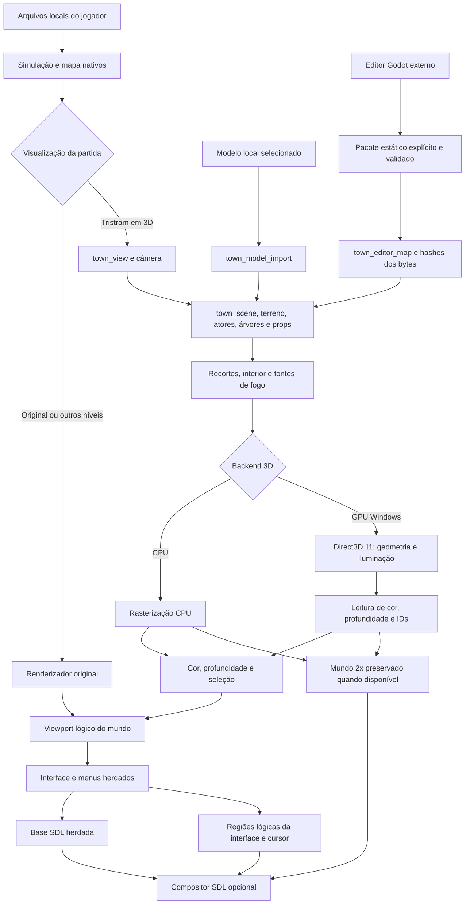
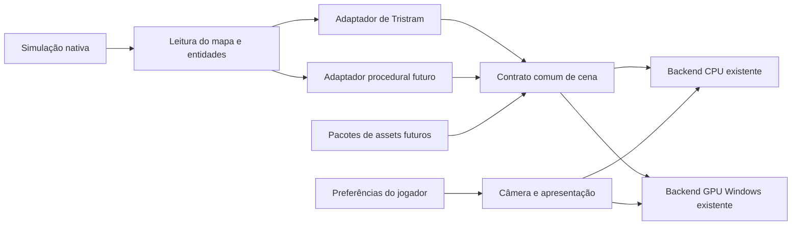
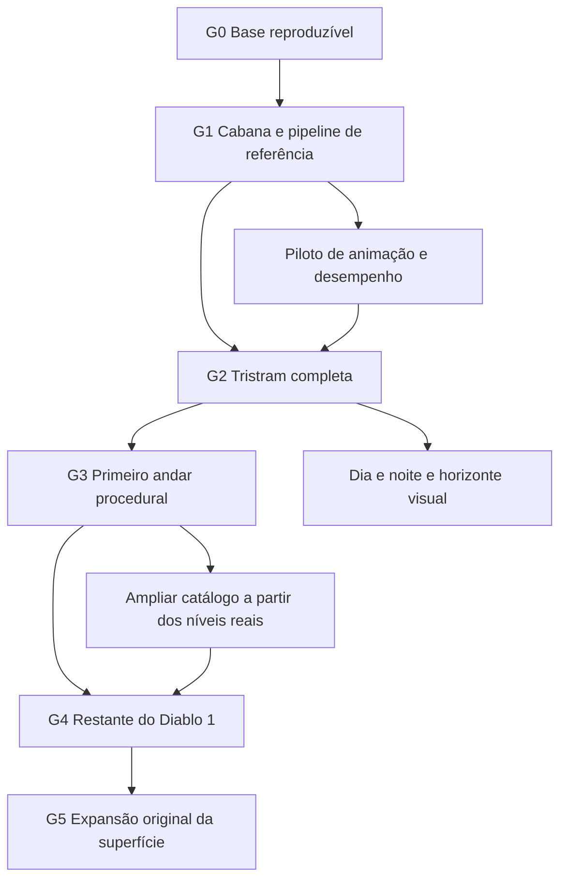
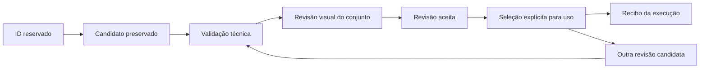

# Arquitetura e execução do Diablo 3D

O objetivo é reconstruir **o Diablo 1 inteiro em 3D**, permitindo alternar a visualização na mesma partida. Tristram é o primeiro ambiente de validação. Depois vêm o primeiro andar procedural da Catedral, os demais ambientes, personagens, monstros e efeitos. A expansão original da superfície fica para uma fase posterior à reconstrução do jogo.

Este é o guia operacional do desenvolvimento. Antes de iniciar uma mudança, o responsável consulta a etapa ativa, os contratos e a fila abaixo; ao concluir, registra o resultado e a próxima ação. O [roadmap](ROADMAP.md) descreve os recursos desejados; este guia determina suas dependências e o que permite avançar. As instruções para os agentes estão em [AGENTS.md](../AGENTS.md).

## Estado de execução

Atualização: **8 de outubro de 2026**. **G0 — base reproduzível está concluído tecnicamente.** A cabana atual fica congelada. Após avaliar o primeiro lote, o usuário considerou a maioria das construções insatisfatória e pediu conferir todos os modelos gerados e aplicados. A prioridade do mundo é agora **revisão por arquivo e por objeto no Godot, com inspector e catálogo públicos para colaboração**; novas gerações e aplicações ficam suspensas. O exterior atual da Catedral foi aprovado, restando altura e fragmentos antigos próximos. A aceitação integral G1 continua parcial. O reparo do HUD, dos fundos/centragem dos menus, da continuidade da música e da troca de idioma foi instalado no launcher habitual após validação técnica; a avaliação artística na partida continua com o usuário.

| Entrega | Estado comprovado | Limite atual |
| --- | --- | --- |
| Alternância F4, órbita, zoom e deslocamento | Implementados no protótipo de Tristram | Outros níveis usam o renderizador original. |
| Perspectiva, modos de câmera e horizonte | Isométrico, órbita livre, terceira e primeira pessoa integrados CPU/GPU; preferências de modo, FOV, sensibilidade e horizonte instaladas | Horizonte provisório, altura ocular ainda em calibração e câmera sem colisão com paredes. Testes finitos não comprovam FPS sustentado ou revisão artística. |
| Preferência inicial 3D | Ligada por padrão; opção persistente em Gráficos e Vídeo na partida, aplicada ao iniciar uma sessão pelo menu principal | A câmera começa 0,15 rad além da referência, usando geometria real. F4 vale para a sessão; Home mantém a comparação nativa. Outros níveis ainda usam o original. |
| Seleção da trilha sonora | Vanilla, Rock e Custom; menu Rock2/alternativa e três opções de arquivo em Tristram com novo sorteio a cada fim de faixa | Quatro ambientes do Diablo e dois do Hellfire ainda usam as originais. Áudios permanecem locais; cinematics não entram no seletor. |
| Fundo dos menus e autoria Godot | Fundo RGB nos menus/submenus; Settings centra o conjunto de título/lista/descrição. Créditos preservam arte e comportamento nativos. Cena 2D exporta os retângulos do menu principal para desenho e clique C++ | Fontes e título animado continuam nativos; logo tem tamanho fixo no v1. Autoria dos retângulos dos submenus não está no formato Godot v1. |
| HUD principal e autoria Godot | Composição reparada com controles/texturas nativos numa faixa inferior; vida/mana, cinto, magia, informações e utilitários usam retângulos compartilhados com input e Godot | Revisão técnica da tela composta concluída; avaliação artística na partida pendente. Painéis/submenus herdados; fallback quando controles MP encontram os painéis compactos. |
| Troca de idioma | Catálogos compilados/entregues, fallback recuperável e callback de opções corrigidos; português brasileiro real verificado com persistência | Fonte adicional de alguns idiomas asiáticos é um recurso separado. Teste finito não substitui revisão de todas as telas em todas as línguas. |
| Comparação Home | Usa o backend original | Igualdade nessa posição não comprova fidelidade das meshes. |
| Cabana leste importada | Exterior e iluminação aprovados pelo usuário para continuar o trabalho | Aprovação parcial; interior, aberturas, telhado, base e conjunto em 360° ainda precisam de revisão final. |
| Recortes e interior da cabana | Implementados no código quando a importação é carregada | Não estão gravados dentro do arquivo do modelo; dependem também do executável. |
| Iluminação e sombras | Albedo importado iluminado em espaço linear; sombra direcional de arquitetura; duas velas na cabana | Sombras pintadas restantes, sombras de atores/árvores/props e ciclo dia/noite estão pendentes. |
| Suavização de bordas 3D | Configuração implementada, desligada por padrão; build candidato e diagnósticos aprovados tecnicamente | Custo alto na CPU; aprovação técnica não substitui avaliação na partida. |
| Apresentação SDL em camadas | Mundo 2× preservado até a saída; interface lógica por regiões opacas, cursor separado e fallback herdado; testes técnicos passaram | Primeiro incremento conservador; não adiciona arte HD nem escala independente à UI. Revisão na janela permanece pendente. |
| Rasterização 3D na GPU | Piloto Direct3D 11 no Windows validado na Radeon RX 570; menu de vídeo na partida, seleção/profundidade e fallback CPU verificados | Ponte síncrona para a composição herdada; outros sistemas continuam na CPU. Medição do mundo não equivale a FPS da partida. |
| Editor Godot e ponte estática | Cena real de arquitetura, referência de chão/colisão, identidade por hash, salvar/reabrir e exportação explícita validados pelo loader C++ | Editor externo; não é port do jogo. Colisão permanece nativa, materiais básicos e cabana com fogo protegida contra override no formato v1. |
| Primeiro lote do restante de Tristram | Nove construções novas e um poço aplicados ao perfil habitual em 12 vínculos, com 75.069 triângulos e identidades conferidas pelo loader real | Candidatos em revisão: escala, orientação, material, recortes e interiores pendentes. Poço importado somente na variante limpa. Árvores, rochas, props e personagens adicionais ainda não estão neste pacote. |
| Inspetor comunitário Godot | Catálogo de 130 arquivos GLB únicos, referências com proveniência, identificação dos 12 vínculos aplicados e da cabana leste, comparação local GLB/D3D e notas exportáveis | Código e metadados públicos; mídia separada. Prévia dos arquivos não reproduz paleta/luz da partida nem geometria acrescentada pelo executável. Não instala, edita ou aprova assets automaticamente. |
| Modelos aceitos no catálogo colaborativo | Zero modelos autorais com aceitação integral registrada | Baseline local selecionada para revisão não equivale a `accepted`. |
| Rede e voz | Pesquisa documentada | Build local `NONET=ON`; nenhuma capacidade nova de jogadores ou voz validada. |

**Revisão solicitada após o lote:** o inspector público está em `editor/godot/review/model_inspector.tscn`, com uso em [MODEL-INSPECTOR.md](MODEL-INSPECTOR.md). O inventário cobre 130 GLBs por hash: 44 masters, 25 derivações, 43 versões pré-remesh, seis arquivos candidatos locais e 12 rigs/clipes. O catálogo distingue os 12 vínculos instalados e a cabana leste, sem confundir a cena Godot mais ampla com o pacote do jogo. Passaram 15 verificações do inventário e a leitura dos 13 D3Ds efetivos por SHA, triângulos, limites e origem; aberturas de Catedral, Griswold e catálogo público sem mídia, filtros e render da interface também passaram. Capturas privadas em `diagnostics/model-review-20261008/godot-inspector-final*.png`. O código e os metadados sanitizados podem ser publicados; a distribuição dos arquivos 3D tem escopo separado, ainda pendente. Nenhuma mídia ou credencial está incluída no catálogo público.

A auditoria confirmou correspondência dos arquivos instalados com suas fontes, mas identificou ajuste independente de eixos aos limites dos antigos substitutos procedurais e perda de dados de material na conversão. Não corrigir isso regenerando modelos sem necessidade. Revisar referência, orientação, proporções, material e aberturas separadamente. A Catedral mantém a aprovação parcial de exterior: não alterar sua geometria, UVs ou material por consequência da rejeição das outras construções. O usuário também apontou cabanas com a face voltada para o lado errado e sem luz interna; identificar cada vínculo pela referência antes de girar ou acrescentar luzes. Orientação, recortes reais e fontes de vela/fogo são requisitos da revisão por objeto, não critérios já cumpridos pelo lote.

### Fila de trabalho

**Integração instalada, 8 de outubro, 06:30:46 (Brasília):** câmeras/horizonte, configurações completas durante a partida e limpeza da torre antiga da Catedral no executável SHA-256 `7720719712c89dab9a6dc0967e0adedbad30fafae27ebca1737b335578d6f14f`. `Iniciar-Tristram.cmd` permanece idêntico e único; v4/quality/godot receberam os mesmos bytes, com backup. Nenhuma partida estava aberta e nenhum processo foi encerrado. A instalação preservou os 26 arquivos do perfil por hash/tamanho/data. `PrepareOnly` posterior atualizou somente o recibo, conservando a seleção de modelos, luz, configuração e saves. Evidência privada: `diagnostics/camera-apply-20261008/installed-20261008T093046Z/receipt.json`. Passaram 849 verificações/78 capturas nativas de câmera e suplemento, 36.612 do menu, 535 de seleção e 55 de reprodução musical. [Câmeras](TRISTRAM-HORIZON-CAMERAS.md) e [menu](INGAME-SETTINGS.md) distinguem essa validação da revisão interativa e das medições de desempenho ainda pendentes. A escala/altura dos modelos não foi corrigida por esse executável.

**Responsabilidades simultâneas, 8 de outubro — divisão explícita para evitar duplicação:**

| Frente | Responsável | Reserva e limite |
| --- | --- | --- |
| Arquitetura, vegetação, rochas, props e cenário de Tristram | **Tristram completa — geração de modelos com Meshy** (`01a11a73-340d-7ef2-83b5-ffde8400b465`) | Não submeter novos moradores, animais ou heróis. Pode consultar/baixar tarefas já pagas e instanciar os mesmos candidatos na cena Godot. |
| Personagens, animais, heróis, rigs e clipes | **Personagens 3D — modelos, rigs e animações** (`01a11a8d-2875-7ce1-b575-058f4b96b2be`) | Proprietário único de novas tarefas dessas famílias. Recebe oito tarefas de vistas e o modelo Griswold já submetido; começar pelo reaproveitamento, sem outro POST para um resultado pendente. Conferir também candidatos de lotes anteriores por ID, variante, etapa e hash. |
| Horizonte e novos modos de câmera | **Tristram — horizonte e novos modos de câmera** (`01a11a81-36d0-74d1-b9ce-23cae9f2a522`) | Perspectiva real, primeira/terceira pessoa, órbita e horizonte visto de frente; primeiro módulos próprios e diagnóstico isolado, com integração CPU/GPU coordenada. Preservar terreno jogável, colisão e comandos nativos. |
| Configurações durante a partida | **Configurações durante a partida — músicas e opções completas** (`01a11a9f-3342-7a91-ba63-d9cb5a64f981`) | Reutilizar opções nativas e ampliar o menu Esc, com trilha sonora acessível, restrições de aplicação e persistência. Código candidato; integração, build e entrega coordenados pelo chat principal. |
| Integração e entrega | Chat principal do jogo (`01a1153a-cad1-7fb1-8326-225511ee918d`) | CMake/cache/build/instalação/Git/guia, HUD/menus/música/idioma. Os demais chats apresentam os arquivos compartilhados antes de editá-los. |

O handoff privado de personagens está em `diagnostics/tristram-production-20261008/actors/handoff.json`: oito tarefas de vistas (24 créditos) e uma de modelo Griswold (30), total 54 já comprometidos no momento da transferência. Isso não comprova rig, animação, aceitação artística ou integração. O responsável de personagens mantém os resultados e custos posteriores por etapa. Cada geração nova consulta tarefa/ID/variante/etapa, reservas e saldo real; a intenção do usuário de repor créditos não é confirmação de saldo nem autorização de compra. GLBs, referências, credenciais e resultados privados não entram no Git.

**Decisão de provedor mais recente:** o usuário escolheu a Tripo como próxima integração e pediu preservar o conhecimento Meshy. Em seguida autorizou um último lote com os **258 créditos Meshy já existentes**, sem recarga. Os tetos iniciais de 150 cenário/108 personagens passaram a **160 cenário/98 personagens**, após a revisão anatômica dispensar dois rigs e liberar dez créditos. O lote foi encerrado com **150 gastos no cenário e 98 nos personagens**; os dez restantes foram retidos, pois não havia necessidade concreta de outra geração paga. Débitos anteriores são contabilizados separadamente. Meshy está pausada, com scripts, documentação, credencial protegida e resultados preservados. A integração Tripo v3 tem planejamento offline, envio com estado durável, consulta e download autenticado separados, credencial local protegida e **31 testes offline**; nenhuma geração autenticada nesse provedor foi feita. Não regenerar objetos existentes apenas por trocar de serviço. Procedimento em [TRIPO-WORKFLOW.md](TRIPO-WORKFLOW.md).

**Reparo entregue, 8 de outubro — HUD, menus, música e idioma:** a faixa inferior usa os controles completos nativos, cinto sobre informações, magia separada e globos que apagam corretamente em 0%. O caso compacto multiplayer recua para o layout nativo quando encontra um painel. Passaram **946 verificações nativas/22 capturas**, **2.542 geométricas**, **1.517 Godot/7 renders** e **227 integradas/12 composições finais** em mundo real original/GPU, com camadas, picking, mapa e RNG preservados. As composições integradas foram inspecionadas; não são screenshots de uma janela nem aprovação artística do usuário. Contrato em [HUD-IMPLEMENTATION.md](HUD-IMPLEMENTATION.md).

O fundo aprovado agora acompanha categorias/opções, heróis, rede e diálogos, com fallback para a arte nativa quando ausente. Créditos permanecem nativos. Settings centra o bloco completo e reserva espaço para descrições. Passaram **196 verificações** de apresentação/layout e **102 verificações com 14 composições** dos menus reais em duas resoluções, inspecionadas visualmente. Fontes pequenas na resolução lógica alta e contraste da descrição sobre pedras continuam limitações artísticas; escala independente da UI não foi adicionada. Evidência privada: `diagnostics/menu-ui-20261008/menus-20261008-050806/REVIEW.md`.

A volta dos submenus usa refresh da música já ativa em vez de recriar o stream; retorno real de partida preserva a inicialização apropriada. Passaram **415 verificações de seleção** e **55 de reprodução**, incluindo continuidade no contexto de menu. A troca de idioma tinha catálogos ausentes neste build sem gettext e fallback inglês persistente; ambos foram corrigidos. O setter de callback também passou a construir novamente o wrapper de função, evitando referência a uma cópia local temporária. Passaram **160 verificações nativas** com o catálogo `pt_BR.gmo` realmente entregue e **61** do compilador de catálogos. CMake usa gettext quando disponível, ou Python 3.8+ e o compilador CPython licenciado incluído, entregando 25 catálogos. Catálogos incompletos voltam ao inglês sem prender trocas posteriores; `forceLocale` continua separado. Os testes não abrem rede, partida ou saves habituais.

**Instalação atual:** candidato e aliases têm SHA-256 `ccfeb4a13f42a9411d51cf9cbe5b995b8db852a6395096059928a0b0ec8b67d5`. `Iniciar-Tristram.cmd` continua a única entrada para jogar. A instalação preservou os **12 arquivos** do perfil por hash/tamanho/data, incluindo configurações, modelo, luz e saves. Recibo privado: `diagnostics/hud-regression-20261008/installed-20261008T081623Z/receipt.json`. A preparação posterior do launcher conferiu a baseline sem abrir partida e renovou o recibo de execução. O usuário abriu o v4 atualizado depois, às 08:20:33 UTC; escritas posteriores de config/log/save não pertencem ao snapshot da instalação e foram preservadas. Os registros de instalações abaixo são históricos, não a seleção atual.

**Aplicação de arquitetura, 8 de outubro, 08:47:43 UTC:** instaladas as casas de Gillian, Pepin, Adria, norte e Farnham, cabana oeste, catedral, taverna e ferraria no perfil habitual. São **nove construções/11 vínculos**, com arquivos identificados por hash e manifesto explícito. A aplicação usou o executável acima, sem recompilar fontes concorrentes, e preservou os **12 arquivos preexistentes** por hash/tamanho/data; nenhum processo foi encerrado. Recibo privado: `diagnostics/map-batch-20261008/installed-20261008T084743Z/receipt.json`. O loader confirmou todos os vínculos; **707 verificações** de renderização CPU/GPU física passaram, com revisão visual restrita à região leste. Não houve avaliação visual completa da cidade nem nova medição de FPS: o benchmark amplo parou antes do desenho por uma asserção antiga do menu. Catacumbas abertas excluídas por incompatibilidade com a variante nativa fechada. Poço, vegetação, rochas, props e atores permanecem em lotes adicionais. Candidatos não foram promovidos a aceitos; interiores/recortes e fidelidade artística continuam pendentes. Detalhes em [TRISTRAM-MAP-BATCH.md](TRISTRAM-MAP-BATCH.md). Próxima ação do mundo: revisar esses objetos na partida e no Godot, corrigir defeitos locais e aplicar os próximos pacotes validados; próxima integração da engine: câmeras/horizonte e configurações durante a partida, após link e testes dos candidatos.

**Acréscimo do poço, 8 de outubro, 06:00:51 (Brasília):** pacote habitual ampliado para **12 vínculos/75.069 triângulos**, preservando exatamente os 11 caminhos e hashes anteriores. O loader real confirmou os 12 no cenário com água limpa. O poço candidato tem 2.992 triângulos e conserva seu master privado. Seleção `clean-water` condicional: se a missão exige água envenenada, o jogo mantém o poço nativo; não há mudança de quest, colisão ou progressão. Com a partida aberta, a transação gravou somente o novo modelo imutável, recibo e manifesto, substituindo o manifesto atomicamente por último; não alterou executável, configurações, saves, cabana ou luz, nem encerrou processos. A cena em cache não foi modificada; o acréscimo vale na próxima carga. Recibo privado: `diagnostics/map-batch-20261008/well-installed-20261008T090051Z/receipt.json`. A aplicação anterior de 11 vínculos e seu teste CPU/GPU continuam como evidência histórica distinta. Vegetação, rochas, props e atores adicionais ainda aguardam integração própria; não forçar essas famílias nos vínculos de arquitetura.

**Produção do restante de Tristram, 8 de outubro — nova prioridade explícita:** o usuário encerrou os refinamentos da cabana atual e pediu um novo chat para gerar todos os demais elementos, seguido de uma cena Godot na qual possa corrigir item por item. Responsável: **Tristram completa — geração de modelos com Meshy** (`01a11a73-340d-7ef2-83b5-ffde8400b465`). Cada objeto deve conservar ID, GLB/master, revisão, hash, posição e estado de aprovação, como instância individual; não fundir a cidade numa malha única. Reutilizar candidatos e o fluxo Meshy existente; geração, referências e modelos ficam locais e privados. O usuário pediu nesse novo chat uma lista completa para conferir antes dos novos envios pagos. O chat anterior da cabana foi instruído a congelar também seu diagnóstico futuro de atribuição, preservando as evidências já prontas. A integração de múltiplos modelos e exportação explícita deve respeitar os limites reais da ponte, sem mudar mapa, colisão ou saves. Build/cache/instalação/Git e guia continuam coordenados pelo chat do jogo, atualmente no reparo do HUD.

**HUD, revisão da partida de 8 de outubro — correção visual em andamento:** o usuário rejeitou a composição instalada em `c87c2327`, com seis utilitários isolados no canto direito, glifos provisórios ampliados, magia desproporcional e ornamentação dos globos sem continuidade. A captura real reproduz os defaults do diagnóstico nativo em 1920 × 1080; não foi demonstrado erro de filtro, compositor ou perfil antigo. Os testes de handlers não comprovaram fidelidade à referência visual. A correção deve reunir os controles numa faixa inferior coerente com os conceitos 07/08, usando os seis controles e estados originais, cinto sobre informações e magia numa área própria, com o mesmo layout no C++ e Godot. Responsável pela apresentação: chat do HUD; integração, build e instalação: chat do jogo. Preservar o atalho único, configurações, saves e assets da cabana. A revisão artística anterior permanece pendente; verificar a tela composta antes de anunciar a próxima entrega.

**Tristram com três opções de música, 8 de outubro — concluída tecnicamente, áudios locais:** as fontes `06.wav` e `06 (2).wav` foram preservadas e convertidas para MP3 de alta qualidade; `06 (1).mp3` foi preservado e usado sem recompressão como Tristram 3. Os três arquivos passaram leitura integral, repetição exata e seek no decoder real. Rock usa Aleatório em Tristram; Custom oferece Original, Tristram 1, Tristram 2, Tristram 3 e Aleatório. Cada término provoca um novo sorteio uniforme entre os arquivos disponíveis, que pode repetir a escolha anterior; o RNG é exclusivo do áudio. Random conserva o ID persistido 3 e Third usa 4. O submenu da partida tem duas páginas com no máximo cinco linhas. `music_selection_smoke` passou **415 verificações**, e `music_playback_smoke` passou **38**, incluindo EOF real com somente a terceira instalada, fallback ausente/corrompido, contexto, mute e RNG nativo. Uma comparação local ao longo de 233,32 s encontrou correlação de 0,99962 entre a terceira fonte e a primeira em mono reduzido: são três opções de arquivo, sem afirmar três gravações distintas; o usuário foi avisado. Contrato, hashes e lista completa de produção 1–8 em [MUSIC.md](MUSIC.md) e [MUSIC-CATALOG.md](MUSIC-CATALOG.md).

**Menu de entrada, 8 de outubro — concluído tecnicamente:** a imagem aprovada `05-fundo-menus.png` foi aplicada como `assets/d3d-ui/menu-background.png`, sem deformação e com recorte proporcional. A UI indexada é sobreposta com transparência do índice zero, preto opaco nos demais índices, fade e cursor nativos. Recursos são descartados antes do renderer e falhas opcionais preservam os controles. `menu_presentation_smoke` passou **112 verificações**, incluindo recorte 4:3/16:9/ultrawide, cores, fade, recriação, fallback, layouts inválidos e dispatch de clique real após mover um retângulo. A cena Godot `ui/main_menu.tscn` passou **16 verificações** de exportação/âncoras/preservação do HUD; o aplicador passou **48 fixtures**, sem instalar perfis de teste. `Abrir-Menu-Godot.cmd` e `Aplicar-Menu-Godot.cmd` estão preparados na raiz. Uso, contrato v1 e limites em [GODOT-EDITOR.md](GODOT-EDITOR.md). Essas provas técnicas não são uma revisão artística da janela completa.

**Instalação e entrada única, 8 de outubro:** o atalho habitual **Iniciar-Tristram.cmd** é a única entrada de jogo apresentada ao usuário, sem parâmetros de comparação. Usa `devilutionx-tristram-v4.exe` e `perfil-tristram`; configurações ficam nos menus do jogo. Os três atalhos locais antigos de comparação foram arquivados em `diagnostics/legacy-launchers`, mantendo suas fontes de desenvolvimento. O wrapper usa os módulos padrão do Windows PowerShell para não herdar um caminho incompatível de outra sessão. A preparação nativa conferiu modelo, luz, perfil Atual e executável, sem iniciar partida. Candidato e aliases têm SHA-256 `c87c2327063f092aa68ac2df6bc89625b6a3b87866427dd34cc462255907ea08`. Na instalação final, os 11 arquivos do perfil habitual ficaram idênticos por hash/tamanho/data; a preparação posterior atualizou somente seu recibo esperado, preservando os dez demais. Evidências privadas: `diagnostics/town-music/installed-20261008-040945/receipt.json` e `diagnostics/canonical-launcher-validation.json`. Os três MP3 locais também foram conferidos no build. A inspeção artística da partida segue pendente.

**Paralelismo autorizado pelo usuário:** o chat **Implementação do HUD e edição visual no Godot** (`01a11a24-ea4b-7d41-be62-b6ad88fc53c4`) implementa primeiro a visão principal, com controles nativos funcionais e layout editável. Submenus são posteriores. O chat **Tristram 3D — revisão da cabana e do cenário** (`01a11a27-14bb-7f82-8dfb-97b4dd15e3ea`) cuida do G1 do mundo. O chat do jogo integra CMake/build/instalação/guia/Git; cada responsável conserva seu escopo, sem builds ou staging concorrentes. O estudo aprovado permanece no chat `01a11a08-c7e1-7ba3-871c-2189ab372140`. Nenhuma dessas frentes muda o objetivo de reconstruir o jogo inteiro.

**G1, revisão paralela de 8 de outubro — correção técnica delimitada:** as quatro barras reais das janelas redondas bloqueavam a visão, mas não a luz das velas. Agora os dois renderizadores consultam os mesmos bloqueadores opacos, derivados dessa geometria. `--cabin-review` passou **2.407 verificações**, com dez câmeras em CPU e GPU, sombras ligadas/desligadas, zero buracos de cobertura e profundidade/seleção/mapa/colisão/atores/RNG preservados. O chão efetivo passou a comparação RGBA das oito máscaras e 80 controles, incluindo três casos negativos. Modelo, iluminação, geometria montada e snapshot permaneceram idênticos por hash. O giro histórico 640×640 preservou oito poses exatamente; somente seis pixels dos túneis mudaram nas duas restantes. Evidência privada em `diagnostics/tristram-g1/window-bars-final-20261008/validation-summary.json`; resultado e limites em [TRISTRAM-G1-REVIEW.md](TRISTRAM-G1-REVIEW.md). As divisões importadas da porta não possuem oclusão própria; comprovar consequência visual atual antes de corrigir esse limite futuro. G1 permanece parcial e depende da revisão artística do conjunto; não gerar outra cabana automaticamente.

**Preferência inicial 3D e trilha selecionável, 8 de outubro — concluídas tecnicamente:** `Start in 3D` é verdadeiro por padrão, salvo em `[Graphics]`, e aplicado uma vez na entrada de cada sessão pelo menu principal. O ângulo inicial tem órbita de 0,15 rad para desenhar meshes/picking efetivos, sem acionar o atalho de referência nativa; Home/F4 e mudanças de nível conservam seus contratos. O usuário pode desligar essa preferência em Settings → Graphics ou Esc → Options → Video Options; mudar a preferência não altera a vista da sessão em andamento. Renderização fora de Tristram permanece nativa.

A nova composição `Main_Menu_Rock2.mp3` é o padrão local. A anterior permanece selecionável. Settings → Soundtrack e Esc → Options → Audio Options → Soundtrack permitem Vanilla/Rock/Custom e escolhas por oito ambientes, salvas em `[Music]`. Alterações individuais ativam Custom; mudanças da faixa atual são imediatas, enquanto arquivos ativos iguais não reiniciam. O contexto menu/partida é definido antes do carregamento, sem depender de `gbRunGame`; rotação Vanilla não herda as variantes Rock dos níveis. Ausência ou rejeição pelo decoder usa a original, e o loader não desreferencia streams ausentes. Menus têm no máximo cinco linhas; volume, velocidade e Gamma foram exercitados após reorganização. `music_selection_smoke` passou **178 verificações** de seleção, persistência, inicialização, navegação e MP3 inválido. Build Windows passou; leitura integral/repetição/seek da Rock2 passou no decoder real. Os executáveis habitual, qualidade e candidato Godot têm SHA-256 `3a58ac384ee52ec5adb27d72ea7ae81976e523b09b03ecf9f15a02572930ec29`; onze arquivos do perfil habitual, incluindo configuração/save/modelo/luz, ficaram idênticos por hash e data na instalação. Evidência privada em `diagnostics/music-selection/installed-20261008-025729/receipt.json` e `settings-smoke.log`. A inspeção automatizada da janela ficou indisponível por falha de inicialização da ferramenta; os testes não são aprovação visual ou escuta artística. Contrato e lista de produção em [MUSIC.md](MUSIC.md) e [MUSIC-CATALOG.md](MUSIC-CATALOG.md).

**HUD responsivo, 8 de outubro — primeira integração concluída tecnicamente:** a tela principal conserva funções, handlers, estados e arte nativos em composição responsiva. O usuário reforçou que esta etapa não deve adicionar funções; os quatro botões extras de magia foram retirados, preservando os atalhos originais. Vida/mana, oito células do cinto, magia preparada e utilitários consultam retângulos compartilhados com o input. A cena `ui/hud.tscn` exporta 13 elementos preservando o menu e retirando as quatro seções antigas. Passaram **697 verificações nativas**, **1.160 geométricas C++**, **962 Godot** e quatro renders da prévia. As 18 capturas nativas usam fundo sintético, sem iniciar partida; incluem globos 0/50/100%, quatro resoluções, cliques, hover, Shift/atalhos nativos, retirada/colocação, override sobre inventário oculto, XP/viewport, Level Up, durabilidade e dicas de gamepad. O teste confirma que a informação do HUD não encobre o menu ativo e que o dispatch de feitiço reconhece o mundo liberado; não executa a simulação de um feitiço. Nomes de itens e triggers receberam os mesmos gates de HUD, revisados por código. A configuração escrita pelo teste pertence exclusivamente ao perfil privado. Evidência em `diagnostics/hud/hud-runtime-499351574346400/receipt.json`; contrato e limites em [HUD-IMPLEMENTATION.md](HUD-IMPLEMENTATION.md). O gtest de viewport foi atualizado, mas não executado neste cache; seus casos passaram no diagnóstico nativo. Aprovação dos conceitos não equivale à aprovação artística da implementação; painéis/submenus são posteriores. G1 da cabana permanece a etapa visual do mundo.

### Registro da entrega anterior de música

**Nova faixa do menu, 8 de outubro — concluída tecnicamente, áudio local:** o usuário forneceu `Main_Menu.mp3` e autorizou conversão para OGG se necessária. O build atual já lê MP3, por isso o runtime preserva a fonte sem recompressão, no caminho opcional `music/d3d-main-menu.mp3`; uma cópia Vorbis foi criada separadamente. O menu seleciona essa faixa também ao retornar da partida, sem alterar as músicas dos níveis ou a lógica nativa de volume/mute. Ausência do recurso conserva a rotação herdada. CMake registra o arquivo opcional para evitar sua remoção pela limpeza do build. O decoder real passou leitura integral, rewind/segunda leitura exata e seek; fonte/runtime têm SHA correspondente. O menu normal confirmou início do playback no log após `Play`; normal, qualidade e candidato Godot têm o mesmo executável validado. Configuração/saves foram preservados na instalação, e os saves continuaram idênticos após o menu. Código em `engine/menu_music.hpp`, `engine/sound.cpp` e `menu.cpp`; contrato, hashes e evidência em [MUSIC.md](MUSIC.md). A faixa e seus metadados permanecem locais nesta entrega. Próxima ação: escuta do autor, especialmente a transição de repetição; G1 da cabana permanece a etapa visual ativa.

Esse registro descreve a primeira entrega. O caminho único foi aposentado pelo seletor acima, sem remover o master ou a exportação OGG privados.

O registro público do editor externo e da correção da janela está em [Godot na revisão da arquitetura](devlog/2026-10-08-editor-godot-arquitetura.md), com tradução integral para inglês e fontes fixadas na revisão `e17b77f03`. O site reutiliza uma imagem identificada como histórica, sem publicar capturas ou assets privados. A publicação distingue a validação da ponte, feita com um substituto sintético, da aprovação artística da cidade. A sequência G1 e os limites do formato permanecem abaixo.

**Prioridade explícita do usuário, 8 de outubro — concluída tecnicamente:** editor Godot para inspeção e autoria colaborativa da arquitetura estática, com ponte real de exportação ao jogo. A cena local deriva dos triângulos efetivamente montados, incluindo recortes/interior, chão de referência e células SOL bloqueadas. O GLB fonte e o snapshot do jogo aparecem em modos distintos, com identidade, revisão e hashes; salvar não promove aprovação nem instala automaticamente um override. Responsabilidades: chat do editor em `editor/godot` e guia; chat do jogo no snapshot, loader C++, preparação e validação. Foram validados salvar/reabrir a cena real, 185 verificações do exportador, 21 do ciclo Godot e 15 da aplicação pelo loader C++ em workspace descartável. O override sintético do poço chegou com 12 triângulos e o hash exportado; a cabana e seu fogo permaneceram herdados. Hash/vínculo/limites inválidos, tentativa de substituir a cabana protegida e ausência do candidato foram recusados; configurações/saves de revisão existentes e todo o perfil habitual foram preservados. A regressão completa de `town_view_smoke` passou em 140.704 ms. Evidência privada: `diagnostics/godot-bridge/full-regression` e `diagnostics/godot-bridge/20261008T051704206523Z/results.json`. Os launchers exigem o candidato Godot, conferem recibo e hashes e usam `perfil-godot-review`. Contrato em [GODOT-BRIDGE.md](GODOT-BRIDGE.md), uso em [GODOT-EDITOR.md](GODOT-EDITOR.md). Limites: arquitetura estática/material básico, colisão e terreno não editáveis, luzes autoradas ainda não exportáveis e cabana com fogo protegida no v1. Próxima ação: revisão G1 em conjunto com o usuário, registrando defeitos em 360°; evoluir o formato de interior/luzes antes de permitir substituir a cabana. Migrar o jogo inteiro para Godot continua uma avaliação futura, sem decisão de trocar a engine nesta etapa.

**Correção delimitada da porta da cabana — concluída tecnicamente:** o vão pequeno existente na malha da porta era bloqueado pela parede interna criada pelo executável. A pipeline `cabin-east-openings-fire-v3` abre somente essa parede, conserva a porta fechada/colisão e suas divisões importadas e deixa a luz interna aparecer pelo vão. O arquivo D3D selecionado não foi regenerado. As capturas forçadas CPU/GPU em oito câmeras passaram, com mapa/RNG/seleção preservados; evidência privada em `diagnostics/door-window/final`. Revisão artística final do conjunto permanece no G1.

**Prioridade autorizada em 8 de outubro — concluída tecnicamente:** substituir a rasterização 3D por um backend GPU dentro do DevilutionX, após a regressão de desempenho com suavização CPU. O piloto Direct3D 11 conserva geometria, materiais, luzes, sombras e IDs; lê os três alvos para a composição herdada. Menu de vídeo durante a partida, fallback integral e recuperação OFF/ON foram validados. Responsabilidades: `town_view` captura/seleção; `town_gpu.*` backend; `town_shadow` mapa compartilhado; `options`/`gamemenu`/tradução controles; `town_view_smoke` diagnóstico. Na última rodada Full HD, mediana de 154,0 ms CPU para 29,6 ms GPU, incluindo readback e excluindo UI/SDL. Seis câmeras/densidades, retorno CPU exato, Home nativo exato, orçamento/falha, regressão, qualidade, compositor e 25 fixtures do launcher passaram. As 108 diferenças de IDs em bases coplanares e uma diferença de subamostra na borda de uma árvore tiveram evidência geométrica independente; zero divergências não explicadas. Perfil habitual conserva 1920×1080, Zoom ligado e AA desligado; somente GPU foi ligada. Modelo, luz e save preservados por hash/tamanho/data. Detalhes e limites em [GPU-RENDERER.md](GPU-RENDERER.md). Próxima ação: acompanhar desempenho em uso prolongado, medir FPS sustentado e retomar a revisão G1 da cabana, sem regeneração automática. Apresentação direta na GPU e escala HD de menus permanecem etapas posteriores.

O registro público desta entrega está em [renderização GPU em Tristram](devlog/2026-10-08-renderizacao-gpu-tristram.md), com tradução integral para inglês. O site identifica a imagem reutilizada como histórica e mantém a medição do mundo separada do FPS final. Em 8 de outubro, após testar a versão GPU na partida habitual, o usuário relatou “melhorou muito!!”. Essa confirmação qualitativa de desempenho está no mesmo artigo, sem nova medição de FPS nem aprovação artística integral. A primeira observação foi positiva; seguem o acompanhamento em uso prolongado, a medição sustentada e a revisão G1.

| Ordem | Trabalho delimitado | Dependência e evidência para encerrar |
| --- | --- | --- |
| 1 | **Concluído:** corrigir a seleção da cabana entre os perfis e registrar a baseline | G0: 20 testes aprovados, nove perfis preparados, modelo/luz verificados por hash e saves preservados. Ver [aprovação de assets](ASSET-APPROVAL.md). |
| 2 | **Congelado por instrução do usuário:** revisão adicional da cabana selecionada | Preservar a revisão atual e suas evidências; a produção dos demais objetos é a prioridade. A aceitação G1 permanece parcial. |
| 3 | **Prioridade atual:** revisar os modelos gerados e sua aplicação no Godot | Conferir referências, orientação, escala e material por objeto com o inspector público e as cópias locais. Produção Meshy encerrada; não gerar outra cabana nem aplicar novos candidatos durante esta revisão. |
| 4 | Preparar a cidade como cena Godot editável por objeto | Cada instância mantém ID, transformação e revisão; salvar/reabrir, comparar e exportar explicitamente, sem alterar colisão nem promover aprovação automaticamente. |
| 5 | Medir desempenho em condição controlada e definir o orçamento de Tristram | G2: resolução, câmera, perfil, hardware e carga registrados; meta de tempo/memória definida antes de aceitar a ampliação da cena. |
| 6 | Integrar e revisar as famílias restantes de Tristram | Produção de candidatos já autorizada; instalação exige fit, contrato suportado, orçamento e revisão individual. Reservar IDs existentes e manter os modelos editáveis separadamente. |

A suavização já implementada não abre uma nova frente de funcionalidades. Permanece opcional enquanto as prioridades de seleção, qualidade dos objetos e custo do renderizador são resolvidas. Os perfis de apresentação são ferramentas de comparação; a direção do produto é oferecer os controles apropriados nas configurações do jogo.

**Prioridade explícita do usuário, 8 de outubro — concluída tecnicamente:** reunir a cabana selecionada e a melhor apresentação no perfil habitual. A auditoria confirmou que os executáveis normal e de qualidade tinham o mesmo código, mas a suavização estava desligada no perfil normal e o mundo 2× era reduzido antes da saída SDL. O compositor preserva agora esse mundo até a apresentação e sobrepõe regiões explícitas da interface lógica, com canal transitório do cursor. Componentes: `town_view`, novo `town_presentation`, registro de regiões da UI, `scrollrt`, `dx` e ciclo de recursos SDL. Fixtures de densidade, preto opaco, clipping, paleta, invalidação, renderer/resize e regressões de seleção passaram; cabana/luz/save foram preservados e o normal recebeu a opção ativada uma vez. Limites e evidência em [DISPLAY-PRESENTATION.md](DISPLAY-PRESENTATION.md). Próxima ação: revisão visual na partida habitual, seguida da revisão G1 da cabana; a ferramenta automática de janela falhou antes de abrir os jogos. Nenhum asset foi regenerado ou promovido a aceito, nem foi importada arte HD do Belzebub.

## Arquitetura em funcionamento

O código-base é o DevilutionX modificado. A análise local do Belzebub é uma referência de comportamento e apresentação; seu executável e seu código não integram a engine. Veja [bases e créditos](ENGINE-BASES-AND-CREDITS.md) e [análise do executável](BELZEBUB-BINARY-ANALYSIS.md).

O desenho mostra responsabilidades, não uma API de plugins já existente. No código atual há acesso direto ao estado global da engine; uma interface geral de cena para todos os níveis ainda precisa ser extraída gradualmente.

| Responsabilidade | Implementação atual | Regra de dependência |
| --- | --- | --- |
| Regras, mapas, colisões, progressão e saves | `Source/levels`, jogador, monstros, NPCs, quests e demais sistemas herdados | Continuam autoritativos. A renderização não altera seu estado nem consome seu RNG. |
| Escolha do backend e composição da tela | [scrollrt.cpp](../Source/engine/render/scrollrt.cpp) | Desenhar o mundo antes da interface; preservar o retorno ao original. |
| Apresentação de maior densidade | [town_presentation.cpp](../Source/engine/render/town_presentation.cpp), `ui_overlay_regions.*` e `dx.cpp` | Somente fluxos da partida autorizam camadas; usar um mundo 2× com epoch válido, paleta ativa e regiões UI explícitas. Liberar texturas antes do renderer; falhas opcionais voltam à base herdada. |
| Câmera, rasterização, caches e picking | [town_view.cpp](../Source/engine/render/town_view.cpp) | Câmera e mouse usam coordenadas lógicas. Em 2×, cor agrega quatro subamostras; profundidade e entidade selecionada vêm juntas da subamostra visível mais próxima. |
| Backend GPU opcional | [town_gpu.cpp](../Source/engine/render/town_gpu.cpp), contrato em `town_gpu.hpp` | Consumir dados emprestados no Submit, preservar ordem e publicar cor/ID/profundidade juntos. Nenhuma rasterização CPU ocorre num frame GPU bem-sucedido. Falha refaz o quadro inteiro na CPU e invalida uploads ao recarregar recursos. |
| Objetos inteiros e interiores | [town_scene.cpp](../Source/engine/render/town_scene.cpp) | Identificar composição e footprint antes de modelar. Aparência não redefine a colisão nativa. |
| Importação estática | [town_model_import.hpp](../Source/engine/render/town_model_import.hpp) | `D3DMESH1` valida limites, UVs e geometria; ainda não contém esqueleto, skin ou clipes de animação. |
| Autoria externa e revisão | [GODOT-EDITOR.md](GODOT-EDITOR.md), `town_editor_map.*`, snapshot e `godot_bridge.py` | IDs/variantes/limites nativos fixos, SHA dos bytes carregados e aplicação explícita num perfil separado. Cabana com fogo protegida até evolução do formato; aprovação técnica não altera o catálogo artístico. |
| Materiais, fogo e sombras | `town_lighting.*`, `town_shadow.*`, `town_lighting_profile.*` | Luz e sombras compartilham coordenadas do mundo; órbita não move a fonte. |
| Atores e vegetação | `town_actor`, `town_body`, `town_volume`, `town_vegetation`, `town_props` | Reconstruções atuais não estabelecem uma pipeline de animação esquelética concluída. |
| Preferências do jogador | [options.cpp](../Source/options.cpp) e menu de configurações | Persistir por perfil; definir quando cada opção pode ser aplicada. |
| Baseline e comparação | Launcher, manifesto de revisão e [town_view_smoke.cpp](../tools/town_view_smoke.cpp) | Identificar os mesmos componentes antes de comparar resultados. |

### Contratos que toda mudança deve preservar

1. **Uma partida, duas visualizações.** F4 não recria mapa, personagem ou seed. Comandos de movimento e interação continuam chegando à simulação nativa.
2. **Fidelidade por objeto completo.** Comparar meshes forçadas com a referência na câmera original e também em 360°. Portas, janelas, escala, telhado, chão e posição precisam pertencer ao mesmo objeto coerente.
3. **Comparação nativa separada.** Home testa o caminho original. Capturas com geometria forçada testam a reconstrução. Não misturar os dois resultados numa afirmação de igualdade.
4. **Luz física consistente.** Velas, candelabros e fogo têm fontes, cores, atenuação e oscilação próprias. Aberturas precisam existir na geometria. Textura amarela ou sombra desenhada não substitui esse sistema. Detalhes em [BUILDING-OPENINGS.md](BUILDING-OPENINGS.md).
5. **Seleção acompanha a imagem.** Mudanças de viewport, painéis, zoom ou qualidade invalidam buffers antigos. Após redução de amostras, profundidade e ID vêm da mesma subamostra.
6. **Versões explícitas.** Geração cria um candidato. Alterar o arquivo mais recente ou trocar resolução não promove outro modelo. O conjunto da revisão inclui modelo, conversor, executável, aberturas e iluminação.
7. **Dados privados ficam locais.** Não publicar credenciais, saves, arquivos do jogo, extrações ou modelos privados. Publicar código, contratos, metadados permitidos e resumos sanitizados de validação.

## Evolução da engine e suporte a modders

A evolução deve aproveitar os módulos existentes. Não há necessidade de reescrever toda a engine antes de terminar a cabana. Extraímos uma fronteira quando o segundo uso concreto a exigir, preservando o caminho anterior até o novo estar validado.

Este segundo desenho é a arquitetura de destino. O piloto GPU existente recebe triângulos projetados de Tristram; o contrato comum de cena e os pacotes ainda não estão implementados como interfaces gerais para todos os níveis.

| Fronteira a consolidar | Conteúdo e responsabilidade | Momento de execução |
| --- | --- | --- |
| Leitura da partida | Mapa vivo, peças, entidades, frames e IDs de interação, sem escrita ou novo RNG | Ao introduzir o segundo adaptador, no G3. Usar a extração mínima que elimine dependências exclusivas de Tristram. |
| Cena visual | Transformações, malhas, materiais, instâncias, luzes e vínculo de seleção com entidades nativas | Estabilizar o contrato estático no G1; generalizar no G3. |
| Pacotes de assets | IDs estáveis, versão de formato, dependências, origem, seleção explícita e validação | O catálogo atual coordena contribuições. Loader geral de modpacks será uma entrega própria; não tratar o JSON atual como esse loader. |
| Animação | Esqueleto, skin, clipes e eventos visuais vinculados ao estado e frame nativos | Piloto com um ator durante G2; usar o resultado antes de produzir todos os personagens. |
| Backend gráfico | Receber a mesma cena e produzir cor, profundidade e seleção coerentes | Piloto GPU Windows validado; preservar CPU como referência/fallback e medir a ponte antes de ampliar a interface para outros níveis. |
| Extensões de gameplay | Alterações explícitas de regras, saves e protocolo, com versão e compatibilidade | Separadas da conversão visual. Expansão e aumento de jogadores exigem projetos de implementação delimitados. |

Para os níveis procedurais, cada instância visual deriva do **mapa realmente gerado**, incluindo portas, escadas e alterações durante a partida. O seed auxilia a repetição dos testes; não substitui a leitura do mapa vivo. Uma variação puramente visual deve usar dados determinísticos próprios, sem avançar o gerador aleatório da simulação.

O piloto de rig deve mapear estados como parado, caminhada, ataque e morte ao tempo do jogo. Rig automático, inclusive pelo Meshy, é uma etapa de produção; não garante sincronização de ataques, contato dos pés ou anatomia correta. Primeiro validar um ator e suas transições, depois ampliar a família.

## Configurações dentro do jogo

Separar **preferências do jogador**, **definições artísticas do asset** e **diagnósticos de desenvolvimento** evita que um atalho de resolução troque uma casa ou sua iluminação aprovada.

| Controle | Situação atual | Política de evolução |
| --- | --- | --- |
| Iniciar em 3D | Opção persistente, padrão ligado; menu principal e vídeo na partida | Aplicação na próxima sessão pelo menu principal; F4 continua temporário e Home permanece referência nativa. |
| Trilha sonora | Vanilla/Rock/Custom e oito escolhas persistentes; áudio e lista de produção separados | Aplicação imediata somente à faixa ativa quando o arquivo muda; ausência usa original, cinematics separados. |
| Renderização 3D por GPU | Opção persistente, padrão desligado; disponível também no menu de vídeo da partida | Próximo desenho, hardware Direct3D 11 no Windows, fallback CPU explícito; desligar/ligar permite nova tentativa. Não troca modelo ou luz. |
| F4, órbita, inclinação, zoom e deslocamento | Aplicados durante a partida em Tristram | Manter resposta imediata e oferecer ajustes de sensibilidade, limites e restauração quando implementados. |
| Suavização de bordas 3D | Opção em Gráficos, aplicada no próximo desenho; desligada por padrão | Mostrar limitação efetiva quando o orçamento recua para 1×; não prometer disponibilidade em qualquer resolução. |
| Filtro de ampliação | Opção gráfica herdada | Preservar a distinção entre filtro da saída e amostragem do mundo. |
| Resolução interna, fullscreen e ajuste à tela | Opções herdadas restringem alteração durante a partida e recriam a interface | Tornar dinâmicas somente após validar tamanho, recursos, seleção e retorno seguro. Até lá, respeitar as flags existentes. |
| Intensidade, perfil de luz e qualidade de sombras | Luz em perfil técnico de arquivo; qualidade da sombra definida em código; sem painel geral durante a partida | Criar opções limitadas e persistentes; definir invalidação dos caches e custo antes de expor controles. |
| Escala independente da interface | Planejada | Exige layout, texto e áreas clicáveis coerentes em diferentes proporções. |
| Modelo e aberturas de uma casa | Seleção de conteúdo, não preferência gráfica | Gerenciar por revisão/asset pack; uma preferência de qualidade não troca silenciosamente a revisão artística. |
| Congelar fogo, forçar geometria e capturas | Diagnósticos | Permanecer separados da experiência normal do jogador. |

Cada nova opção precisa declarar valor padrão, persistência, faixa válida, aplicação imediata/reconstrução/reinício e fallback. Um controle que exige reinício pode existir no menu com indicação clara; não deve receber uma promessa falsa de alteração imediata.

## Marcos e dependências

Os marcos são critérios de passagem, não datas prometidas. Atividades independentes podem ocorrer em paralelo com responsáveis e arquivos separados. Um marco dependente só começa sua implementação principal depois de sua entrada estar satisfeita; pesquisa e inventário não significam início ou conclusão do marco.

| Marco | Entrada | Entregas e condição de saída | Estado |
| --- | --- | --- | --- |
| **G0 Base reproduzível** | Código e assets locais existentes | Seleção explícita da baseline; launcher consistente; recibo de execução; testes de divergência; preservação dos perfis; guia operacional acessível. | Concluído tecnicamente nesta atualização. Não equivale a aprovação visual do conjunto. |
| **G1 Cabana de referência** | G0 | Objeto completo e coerente na câmera original e em 360°, aberturas e interior corretos, cor/luz calibradas, sombra real sem duplicação no chão auditado, colisão preservada, conversão repetível e aprovação integral registrada. | Parcial. Exterior/luz já permitem continuar; não regenerar por ausência de registro integral. |
| **G2 Tristram completa** | G1 | Inventário do cenário de Tristram do Diablo fechado, com revisões aceitas das famílias desse escopo; terreno coerente, interiores visíveis necessários, NPCs e vegetação com volume, piloto de herói animado, sombras e oclusão corretas, picking e interação preservados; orçamento de CPU/memória atendido em fixtures declaradas. | Protótipo parcial; vários objetos ainda requerem reconstrução. |
| **G3 Primeiro andar procedural da Catedral** | G2 e contrato de importação estável | Adaptador do mapa vivo; conjunto reproduzível de seeds cobrindo salas, corredores, portas e escadas; variações e mudanças em jogo; seleção, colisão, transparência e alternância F4 corretas; orçamento medido. | Planejado. |
| **G4 Diablo 1 completo em 3D** | G3 | Demais andares e ambientes; heróis, equipamentos, monstros, bosses, estados, animações, objetos e efeitos necessários; fixtures de progressão, combate, quests e save/load sem regressões. | Planejado. Catálogo completo será derivado das fases auditadas. |
| **G5 Expansão da superfície** | G4 e proposta de gameplay aprovada | Definir mundo externo, progressão, geração/autoria, saves e compatibilidade; implementar uma região piloto antes de ampliar. | Visão futura, ainda sem escopo fechado. |

No início de G2, registrar a matriz de objetos, estados e fixtures do Diablo suportados, incluindo a identificação do cenário residual. Conteúdo `conditional-hellfire` fica separado. O gate exige completar o cenário desse escopo e suas interações; a biblioteca integral de classes/equipamentos e o conteúdo de outros ambientes pertencem ao G4. Não exigir aceitação indiscriminada de toda categoria do catálogo para liberar G3, nem ocultar objetos restantes de Tristram para declarar G2 concluído.

Dia/noite permanece posterior a G2. Por solicitação explícita mais recente do usuário, horizonte decorativo e novos modos de câmera têm agora uma frente paralela própria, começando por módulos e diagnósticos isolados antes de integrar CPU/GPU. Isso não cria terreno jogável extra nem declara primeira pessoa já disponível no jogo. A sombra deve acompanhar a fonte de luz; fog precisa respeitar profundidade e silhuetas. Rede/voz e novo menu seguem suas dependências próprias. O site/devlog recebe apenas resultados efetivamente entregues.

### Decisões abertas com momento de resolução

| Decisão | Evidência necessária | Resolver antes de |
| --- | --- | --- |
| Orçamento de frame/memória e viabilidade de GPU | Medição controlada do mundo e da partida, resolução de referência, hardware e qualidade registrados; custo dos passes identificado | Escalar a produção da cena em G2. O experimento atual não fixa uma meta de FPS. |
| Formato de atores e ferramenta de rig | Piloto com esqueleto, skin, ações e eventos nativos; tamanho e custo medidos | Produzir personagens em série no G2/G4. |
| Esquema geral de asset packs | Segundo uso real, dependências, versionamento, prioridade e fallback testados | Anunciar suporte público de modpacks. |
| Horizonte decorativo ou superfície explorável | Proposta visual para G2; proposta de gameplay separada para G5 | Introduzir qualquer nova colisão ou região jogável. |
| Mais jogadores e voz de proximidade | Protocolo, autoridade, sincronização, instâncias, saves, transporte e custos; [pesquisa de rede](NETWORKING-RESEARCH.md) | Modificar limites/protocolo ou integrar serviço de voz. |

## Aprovação e continuidade dos assets

O [catálogo existente](ASSET-CATALOG.md) e [assets/registry.json](../assets/registry.json) continuam sendo a fonte de IDs, reservas e aceitação colaborativa. Não criar um catálogo paralelo. O manifesto de baseline de revisão resolve outro problema: **qual revisão local está sendo usada agora**. Veja [ASSET-APPROVAL.md](ASSET-APPROVAL.md).

Uma aprovação parcial pode selecionar uma baseline para continuar a revisão, como ocorre com a cabana. Isso não a promove a aceitação integral. A revisão anterior permanece identificável para rollback. Nenhuma etapa deve escolher arquivos por data de modificação ou considerar a conversão mais recente automaticamente melhor.

Ao encontrar uma diferença, comparar primeiro modelo, executável, perfil de luz, câmera e estado. Se o modelo não foi carregado, corrigir a inicialização; se a abertura depende do código, corrigir esse componente. Não gerar outra casa para compensar uma falha de perfil, câmera ou luz.

## Rotina obrigatória de execução

1. **Ler o estado real.** Consultar este guia, instruções aplicáveis, registro do asset e arquivos relevantes. Verificar alterações locais, tarefas concorrentes e qual executável está realmente em uso.
2. **Escolher uma entrega delimitada.** Anotar na fila seu objetivo, dependências, arquivos sob responsabilidade, critério de conclusão e evidência necessária. Se uma dependência falhar, corrigir a causa antes de avançar.
3. **Preservar a referência.** Identificar revisão e hashes do conjunto existente. Respeitar o escopo já aprovado; manter candidatos e capturas separados. Não sobrescrever uma partida aberta para substituir seu executável.
4. **Implementar e validar o necessário.** Fazer verificações proporcionais à mudança. Repetir testes amplos somente por alteração relevante, falha nova ou risco ainda aberto. Manter os resultados técnicos separados da aprovação artística.
5. **Registrar e entregar.** Atualizar esta fila e o documento responsável pelo detalhe, com resultado, evidência, limitação e próxima ação. Publicar apenas os arquivos autorizados, após revisar o diff e verificar segredos. Atualizar o devlog com fatos entregues.

Uma etapa encerrada só reabre por **defeito reproduzido**, **mudança explícita de requisito** ou **dependência que mudou**. Registrar o motivo e limitar o retrabalho ao componente afetado. Recompilar ou revalidar uma dependência alterada não significa refazer toda a etapa artística.

### Evidências disponíveis nesta atualização

- A auditoria dos perfis identificou a regressão: atalhos comuns sem modelo importado carregavam a cabana procedural; os quatro perfis Meshy auditados continham o mesmo arquivo v2. Recortes e interior são adicionados pelo código somente após importação bem-sucedida. Relatório local: `diagnostics/profile-asset-audit/profile-assets.json`.
- A correção passou em 20 fixtures no Windows PowerShell 5.1. Nove perfis receberam/verificaram a mesma baseline e seus recibos foram renovados após a atualização do executável. Os sete saves existentes, duas cópias iniciais e o INI habitual foram preservados. Relatórios locais: `diagnostics/runtime-baseline-tests` e `diagnostics/runtime-baseline-prepare`. A preparação não modifica uma cena já cacheada numa partida aberta.
- O diagnóstico normal e `--quality` passaram. A revisão de qualidade preservou enquadramento, interface, seleção, retorno 1× → 2× → 1× e 75 amostras geométricas independentes. Relatórios/capturas locais: `diagnostics/quality-meshy-gog` e `diagnostics/quality-regression-meshy-gog`.
- Em 960×540, as medianas do experimento de CPU foram 41,8 ms em 1× e 136,9 ms em 2×, com duas instâncias do jogo abertas. Isso mede o desenho diagnóstico e não o FPS sustentado de uma partida. [Detalhes de apresentação](DISPLAY-PRESENTATION.md).
- O candidato `devilutionx-tristram-quality.exe` foi compilado separadamente enquanto o Windows mantinha o v4 aberto em uso. Depois que essas partidas foram encerradas, o executável habitual v4 também foi atualizado com os mesmos objetos já validados. O cache de compilação mantém o nome habitual.
- Em 8 de outubro, o incremento de apresentação em camadas passou nos fixtures sintéticos SDL, na revisão `--quality` (75 amostras geométricas, zero falhas) e na suíte de regressão com a cabana local selecionada. O jogo habitual foi recompilado; o alias de qualidade contém o mesmo binário. O perfil normal 960×540 conserva modelo, luz e save; a única mudança gráfica solicitada foi habilitar `3D Edge Smoothing`. Seu recibo registra as nove solicitações gráficas finais, sem presumir saída física ou fallback efetivo. O teste do launcher passou em 22 casos PS5.1. Relatórios locais: `diagnostics/presentation-layers-*` e `diagnostics/presentation-integrated-normal/final-20261008`.

Os caminhos de evidência acima são locais ao workspace, fora do repositório público. Uma captura antiga continua útil como histórico, mas não prova o estado de uma revisão diferente.

### Documentos responsáveis por cada detalhe

| Assunto | Fonte de verdade |
| --- | --- |
| Etapa ativa, dependências, decisões e continuidade | Este guia |
| Visão e recursos planejados | [ROADMAP.md](ROADMAP.md) |
| IDs, reservas e aceitação colaborativa | [ASSET-CATALOG.md](ASSET-CATALOG.md), [registry.json](../assets/registry.json) |
| Seleção de revisão e recibos | [ASSET-APPROVAL.md](ASSET-APPROVAL.md) e manifesto de baseline |
| Referências, conversão e geração Meshy | [MESHY-WORKFLOW.md](MESHY-WORKFLOW.md), [REFERENCE-SOURCES.md](REFERENCE-SOURCES.md) |
| Luz, interiores e aberturas | [TRISTRAM-LIGHTING.md](TRISTRAM-LIGHTING.md), [BUILDING-OPENINGS.md](BUILDING-OPENINGS.md) |
| Resolução, qualidade e medições | [DISPLAY-PRESENTATION.md](DISPLAY-PRESENTATION.md) |
| Compilação e contribuição | [BUILDING-D3D.md](BUILDING-D3D.md), [CONTRIBUTING.md](CONTRIBUTING.md) |

Atualizar o documento responsável e manter links nos demais. Não copiar estados e instruções para múltiplas listas independentes que possam divergir.

### Música de fundo do site — 8 de outubro de 2026

Solicitação explícita do usuário para publicar a faixa fornecida com player simples. O site PT-BR/EN recebeu controles de tocar/pausar, silêncio e volume, repetição e preferência local, usando Plyr auto-hospedado e fallback HTML. O usuário confirmou a reprodução durante a revisão; a preparação preservou o áudio sem recompressão e removeu capa/metadados privados. Início automático e retomada entre páginas respeitam os limites do navegador. Detalhes e manutenção em [Música do site](../website/MUSIC.md). Esta entrega é independente das trilhas da engine; G1 do mundo mantém seu escopo. Próxima ação: acompanhar o uso e somente substituir a faixa por nova solicitação explícita.
